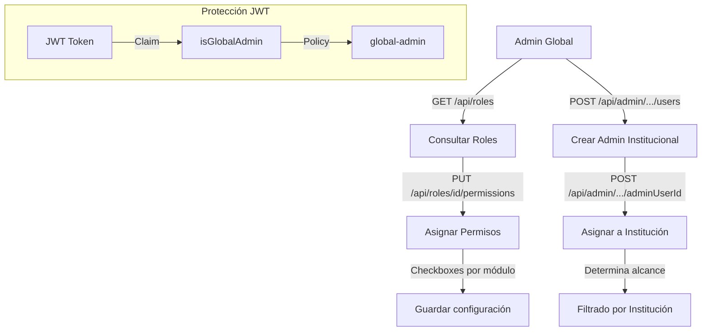

# Proceso 02 — Gestión de Roles y Permisos

**Área:** Configuración del Sistema

## Descripción
Proceso de configuración de los roles del sistema y asignación de permisos a cada rol. Los permisos se agrupan por módulo y controlan el acceso a funcionalidades específicas de la plataforma. Solo el admin global puede modificar permisos; los roles están predefinidos (Admin, Professional, FamilyRepresentative, PersonWithDisability).

## Participantes
- **Admin Global** — Consulta roles y asigna permisos

## Pasos del proceso

### 1. Consulta de Roles
El admin global visualiza los roles del sistema con sus permisos actuales.
- **Listar roles:** `GET /api/roles`
- **Detalle de rol:** `GET /api/roles/{id}`
- **Permisos disponibles:** `GET /api/roles/available-permissions`
- **Frontend:** `/admin/roles` (DataTable con roles)

### 2. Asignación de Permisos
El admin global selecciona permisos mediante checkboxes agrupados por módulo y los asigna al rol.
- **Endpoint:** `PUT /api/roles/{id}/permissions`
- **Protección:** `[Authorize(Policy = "global-admin")]`
- **Frontend:** `/admin/roles/{id}` (checkboxes por módulo)

### 3. Jerarquía Admin Global / Institucional

| Capacidad | Admin Global | Admin Institucional |
|-----------|-------------|-------------------|

### 4. Creación de Admins Institucionales
El admin global crea usuarios admin y los vincula a instituciones. Se genera contraseña temporal.
- **Crear admin:** `POST /api/admin/institutions-assignments/users`
- **Asignar institución:** `POST /api/admin/institutions-assignments/{adminUserId}`
- **Desasignar:** `DELETE /api/admin/institutions-assignments/{adminUserId}/{instId}`
- **Listar admins:** `GET /api/admin/institutions-assignments/admins`
- **Mis instituciones:** `GET /api/admin/institutions-assignments/me`
- **Frontend:** `/admin/admins`

### 5. Filtrado por Institución
Los admins institucionales solo ven datos de sus instituciones asignadas.
```
Admin Institucional
  → AdminInstitution (sus instituciones)
    → ProfessionalInstitution (profesionales de esas instituciones)
      → ProfessionalPerson (personas de esos profesionales)
        → PersonRepresentative (familiares de esas personas)
        → Invitation (invitaciones de esos profesionales)
```

## Diagrama de flujo




