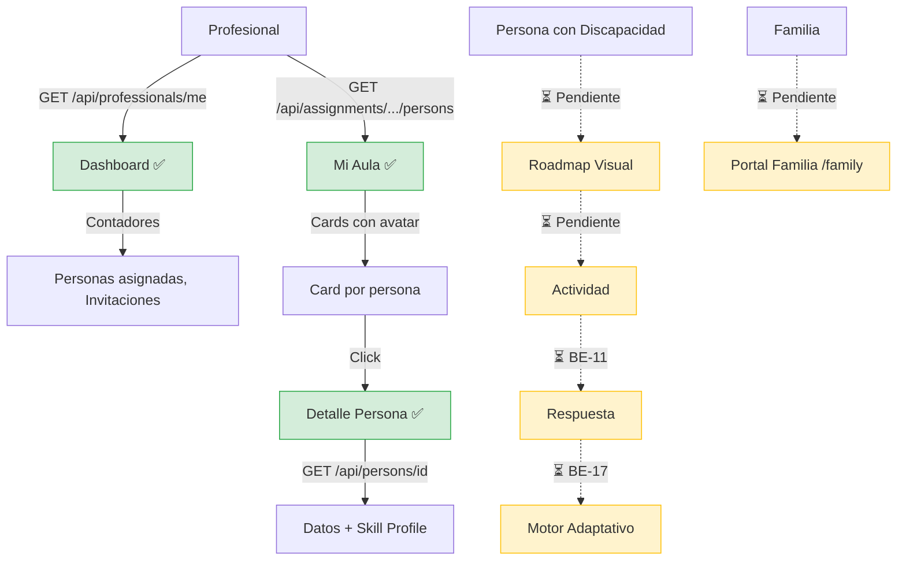

# Proceso 03 — Registro y Seguimiento de Avances

**Origen:** Proyecto final (Proceso 3: Registro y Seguimiento de Avances)

## Descripción
Proceso de monitoreo del progreso de las personas con discapacidad. Actualmente el profesional cuenta con un dashboard con contadores reales y una vista "Mi Aula" con cards de sus personas asignadas. El seguimiento de actividades, respuestas, motor adaptativo y portal familia están pendientes.

## Participantes
- **Profesional** — Consulta dashboard y Mi Aula
- **Persona con discapacidad** — ⏳ Pendiente: realizará actividades en el portal AAC
- **Familia** — ⏳ Pendiente: consultará progreso desde el portal familia

## Pasos del proceso

### 1. Dashboard del Profesional ✅ Implementado
El profesional ve contadores reales en su dashboard: total de personas asignadas, invitaciones pendientes y aceptadas.
- **Datos obtenidos de:** `GET /api/professionals/me`, `GET /api/invitations`
- **Frontend:** `/pro/dashboard`
- Los contadores se calculan a partir de las asignaciones y las invitaciones del profesional autenticado.

### 2. Mi Aula ✅ Implementado
Vista de cards con avatar coloreado de cada persona asignada al profesional. Cada card permite acceso rápido al detalle de la persona.
- **Datos obtenidos de:** `GET /api/assignments/{profId}/persons`
- **Frontend:** `/pro/dashboard` (sección Mi Aula con cards)
- Cada card muestra nombre, avatar y permite navegar a `/pro/persons/{id}`

### 3. Detalle de Persona ✅ Implementado
El profesional accede al detalle completo de una persona: datos personales, tipo de discapacidad, nivel de autonomía, perfil de accesibilidad, método de login y perfil de habilidades.
- **Endpoint:** `GET /api/persons/{id}`
- **Skill profile:** `GET /api/persons/{id}/skill-profile`
- **Frontend:** `/pro/persons/{id}` con edición inline

### 4. Resolución de Actividades ⏳ Pendiente (BE-11, FE-09, FE-10, FE-11)
La persona accederá a su roadmap visual y realizará las actividades asignadas desde el portal AAC (`/app`).
- No existen controllers para actividades ni respuestas.
- El portal AAC (`/app`) es placeholder.

### 5. Registro Automático de Respuestas ⏳ Pendiente (BE-11)
La plataforma registrará tiempos, aciertos, errores y patrones de cada actividad.
- No existe controller ni handlers.

### 6. Motor de Dificultad Adaptativa ⏳ Pendiente (BE-17)
Ajuste automático de la dificultad segun el rendimiento del estudiante.
- Las entidades de dominio existen en el backend pero la logica de adaptacion no esta implementada.

### 7. Portal Familia ⏳ Pendiente (FE-15)
La familia consultará el progreso de su familiar desde el portal familia (`/family`).
- El portal familia (`/family`) es placeholder.

## Diagrama de flujo

## Estado resumen

| Paso | Estado | Referencia |
|------|--------|------------|
| Dashboard profesional | ✅ Implementado | — |
| Mi Aula | ✅ Implementado | — |
| Detalle de persona | ✅ Implementado | — |
| Resolución de actividades | ⏳ Pendiente | BE-11, FE-09/10/11 |
| Registro de respuestas | ⏳ Pendiente | BE-11 |
| Motor adaptativo | ⏳ Pendiente | BE-17 |
| Portal familia | ⏳ Pendiente | FE-15 |
