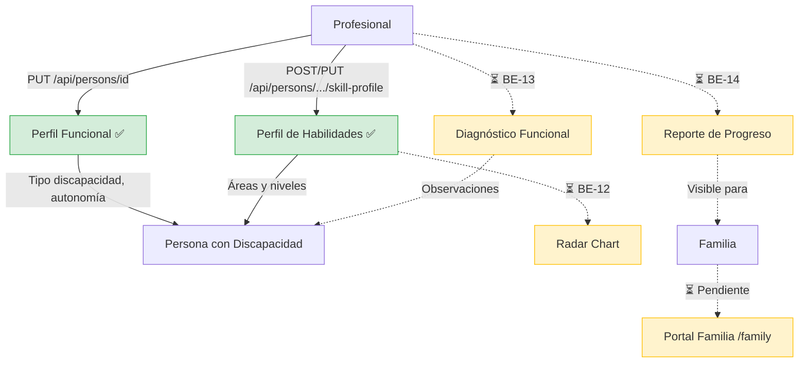

# Proceso 04 — Evaluación y Generación de Informes

**Origen:** Proyecto final (Proceso 4: Evaluación y Generación de Informes)

## Descripción
Proceso de evaluación formal del progreso de la persona con discapacidad, incluyendo diagnósticos funcionales, reportes de progreso y visualización de métricas. Actualmente solo la edición del perfil funcional de la persona está implementada; los diagnósticos, reportes, radar chart y consulta familiar están pendientes.

## Participantes
- **Profesional** — Edita perfil funcional de la persona
- **Familia** — ⏳ Pendiente: consultará reportes
- **Admin** — ⏳ Pendiente: supervisará métricas globales

## Pasos del proceso

### 1. Edición del Perfil Funcional ✅ Implementado
El profesional edita los datos funcionales de la persona: tipo de discapacidad, nivel de autonomía, perfil de accesibilidad y método de login. La edición se realiza inline desde el detalle de la persona.
- **Endpoint:** `PUT /api/persons/{id}`
- **Método de login:** `PUT /api/persons/{id}/login-method`
- **Frontend:** `/pro/persons/{id}` (edición inline)

### 2. Perfil de Habilidades ✅ Implementado
El profesional configura y actualiza las áreas de habilidad y sus niveles.
- **Crear:** `POST /api/persons/{id}/skill-profile`
- **Leer:** `GET /api/persons/{id}/skill-profile`
- **Actualizar área:** `PUT /api/persons/{id}/skill-profile/{areaId}`

### 3. Diagnóstico Funcional ⏳ Pendiente (BE-13)
El profesional registrará diagnósticos formales con observaciones y recomendaciones.
- No existe controller ni handlers.

### 4. Generación de Reportes ⏳ Pendiente (BE-14)
La plataforma generará reportes de progreso para un período determinado.
- No existe controller ni handlers.

### 5. Radar Chart de Habilidades ⏳ Pendiente (BE-12, FE-12)
Visualización gráfica del nivel de cada área de habilidad de la persona.
- No existen endpoints de datos agregados para el chart.
- Los datos base del skill profile sí existen (`GET /api/persons/{id}/skill-profile`).

### 6. Consulta por Familia ⏳ Pendiente (FE-15)
La familia podrá ver los reportes de su familiar desde el portal familia.
- El portal familia (`/family`) es placeholder.

## Diagrama de flujo

## Estado resumen

| Paso | Estado | Referencia |
|------|--------|------------|
| Edición perfil funcional | ✅ Implementado | — |
| Perfil de habilidades | ✅ Implementado | BE-07 |
| Diagnóstico funcional | ⏳ Pendiente | BE-13 |
| Reportes de progreso | ⏳ Pendiente | BE-14 |
| Radar chart | ⏳ Pendiente | BE-12, FE-12 |
| Consulta familia | ⏳ Pendiente | FE-15 |
