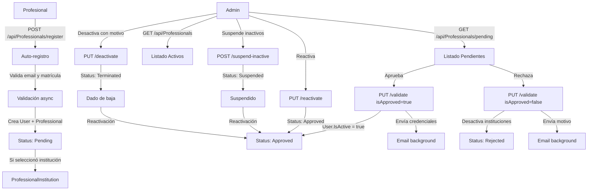
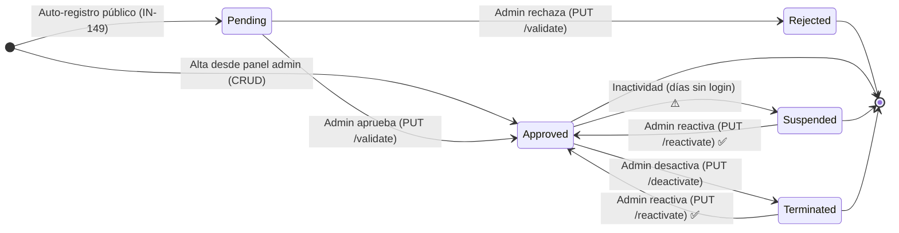

# Proceso 04 — Gestión de Profesionales

**Área:** Gestión de Usuarios

## Descripción
Proceso de auto-registro, validación, edición y gestión del ciclo de vida de profesionales en la plataforma. El profesional es el actor principal del sistema: evalúa personas con discapacidad, crea planes de trabajo, asigna actividades y monitorea el progreso.

## Participantes
- **Profesional** — Se auto-registra, selecciona institución, espera validación
- **Admin Global** — CRUD completo, valida solicitudes sin institución
- **Admin Institucional** — Valida solicitudes de su institución, gestiona profesionales asignados

## Pasos del proceso

### 1. Auto-registro de Profesional (HU IN-149)
El profesional accede al formulario público (`/register-professional`), completa sus datos y selecciona opcionalmente su institución. Se crea el User (inactivo) y el Professional (Pending).
- **Endpoint:** `POST /api/Professionals/register`
- **Validación async:** Email y matrícula se validan en tiempo real (debounce 800ms)
- **Frontend:** `/register-professional` (formulario público)

### 2. Validación por Administrador (HU IN-150)
El admin revisa las solicitudes pendientes en el tab "Validaciones". Puede aprobar (activa usuario, envía credenciales) o rechazar (con motivo, notifica al solicitante).
- **Listado pendientes:** `GET /api/Professionals/pending`
- **Aprobar/Rechazar:** `PUT /api/Professionals/{id}/validate`
- **Frontend:** `/admin/professionals` (tab "Validaciones")

### 3. Consulta de Profesionales
Listado paginado con búsqueda, filtrado por estado (Activos, Suspendidos, Dados de baja), especialidad e institución. Ordenamiento por columnas.
- **Listado:** `GET /api/Professionals` (paginado)
- **Detalle:** `GET /api/Professionals/{id}`
- **Historial de estados:** `GET /api/Professionals/{id}/status-history`
- **Frontend:** `/admin/professionals` (tab "Activos")

### 4. Edición de Profesional
El admin modifica los datos personales del profesional y sus instituciones asignadas.
- **Endpoint:** `PUT /api/Professionals/{id}`

### 5. Desactivación de Profesional
El admin desactiva al profesional con motivo obligatorio. Se desactivan las relaciones con instituciones.
- **Endpoint:** `PUT /api/Professionals/{id}/deactivate`

### 6. Reactivación de Profesional
El admin reactiva un profesional dado de baja o suspendido.
- **Endpoint:** `PUT /api/Professionals/{id}/reactivate`

### 7. Suspensión por Inactividad
Suspende profesionales que no han iniciado sesión en los últimos N días (default 90).
- **Endpoint:** `POST /api/Professionals/suspend-inactive?days=90`

## Diagrama de flujo

## Diagrama de Estados del Profesional

> **⚠️ Suspensión por inactividad:** El endpoint `POST /api/Professionals/suspend-inactive` está implementado, pero aún falta la automatización (background job o tarea programada) que lo ejecute periódicamente. Por ahora se ejecuta manualmente.
>
> **✅ Reactivación:** Completamente implementada. El admin puede reactivar profesionales en estado `Suspended` o `Terminated` desde la tabla de activos.

### Dos caminos de alta

| Camino | Estado inicial | Descripción |
|--------|---------------|-------------|
| **Auto-registro público** (IN-149) | `Pending` | El profesional se registra desde `/register-professional`. Requiere validación del admin. |
| **Alta desde panel admin** (CRUD) | `Approved` | El admin crea el profesional directamente desde `/admin/professionals/new`. Se crea con acceso activo y contraseña temporal. |

## Estados del Profesional

| Estado | Descripción | Transiciones |
|--------|-------------|--------------|
| Pending | Registrado, pendiente de validación | → Approved, Rejected |
| Approved | Validado, acceso activo | → Suspended, Terminated |
| Rejected | Rechazado por el admin | — |
| Suspended | Suspendido por inactividad | → Approved |
| Terminated | Dado de baja por el admin | → Approved |

## Historial de Estados

Cada cambio de estado se registra en `ProfessionalStatusHistory` con:
- Estado anterior y nuevo
- Observación/motivo
- Usuario que realizó el cambio
- Fecha y hora

## Endpoints

| Método | Endpoint | Auth | Descripción |
|--------|----------|------|-------------|
| POST | `/api/Professionals/register` | Público | Auto-registro |
| GET | `/api/Professionals` | `professionals:read` | Listado aprobados |
| GET | `/api/Professionals/pending` | `professionals:read` | Listado pendientes |
| GET | `/api/Professionals/{id}` | `professionals:read` | Detalle |
| GET | `/api/Professionals/me` | Auth | Mi perfil |
| PUT | `/api/Professionals/{id}` | `professionals:update` | Editar |
| PUT | `/api/Professionals/{id}/validate` | `professionals:update` | Aprobar/rechazar |
| PUT | `/api/Professionals/{id}/deactivate` | `professionals:update` | Desactivar |
| PUT | `/api/Professionals/{id}/reactivate` | `professionals:update` | Reactivar |
| GET | `/api/Professionals/{id}/status-history` | `professionals:read` | Historial |
| POST | `/api/Professionals/suspend-inactive` | `professionals:update` | Suspender inactivos |
| GET | `/api/ProfessionalValidation/email` | Público | Validar email |
| GET | `/api/ProfessionalValidation/license-number` | Público | Validar matrícula |
| GET | `/api/Institutions` | Público | Listado instituciones |
