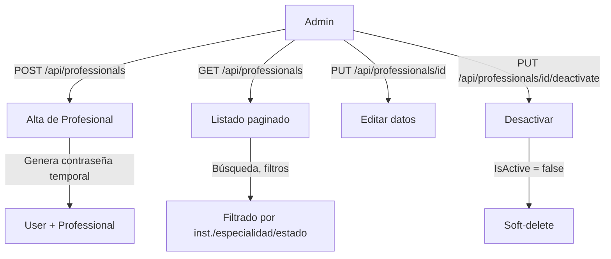

# Proceso 04 — Gestión de Profesionales

**Área:** Gestión de Usuarios

## Descripción
Proceso de alta, edición y desactivación de profesionales en la plataforma. El profesional es el actor principal del sistema: evalúa personas con discapacidad, crea planes de trabajo, asigna actividades y monitorea el progreso. El admin (global o institucional) gestiona el ciclo de vida del profesional.

## Participantes
- **Admin Global** — CRUD completo de profesionales
- **Admin Institucional** — CRUD de profesionales dentro de su institución

## Pasos del proceso

### 1. Alta de Profesional
El admin crea el profesional con datos personales y credenciales. Se genera contraseña temporal que el profesional debe cambiar en su primer login.
- **Endpoint:** `POST /api/professionals`
- **Transacción:** Crea `User` + `Professional` en la misma operación
- **Frontend:** `/admin/professionals` (formulario)

### 2. Consulta de Profesionales
Listado paginado con búsqueda, filtrado por especialidad, institución y estado activo/inactivo.
- **Listado:** `GET /api/professionals` (paginado)
- **Detalle:** `GET /api/professionals/{id}`
- **Mi perfil:** `GET /api/professionals/me`
- **Frontend:** `/admin/professionals` (DataTable)

### 3. Edición de Profesional
El admin modifica los datos personales del profesional.
- **Endpoint:** `PUT /api/professionals/{id}`
- **Frontend:** `/admin/professionals/{id}` (formulario de edición)

### 4. Desactivación de Profesional
El admin desactiva al profesional (soft-delete). No se eliminan datos históricos.
- **Endpoint:** `PUT /api/professionals/{id}/deactivate`

## Diagrama de flujo

