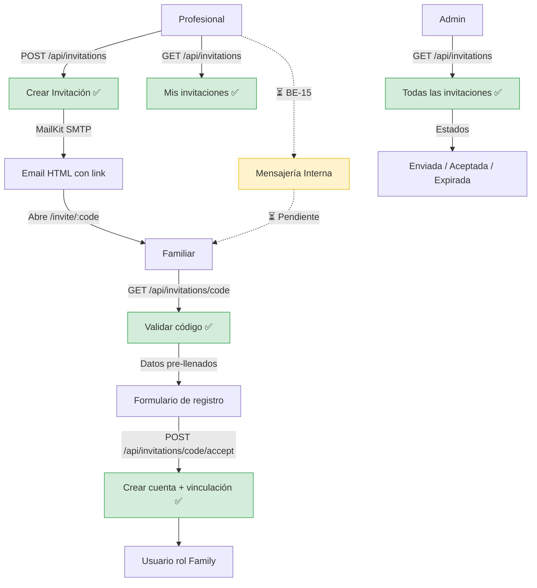

# Proceso 05 — Comunicación

**Origen:** Implementación del sistema (derivado del alcance "Comunicación entre profesionales y familias" del proyecto final)

## Descripción
Procesos de comunicación entre los distintos actores del sistema. Actualmente el único canal implementado son las invitaciones familiares por email SMTP. La mensajería interna y las notificaciones están pendientes de desarrollo.

## Participantes
- **Profesional** — Genera invitaciones por email
- **Familia** — Recibe invitaciones y se registra
- **Admin** — Consulta y gestiona invitaciones

## Canales de comunicación

### 1. Invitaciones Familiares (Email) ✅ Implementado
El profesional genera una invitación con email del familiar y persona asociada. El sistema envía un email SMTP con un link único de registro.

**Endpoints:**
- **Crear invitación:** `POST /api/invitations` — Genera código único y envía email
- **Listar invitaciones:** `GET /api/invitations` — Paginado, con filtrado por institución para admins institucionales
- **Validar código:** `GET /api/invitations/{code}` — Verifica vigencia y devuelve datos pre-llenados
- **Aceptar invitación:** `POST /api/invitations/{code}/accept` — Crea usuario, familiar y vinculación

**Infraestructura de email:**
- SMTP vía MailKit
- Templates HTML con botón de acción y datos pre-llenados
- Configuración Ethereal para desarrollo, configurable para producción

**Frontend:**
- Profesional: `/pro/invitations` (crear y listar invitaciones)
- Admin: `/admin/invitations` (consultar todas las invitaciones)
- Familiar: `/invite/:code` (ruta pública de registro)

**Estados de invitación:**
- **Enviada** — Email enviado, pendiente de aceptación
- **Aceptada** — Familiar completó el registro
- **Expirada** — Código venció sin ser usado

### 2. Mensajería Interna ⏳ Pendiente (BE-15, FE-16)
Sistema de mensajes dentro de la plataforma entre profesional y familia.
- No existe controller ni handlers.

### 3. Notificaciones ⏳ Pendiente
Alertas de nuevas actividades, reportes o mensajes.
- No existe implementación.

## Diagrama de flujo

## Estado resumen

| Canal | Estado | Referencia |
|-------|--------|------------|
| Invitaciones por email | ✅ Implementado | — |
| Mensajería interna | ⏳ Pendiente | BE-15, FE-16 |
| Notificaciones | ⏳ Pendiente | — |
