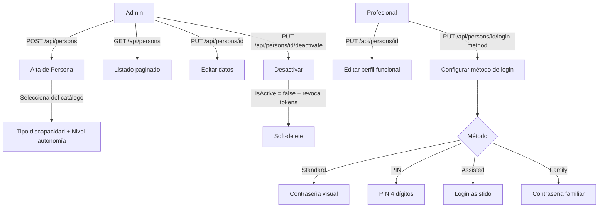

# Proceso 05 — Gestión de Personas con Discapacidad

**Área:** Gestión de Usuarios

## Descripción
Proceso de alta, edición y gestión de las personas con discapacidad en la plataforma. La persona es el destinatario central del sistema: recibe planes de trabajo, realiza actividades y su progreso es monitoreado por profesionales y familiares. Se configura su tipo de discapacidad, nivel de autonomía, perfil de accesibilidad y método de login adaptativo.

## Participantes
- **Admin Global** — CRUD completo
- **Admin Institucional** — CRUD dentro de su institución
- **Profesional** — Edita datos funcionales de sus personas asignadas

## Pasos del proceso

### 1. Alta de Persona
El admin registra la persona con datos personales, tipo de discapacidad (del catálogo), nivel de autonomía y perfil de accesibilidad.
- **Endpoint:** `POST /api/persons`
- **Frontend:** `/admin/persons` (formulario)

### 2. Consulta de Personas
Listado paginado con búsqueda. Admins institucionales ven solo personas de sus instituciones.
- **Listado:** `GET /api/persons` (paginado)
- **Detalle:** `GET /api/persons/{id}`
- **Frontend admin:** `/admin/persons` (DataTable)
- **Frontend profesional:** `/pro/persons/{id}` (detalle con edición inline)

### 3. Edición de Persona
El admin o profesional modifica datos personales y funcionales: tipo de discapacidad, nivel de autonomía, perfil de accesibilidad.
- **Endpoint:** `PUT /api/persons/{id}`
- **Frontend:** Edición inline en detalle de persona

### 4. Configuración del Método de Login
Se asigna el método de login según el nivel de autonomía de la persona (Standard, PIN, Assisted, Family).
- **Endpoint:** `PUT /api/persons/{id}/login-method`
- **Métodos disponibles:** `GET /api/catalogs/login-methods`

### 5. Desactivación de Persona
El admin desactiva a la persona (soft-delete). Se revoca el acceso y las sesiones activas. No se eliminan datos históricos.
- **Endpoint:** `PUT /api/persons/{id}/deactivate`
- **Autorización:** Policy `persons:delete`
- **Transacción:** `User.IsActive = false` + revoca todos los RefreshTokens activos

## Diagrama de flujo

