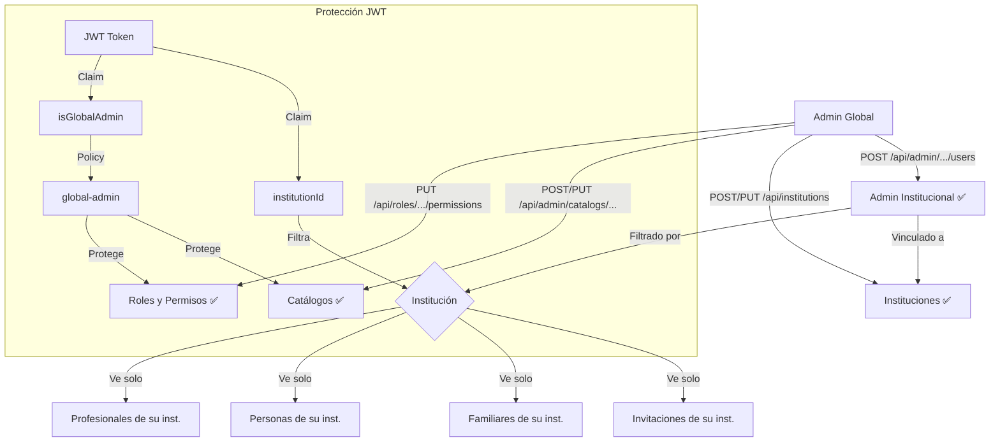

# Proceso 06 — Administración del Sistema

**Origen:** Implementación del sistema (derivado del alcance "Gestión integral de usuarios y roles" del proyecto final)

## Descripción
Procesos de configuración y gestión del sistema por parte de los administradores. El admin global tiene acceso completo al sistema; el admin institucional ve datos filtrados por sus instituciones asignadas. Todas las funciones de administración descritas están implementadas.

## Participantes
- **Admin Global** — Gestión completa del sistema, sin restricción de institución
- **Admin Institucional** — Gestión limitada a los datos de sus instituciones asignadas

## Jerarquía de administración

| Capacidad | Admin Global | Admin Institucional |
|-----------|-------------|-------------------|
| Crear instituciones | ✅ | ❌ |
| Crear admins institucionales | ✅ | ❌ |
| Gestionar roles y permisos | ✅ | ❌ |
| Modificar catálogos | ✅ | ❌ (solo lectura) |
| Crear profesionales | ✅ | ✅ (su institución) |
| Crear personas | ✅ | ✅ (su institución) |
| Crear familiares | ✅ | ✅ (su institución) |
| Ver invitaciones | ✅ Todas | ✅ Solo de su institución |

## Procesos implementados

### 1. Gestión de Roles y Permisos ✅ Implementado
El admin global consulta los roles del sistema y asigna permisos a cada rol usando checkboxes agrupados por módulo.
- **Listar roles:** `GET /api/roles`
- **Detalle de rol:** `GET /api/roles/{id}`
- **Permisos disponibles:** `GET /api/roles/available-permissions`
- **Asignar permisos:** `PUT /api/roles/{id}/permissions`
- **Protección:** `[Authorize(Policy = "global-admin")]`
- **Frontend:** `/admin/roles`

### 2. ABM de Catálogos ✅ Implementado
Gestión de los 6 catálogos del sistema (ver Proceso 09 para detalle completo).
- **Endpoint:** `POST/PUT /api/admin/catalogs/{tipo}`
- **Protección:** `[Authorize(Policy = "global-admin")]`
- **Frontend:** `/admin/catalogs/{tipo}`

### 3. Gestión de Instituciones ✅ Implementado
CRUD de instituciones educativas.
- **Endpoints:** `GET /api/institutions`, `POST /api/institutions`, `PUT /api/institutions/{id}`
- **Frontend:** `/admin/institutions`

### 4. Creación de Admins Institucionales ✅ Implementado
El admin global crea usuarios admin y los vincula a instituciones.
- **Crear admin:** `POST /api/admin/institutions-assignments/users`
- **Asignar institución:** `POST /api/admin/institutions-assignments/{adminUserId}`
- **Desasignar:** `DELETE /api/admin/institutions-assignments/{adminUserId}/{instId}`
- **Listar admins:** `GET /api/admin/institutions-assignments/admins`
- **Mis instituciones:** `GET /api/admin/institutions-assignments/me`
- **Frontend:** `/admin/admins`

### 5. Gestión de Profesionales ✅ Implementado
CRUD paginado con búsqueda. Admins institucionales ven solo profesionales de sus instituciones.
- **CRUD:** `GET/POST /api/professionals`, `GET/PUT /api/professionals/{id}`
- **Desactivar:** `PUT /api/professionals/{id}/deactivate`
- **Frontend:** `/admin/professionals`

### 6. Gestión de Personas ✅ Implementado
CRUD paginado con búsqueda. Filtrado por institución para admins institucionales.
- **CRUD:** `GET/POST /api/persons`, `GET/PUT /api/persons/{id}`
- **Frontend:** `/admin/persons`

### 7. Gestión de Familiares ✅ Implementado
CRUD paginado con búsqueda. Filtrado por institución para admins institucionales.
- **CRUD:** `GET/POST /api/family`, `GET/PUT /api/family/{id}`
- **Desactivar:** `PUT /api/family/{id}/deactivate`
- **Frontend:** `/admin/family`

### 8. Gestión de Invitaciones ✅ Implementado
Consulta de todas las invitaciones con filtrado por institución.
- **Listar:** `GET /api/invitations`
- **Frontend:** `/admin/invitations`

### 9. Perfil del usuario autenticado ✅ Implementado
Cualquier usuario puede consultar su propio perfil.
- **Endpoint:** `GET /api/users/me`

## Filtrado por Institución ✅ Implementado
Los admins institucionales solo ven datos de sus instituciones asignadas. La cadena de filtrado:
```
Admin Institucional
  → AdminInstitution (sus instituciones)
    → ProfessionalInstitution (profesionales de esas instituciones)
      → ProfessionalPerson (personas de esos profesionales)
        → PersonRepresentative (familiares de esas personas)
        → Invitation (invitaciones de esos profesionales)
```

## Diagrama de flujo


