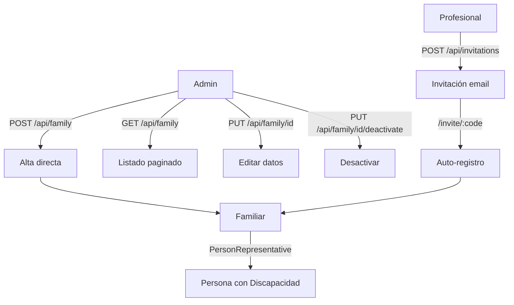

# Proceso 06 — Gestión de Familiares

**Área:** Gestión de Usuarios

## Descripción
Proceso de alta, edición y desactivación de los representantes familiares en la plataforma. Los familiares son los acompañantes de la persona con discapacidad: monitorean su progreso, reciben reportes y se comunican con los profesionales. Pueden darse de alta por dos vías: CRUD directo del admin o registro vía invitación.

## Participantes
- **Admin Global** — CRUD completo de familiares
- **Admin Institucional** — CRUD dentro de su institución
- **Profesional** — Invita familiares vía email (ver Proceso 07)

## Pasos del proceso

### 1. Alta de Familiar (vía Admin) ✅ Implementado
El admin crea directamente al familiar con datos personales, vinculándolo a una persona con discapacidad.
- **Endpoint:** `POST /api/family`
- **Frontend:** `/admin/family` (formulario)

### 2. Alta de Familiar (vía Invitación) ✅ Implementado
El familiar se registra desde una ruta pública usando un código de invitación generado por un profesional. Se crea automáticamente el usuario, el perfil de familiar y la vinculación con la persona.
- **Validar código:** `GET /api/invitations/{code}`
- **Aceptar:** `POST /api/invitations/{code}/accept`
- **Frontend:** `/invite/:code` (ruta pública)
- Ver detalle completo en **Proceso 07 — Gestión de Invitaciones**

### 3. Consulta de Familiares ✅ Implementado
Listado paginado con búsqueda. Filtrado por institución para admins institucionales.
- **Listado:** `GET /api/family` (paginado)
- **Detalle:** `GET /api/family/{id}`
- **Frontend:** `/admin/family` (DataTable)

### 4. Edición de Familiar ✅ Implementado
El admin modifica los datos personales del familiar.
- **Endpoint:** `PUT /api/family/{id}`

### 5. Desactivación de Familiar ✅ Implementado
El admin desactiva al familiar (soft-delete).
- **Endpoint:** `PUT /api/family/{id}/deactivate`

## Diagrama de flujo

## Estado resumen

| Paso | Estado |
|------|--------|
| Alta vía admin | ✅ Implementado |
| Alta vía invitación | ✅ Implementado |
| Consulta de familiares | ✅ Implementado |
| Edición | ✅ Implementado |
| Desactivación | ✅ Implementado |
