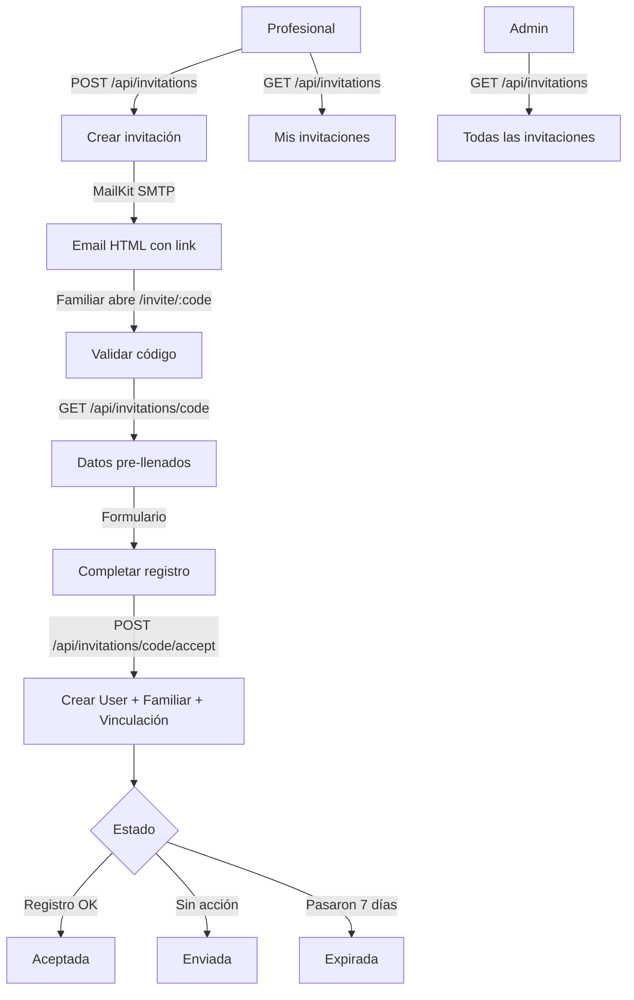

# Proceso 07 — Gestión de Invitaciones

**Área:** Gestión de Usuarios

## Descripción
Proceso de generación, envío y aceptación de invitaciones por email para el registro de familiares en la plataforma. El profesional genera una invitación con el email del familiar y la persona asociada; el sistema envía un email SMTP con un link único de registro; el familiar completa el formulario y queda vinculado automáticamente.

## Participantes
- **Profesional** — Genera invitaciones para familiares de sus personas asignadas
- **Admin** — Consulta todas las invitaciones
- **Familiar** — Recibe email y se registra

## Pasos del proceso

### 1. Crear Invitación ✅ Implementado
El profesional ingresa email, nombre, apellido y relación del familiar, y selecciona la persona con discapacidad asociada. El sistema genera un código único y envía un email SMTP.
- **Endpoint:** `POST /api/invitations`
- **Frontend:** `/pro/invitations` (formulario de invitación)

### 2. Envío de Email ✅ Implementado
El sistema envía un email HTML con un botón de acción que enlaza a `/invite/:code`.
- **Infraestructura:** SMTP vía MailKit
- **Templates:** HTML con datos pre-llenados del familiar y la persona
- **Configuración:** Ethereal para desarrollo, configurable para producción

### 3. Validación de Código ✅ Implementado
Cuando el familiar abre el link, el sistema valida el código y devuelve los datos pre-llenados.
- **Endpoint:** `GET /api/invitations/{code}` (público, sin JWT)
- **Validaciones:** Código existente, no expirado, no aceptado

### 4. Aceptación y Registro ✅ Implementado
El familiar completa el formulario de registro. El sistema crea en una transacción: el usuario, el perfil de familiar y la vinculación (`PersonRepresentative`) con la persona.
- **Endpoint:** `POST /api/invitations/{code}/accept` (público)
- **Frontend:** `/invite/:code` (formulario público)

### 5. Consulta de Invitaciones ✅ Implementado
El profesional ve sus invitaciones; el admin ve todas con filtrado por institución.
- **Endpoint:** `GET /api/invitations` (paginado)
- **Frontend profesional:** `/pro/invitations`
- **Frontend admin:** `/admin/invitations`

### Estados de invitación
- **Enviada** — Email enviado, pendiente de aceptación
- **Aceptada** — Familiar completó el registro
- **Expirada** — Código venció (7 días) sin ser usado

## Diagrama de flujo

## Estado resumen

| Paso | Estado |
|------|--------|
| Crear invitación | ✅ Implementado |
| Envío de email | ✅ Implementado |
| Validación de código | ✅ Implementado |
| Aceptación y registro | ✅ Implementado |
| Consulta de invitaciones | ✅ Implementado |
