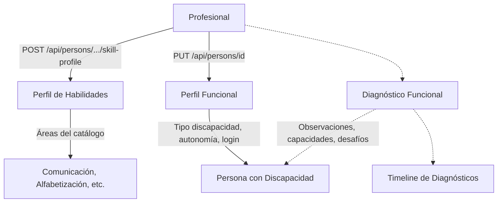

# Proceso 09 — Evaluación y Diagnóstico

**Área:** Evaluación y Planificación

## Descripción
Proceso donde el profesional evalúa a la persona con discapacidad, establece su perfil funcional y registra diagnósticos formales. Corresponde a la Fase 2 del DOCX: el profesional analiza capacidades, limitaciones y necesidades para establecer el punto de partida antes de la intervención. El perfil de habilidades y la edición del perfil funcional están implementados; el diagnóstico formal está pendiente.

## Participantes
- **Profesional** — Evalúa, configura perfiles y diagnostica

## Pasos del proceso

### 1. Configuración del Perfil de Habilidades
El profesional selecciona las áreas de habilidad que se van a trabajar con la persona y establece niveles iniciales.
- **Crear perfil:** `POST /api/persons/{id}/skill-profile`
- **Leer perfil:** `GET /api/persons/{id}/skill-profile`
- **Desactivar área:** `PUT /api/persons/{id}/skill-profile/{areaId}`
- **Frontend:** Sección "Perfil de habilidades" en `/pro/persons/{id}`
- **Catálogo:** `GET /api/catalogs/skill-areas`

### 2. Edición del Perfil Funcional
El profesional edita los datos funcionales de la persona: tipo de discapacidad, nivel de autonomía, perfil de accesibilidad y método de login.
- **Endpoint:** `PUT /api/persons/{id}`
- **Método de login:** `PUT /api/persons/{id}/login-method`
- **Frontend:** `/pro/persons/{id}` (edición inline)

### 3. Diagnóstico Funcional
El profesional registrará diagnósticos formales con fecha, diagnóstico principal, observaciones, capacidades, desafíos, apoyos, objetivos y estrategias.
- **Endpoints previstos:**
  - `GET /api/persons/{id}/diagnoses` (lista por fecha desc)
  - `GET /api/diagnoses/{id}` (detalle)
  - `POST /api/persons/{id}/diagnoses` (crear)
  - `PUT /api/diagnoses/{id}` (editar, solo por el creador)
- **Frontend:** Timeline de diagnósticos en detalle de persona (IN-86)

## Diagrama de flujo

