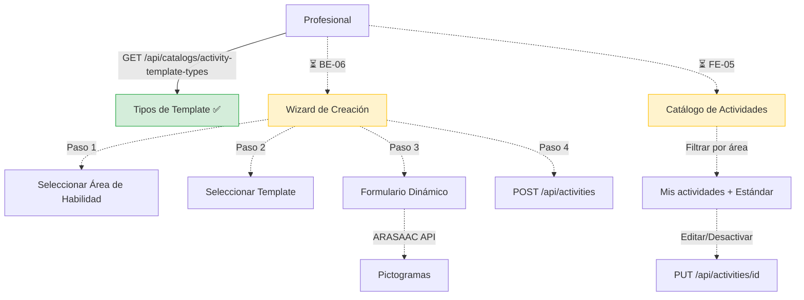

# Proceso 10 — Gestión de Actividades

**Área:** Evaluación y Planificación

## Descripción
Proceso de creación, edición y organización de actividades educativas con contenido dinámico. Las actividades se basan en templates (tipos de actividad) y se vinculan a áreas de habilidad y categorías. El profesional crea actividades propias o usa actividades estándar del sistema. Los catálogos de soporte (categorías, templates, áreas) ya están implementados; el CRUD de actividades está pendiente.

## Participantes
- **Profesional** — Crea, edita y organiza actividades
- **Admin Global** — Gestiona templates y categorías (vía catálogos)

## Pasos del proceso

### 1. Consulta de Templates de Actividad ✅ Implementado
Los tipos de template definen la estructura del contenido dinámico de cada tipo de actividad (selección, emparejamiento, secuencia, completar, respuesta libre). Se consultan como catálogo.
- **Endpoint:** `GET /api/catalogs/activity-template-types`
- No existe controller dedicado de templates; los tipos se gestionan desde el catálogo

### 2. Creación de Actividad ⏳ Pendiente (BE-06, FE-04)
El profesional creará actividades con un wizard multi-paso:
1. Seleccionar área de habilidad
2. Seleccionar template de actividad
3. Completar formulario dinámico según el schema del template
4. Integrar pictogramas ARASAAC (`GET https://api.arasaac.org/api/pictograms/search/{term}?locale=es`)
5. Guardar actividad

- **Endpoints previstos:**
  - `POST /api/activities`
  - `GET /api/activities` (paginado, propias + estándar)
  - `GET /api/activities/{id}`
  - `PUT /api/activities/{id}`
  - `PUT /api/activities/{id}/deactivate`
- **Catálogos de soporte:** `GET /api/catalogs/activity-categories`, `GET /api/catalogs/activity-template-types`

### 3. Catálogo de Actividades del Profesional ⏳ Pendiente (FE-05)
Vista donde el profesional puede navegar sus actividades creadas y las actividades estándar, filtrar por área de habilidad y gestionar su catálogo personal.

## Diagrama de flujo

## Estado resumen

| Paso | Estado | Referencia |
|------|--------|------------|
| Tipos de template (catálogo) | ✅ Implementado | BE-05 |
| Catálogos de soporte | ✅ Implementado | BE-01 |
| CRUD de actividades | ⏳ Pendiente | BE-06, FE-04 |
| Catálogo del profesional | ⏳ Pendiente | FE-05 |
