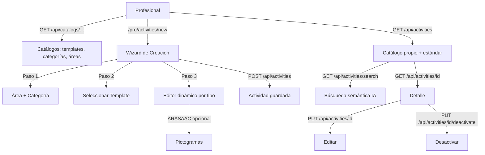

# Proceso 10 — Gestión de Actividades

**Área:** Evaluación y Planificación

## Descripción
Proceso de creación, edición y organización de actividades educativas con contenido dinámico. Las actividades se basan en 5 tipos de template. El profesional crea actividades propias o usa actividades estándar del sistema. Incluye búsqueda semántica por lenguaje natural mediante embeddings ONNX. Todos los pasos están implementados.

## Participantes
- **Profesional** — Crea, edita y organiza actividades
- **Admin Global** — Gestiona templates y categorías (vía catálogos)

## Tipos de Template

| Código | Nombre | Descripción |
|--------|--------|-------------|
| `SELECT_FIGURE` | Selección de figuras | Elegir la figura correcta entre opciones con pictogramas |
| `MATCH_IMAGE_WORD` | Emparejar imagen-palabra | Unir imagen con su palabra correspondiente |
| `ORDER_SEQUENCE` | Ordenar secuencia | Reordenar elementos en el orden correcto |
| `VISUAL_SUM` | Suma visual | Suma con bolitas o pictogramas |
| `COMPLETE_LETTER` | Completar letra | Rellenar letras faltantes en huecos |

## Pasos del proceso

### 1. Consulta de Templates y Categorías
Los tipos de template y categorías se consultan como catálogos.
- `GET /api/catalogs/activity-template-types`
- `GET /api/catalogs/activity-categories`
- `GET /api/catalogs/skill-areas`

### 2. Creación de Actividad
El profesional crea actividades con un wizard multi-paso:
1. Seleccionar área de habilidad y categoría
2. Seleccionar template de actividad
3. Completar formulario dinámico según el template (con editor de contenido específico por tipo)
4. Integrar pictogramas ARASAAC opcionales por ítem (`GET https://api.arasaac.org/api/pictograms/search/{term}?locale=es`)
5. Guardar

- **Endpoint:** `POST /api/activities`
- **Frontend:** `/pro/activities/new` — wizard con editor dinámico por templateTypeCode

### 3. Catálogo de Actividades
El profesional navega sus actividades y las estándar, con búsqueda semántica en lenguaje natural y filtros.
- **Endpoint:** `GET /api/activities` (paginado; filtros: `search`, `categoryId`, `skillAreaId`, `templateTypeId`, `isStandard`, `isActive`)
- **Búsqueda semántica:** `GET /api/activities/search?q={texto}` — embeddings ONNX, busca por similitud de contenido
- **Frontend:** `/pro/activities`

### 4. Detalle y Edición
El profesional puede ver el detalle completo de una actividad propia y editarla.
- **Detalle:** `GET /api/activities/{id}`
- **Editar:** `PUT /api/activities/{id}`
- **Frontend:** `/pro/activities/{id}/edit`

### 5. Desactivación
El profesional desactiva una actividad propia. El sistema valida que no tenga asignaciones activas.
- **Endpoint:** `PUT /api/activities/{id}/deactivate`
- **Restricción:** Rechaza si hay `ActivityAssignment` en estado `Pendiente` o `EnProgreso`

## Diagrama de flujo

## Endpoints

| Método | Endpoint | Auth | Descripción |
|--------|----------|------|-------------|
| GET | `/api/activities` | `activities:read` | Listado paginado con filtros |
| GET | `/api/activities/search` | `activities:read` | Búsqueda semántica por lenguaje natural |
| GET | `/api/activities/{id}` | `activities:read` | Detalle con ContentJson |
| POST | `/api/activities` | `activities:create` | Crear actividad |
| PUT | `/api/activities/{id}` | `activities:update` | Editar actividad propia |
| PUT | `/api/activities/{id}/deactivate` | `activities:update` | Baja lógica |
| GET | `/api/catalogs/activity-categories` | (autenticado) | Catálogo de categorías |
| GET | `/api/catalogs/activity-template-types` | (autenticado) | Catálogo de templates |
