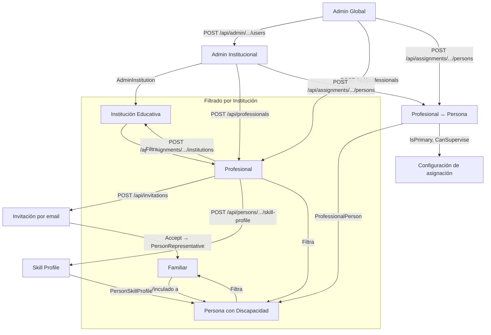
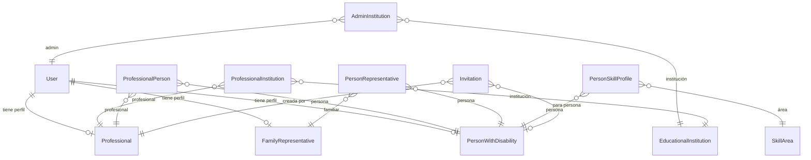

# Proceso 10 — Vinculación de Actores

**Origen:** Proyecto final (Procesos involucrados) + BE-03 + Implementación adicional

## Descripción

Proceso de establecimiento de relaciones entre los distintos actores del sistema. Las vinculaciones definen quién puede ver, gestionar y actuar sobre qué datos. Son la base del filtrado por institución y del alcance de trabajo del profesional. Todas las vinculaciones están implementadas.

## Participantes

- **Admin Global** — Vincula admins a instituciones, profesionales a instituciones, personas a profesionales
- **Admin Institucional** — Vincula profesionales a personas (dentro de su institución)
- **Profesional** — Invita familiares (se vinculan a personas automáticamente)

## Relaciones del sistema ✅ Implementado

| Relación | Tabla intermedia | Campos clave | Quién gestiona |
|----------|-----------------|-------------|----------------|
| Admin ↔ Institución | `AdminInstitution` | AdminUserId, InstitutionId, IsActive | Admin Global |
| Profesional ↔ Institución | `ProfessionalInstitution` | ProfessionalId, InstitutionId, IsActive | Admin |
| Profesional ↔ Persona | `ProfessionalPerson` | ProfessionalId, PersonId, IsPrimaryProfessional, CanSuperviseLogin | Admin |
| Persona ↔ Familiar | `PersonRepresentative` | PersonId, RepresentativeId, IsPrimary, HasInformedConsent, CanSuperviseLogin | Admin / vía Invitación |
| Persona ↔ Área de habilidad | `PersonSkillProfile` | PersonId, SkillAreaId, IsActive | Profesional |

## Pasos del proceso

### 1. Admin Global asigna institución a Admin Institucional ✅ Implementado
Al crear un admin institucional, se lo vincula obligatoriamente a una institución. Esto determina su alcance de datos. Se pueden agregar o quitar instituciones después.
- **Crear admin con institución:** `POST /api/admin/institutions-assignments/users`
- **Agregar institución:** `POST /api/admin/institutions-assignments/{adminUserId}`
- **Quitar institución:** `DELETE /api/admin/institutions-assignments/{adminUserId}/{instId}`
- **Ver instituciones de un admin:** `GET /api/admin/institutions-assignments/{adminUserId}`
- **Ver mis instituciones:** `GET /api/admin/institutions-assignments/me`

### 2. Admin asigna profesional a institución ✅ Implementado
Desde el detalle del profesional (tab Instituciones), se agrega o quita la institución.
- **Asignar:** `POST /api/assignments/{profId}/institutions`
- **Listar:** `GET /api/assignments/{profId}/institutions`
- **Desasignar:** `DELETE /api/assignments/{profId}/institutions/{instId}`

### 3. Admin asigna persona a profesional ✅ Implementado
Desde el detalle del profesional (tab Personas a cargo), se asigna la persona. Se define si es profesional principal y si puede supervisar login asistido.
- **Asignar:** `POST /api/assignments/{profId}/persons`
- **Listar:** `GET /api/assignments/{profId}/persons`
- **Desactivar:** `PUT /api/assignments/{profId}/persons/{personId}/deactivate`

### 4. Vinculación familiar (vía invitación) ✅ Implementado
El profesional crea una invitación con email del familiar y persona asociada. Al aceptar la invitación, se crea automáticamente el `PersonRepresentative` vinculando al familiar con la persona.
- **Crear invitación:** `POST /api/invitations`
- **Aceptar invitación:** `POST /api/invitations/{code}/accept` (crea usuario + familiar + PersonRepresentative)

### 5. Vinculación familiar (vía admin) ✅ Implementado
El admin crea el familiar directamente desde el CRUD.
- **Crear familiar:** `POST /api/family`
- Nota: la vinculación a persona se establece en el formulario de creación.

### 6. Profesional asigna perfil de habilidades ✅ Implementado
El profesional configura las áreas de habilidad que se van a trabajar con la persona.
- **Crear perfil:** `POST /api/persons/{id}/skill-profile`
- **Leer perfil:** `GET /api/persons/{id}/skill-profile`
- **Actualizar área:** `PUT /api/persons/{id}/skill-profile/{areaId}`

### 7. Desvinculación (soft-delete) ✅ Implementado
Todas las relaciones soportan desactivación (IsActive = false) sin eliminar datos históricos.
- Profesional-Persona: `PUT /api/assignments/{profId}/persons/{personId}/deactivate`
- Profesional-Institución: `DELETE /api/assignments/{profId}/institutions/{instId}`
- Admin-Institución: `DELETE /api/admin/institutions-assignments/{adminUserId}/{instId}`
- Profesional: `PUT /api/professionals/{id}/deactivate`
- Familiar: `PUT /api/family/{id}/deactivate`

## Cadena de filtrado por institución

```
Admin Institucional
  → AdminInstitution (sus instituciones)
    → ProfessionalInstitution (profesionales de esas instituciones)
      → ProfessionalPerson (personas de esos profesionales)
        → PersonRepresentative (familiares de esas personas)
        → Invitation (invitaciones de esos profesionales)
```

## Diagrama de flujo



## Diagrama de entidades


