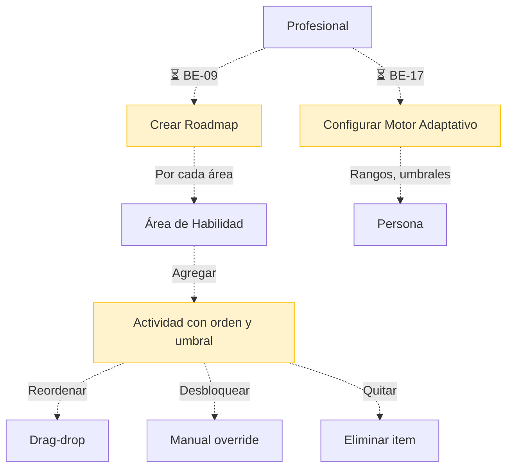

# Proceso 11 — Gestión del Plan de Trabajo (Roadmap)

**Área:** Evaluación y Planificación

## Descripción
Proceso donde el profesional arma el roadmap educativo personalizado para cada persona con discapacidad. El roadmap organiza actividades en secuencia por área de habilidad, define umbrales de desbloqueo y permite gestión manual del orden y progresión. Corresponde a la Fase 3 del DOCX: Intervención y Personalización. Todo el proceso está pendiente de implementación.

## Participantes
- **Profesional** — Crea y gestiona roadmaps para sus personas asignadas

## Pasos del proceso

### 1. Creación del Roadmap ⏳ Pendiente (BE-09, FE-07)
El profesional armará el roadmap agregando actividades en secuencia dentro de cada área de habilidad, con un orden y umbrales de desbloqueo.
- **Endpoints previstos:**
  - `POST /api/persons/{id}/roadmap` (agregar actividad con sequenceOrder, unlockThreshold)
  - `GET /api/persons/{id}/roadmap` (agrupado por área)

### 2. Reordenamiento ⏳ Pendiente (BE-09)
El profesional podrá cambiar el orden de las actividades en el roadmap mediante drag-drop.
- **Endpoint previsto:** `PUT /api/persons/{id}/roadmap/{itemId}/reorder`

### 3. Desbloqueo Manual ⏳ Pendiente (BE-09)
El profesional podrá desbloquear manualmente una actividad del roadmap (sin esperar que se cumpla el umbral automático).
- **Endpoint previsto:** `PUT /api/persons/{id}/roadmap/{itemId}/unlock`

### 4. Eliminación de Item ⏳ Pendiente (BE-09)
El profesional podrá quitar actividades del roadmap.
- **Endpoint previsto:** `DELETE /api/persons/{id}/roadmap/{itemId}`

### 5. Configuración del Motor Adaptativo ⏳ Pendiente (BE-17, FE-17)
El profesional configurará los parámetros del motor de dificultad adaptativa para cada persona: rangos de dificultad, umbrales de frustración, límites de tiempo, número de intentos.
- Las entidades existen (`AdaptiveEngineConfig`, `AdaptiveAdjustmentLog`)
- La lógica no está implementada
- Referencia técnica: `Features/MDA_Especificacion_Tecnica.md`

## Entidades de dominio (existentes)
- `PersonRoadmap` — Roadmap de una persona
- `PersonRoadmapArea` — Área dentro del roadmap
- `PersonRoadmapActivity` — Actividad dentro de un área con orden y umbral

## Diagrama de flujo

## Estado resumen

| Paso | Estado | Referencia |
|------|--------|------------|
| Creación del roadmap | ⏳ Pendiente | BE-09, FE-07 |
| Reordenamiento | ⏳ Pendiente | BE-09 |
| Desbloqueo manual | ⏳ Pendiente | BE-09 |
| Eliminación de item | ⏳ Pendiente | BE-09 |
| Configuración MDA | ⏳ Pendiente | BE-17, FE-17 |
