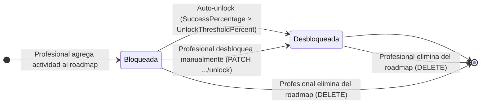
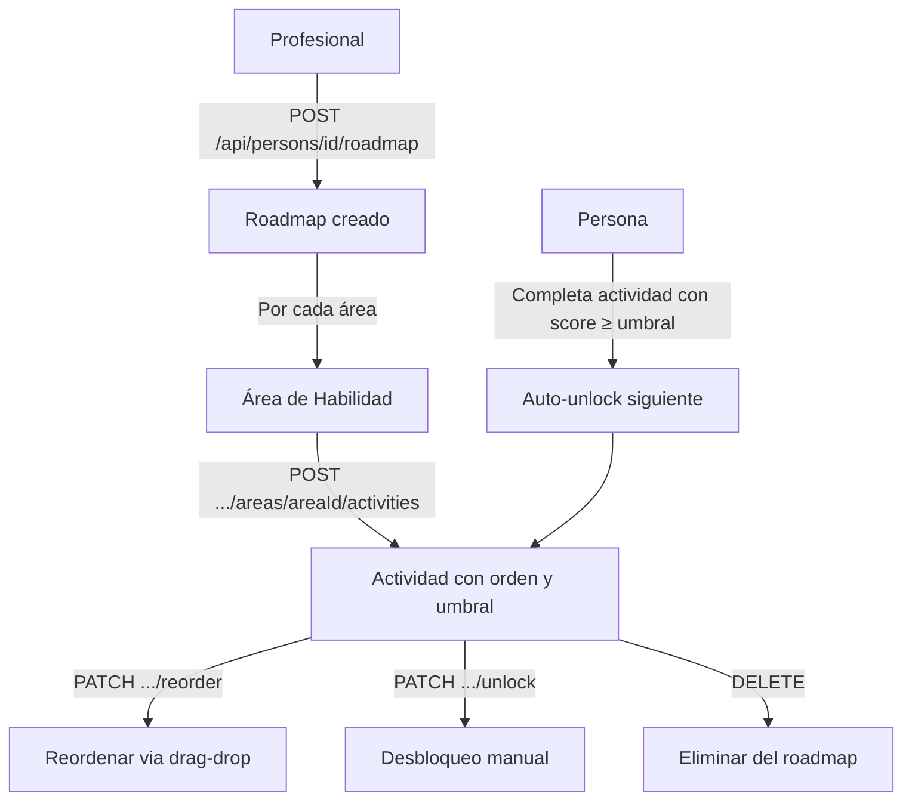

# Proceso 11 — Gestión del Plan de Trabajo (Roadmap)

**Área:** Evaluación y Planificación

## Descripción
El profesional arma el roadmap educativo personalizado para cada persona con discapacidad. El roadmap organiza actividades en secuencia por área de habilidad, define umbrales de desbloqueo progresivo y permite gestión manual del orden y progresión. Corresponde a la Fase 3 del DOCX: Intervención y Personalización.

## Participantes
- **Profesional** — Crea y gestiona roadmaps para sus personas asignadas
- **Sistema** — Auto-desbloquea la siguiente actividad al superar el umbral de rendimiento

## Estados de actividad en el roadmap — PersonRoadmapActivity

> **Umbral por defecto:** 60%. Configurable por actividad en el roadmap.
> **Primera actividad de cada área:** Se crea desbloqueada automáticamente.

## Pasos del proceso

### 1. Creación del Roadmap
El profesional crea el roadmap para la persona. Si ya existe, el endpoint es idempotente.
- **Endpoint:** `POST /api/persons/{id}/roadmap`

### 2. Agregar Actividades por Área
El profesional agrega actividades al roadmap agrupadas por área de habilidad, con orden y umbral.
- **Endpoint:** `POST /api/persons/{id}/roadmap/areas/{areaId}/activities`
- **Body:** `{ activityId, sequenceOrder, unlockThresholdPercent }`

### 3. Consulta del Roadmap
Devuelve el roadmap agrupado por área con estado de desbloqueo de cada actividad.
- **Endpoint:** `GET /api/persons/{id}/roadmap`

### 4. Reordenamiento
El profesional cambia el orden de las actividades en el roadmap mediante drag-drop.
- **Endpoint:** `PATCH /api/persons/{id}/roadmap/areas/{areaId}/activities/reorder`
- **Body:** `[{ id, sequenceOrder }]`

### 5. Desbloqueo Manual
El profesional desbloquea manualmente una actividad sin esperar que se cumpla el umbral.
- **Endpoint:** `PATCH /api/persons/{id}/roadmap/activities/{itemId}/unlock`

### 6. Eliminación de Item
El profesional quita una actividad del roadmap (soft-delete).
- **Endpoint:** `DELETE /api/persons/{id}/roadmap/activities/{itemId}`

### 7. Auto-desbloqueo por Umbral
Al completar una actividad, el sistema verifica si el porcentaje de éxito supera el umbral configurado y desbloquea automáticamente la siguiente actividad del área.
- **Trigger:** `POST /api/activity-assignments/{id}/responses/{resId}/complete`
- **Lógica:** En `CompleteActivityResponseCommandHandler`, tras guardar el resultado.

## Entidades de dominio
- `PersonRoadmap` — Roadmap raíz de una persona (uno por persona)
- `PersonRoadmapArea` — Área de habilidad dentro del roadmap
- `PersonRoadmapActivity` — Actividad dentro de un área, con `SequenceOrder`, `IsUnlocked`, `UnlockThresholdPercent`

## Diagrama de flujo

## Endpoints

| Método | Endpoint | Auth | Descripción |
|--------|----------|------|-------------|
| POST | `/api/persons/{id}/roadmap` | `activities:create` | Crear roadmap |
| GET | `/api/persons/{id}/roadmap` | `activities:read` | Consultar roadmap |
| POST | `/api/persons/{id}/roadmap/areas/{areaId}/activities` | `activities:create` | Agregar actividad |
| PATCH | `/api/persons/{id}/roadmap/areas/{areaId}/activities/reorder` | `activities:create` | Reordenar |
| PATCH | `/api/persons/{id}/roadmap/activities/{itemId}/unlock` | `activities:create` | Desbloqueo manual |
| DELETE | `/api/persons/{id}/roadmap/activities/{itemId}` | `activities:create` | Eliminar del roadmap |
