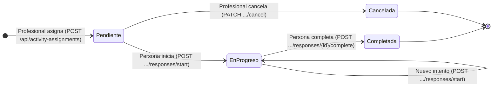
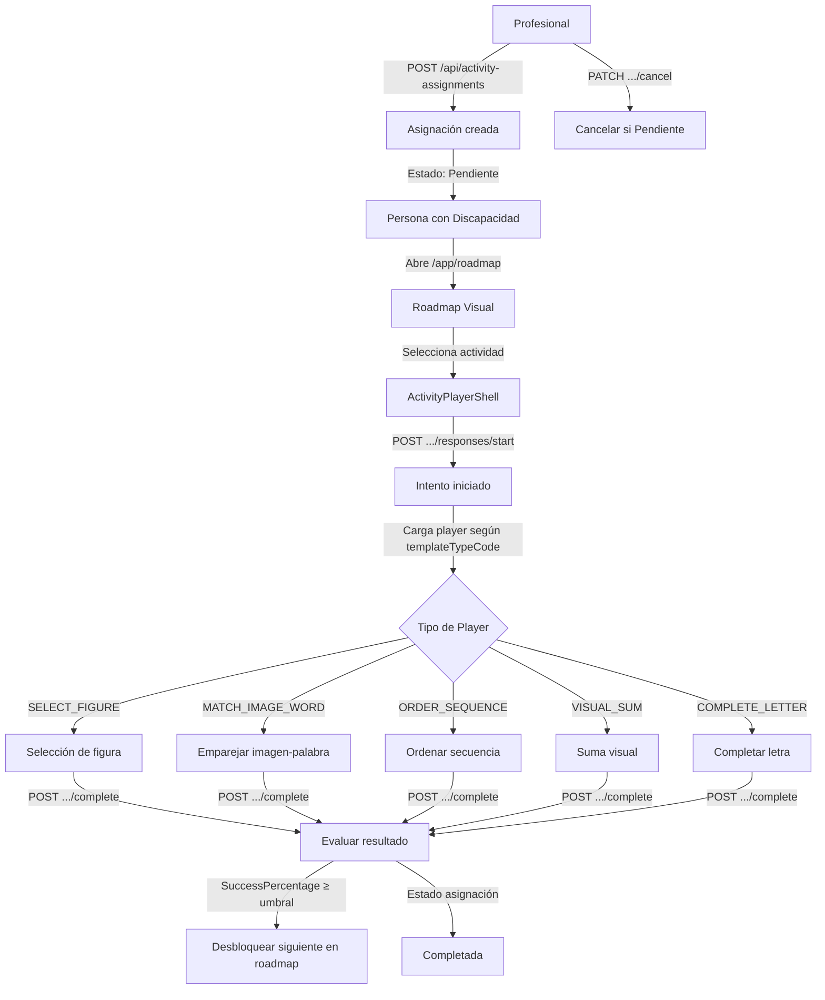

# Proceso 12 — Resolución de Actividades

**Área:** Ejecución

## Descripción
La persona con discapacidad realiza las actividades asignadas desde el portal AAC. Accede al roadmap visual (estilo Duolingo), selecciona una actividad desbloqueada, la realiza en un player interactivo y el sistema registra automáticamente tiempos, aciertos y resultados. Corresponde a la Fase 4 del DOCX.

## Participantes
- **Persona con discapacidad** — Realiza las actividades desde `/app`
- **Sistema** — Registra respuestas, evalúa resultados, desbloquea siguiente actividad automáticamente

## Máquina de estados — ActivityAssignment

> **Nota:** Solo asignaciones en estado `Pendiente` pueden cancelarse. Una vez `EnProgreso` o `Completada`, la asignación no puede cancelarse.
> **Múltiples intentos:** Si la asignación ya está `EnProgreso`, nuevos intentos (start) crean otro `ActivityResponse` sin cambiar el estado de la asignación.

## Resultado de cada intento — ActivityResponse.Result

| Resultado | Condición | Descripción |
|-----------|-----------|-------------|
| `Exito`   | SuccessPercentage ≥ 80% | Actividad dominada |
| `Parcial` | SuccessPercentage ≥ 50% | Progreso parcial |
| `Fallido` | SuccessPercentage < 50%  | Requiere refuerzo |

## Pasos del proceso

### 1. Visualización del Roadmap
La persona accede a su roadmap visual desde el portal AAC (`/app/roadmap`). Ve las actividades agrupadas por área de habilidad, con indicador de estado (bloqueada, disponible, completada).
- **Endpoint:** `GET /api/persons/{id}/roadmap`

### 2. Consulta de Asignación
Al seleccionar una actividad, el sistema carga los datos completos de la asignación incluyendo `ContentJson` y `TemplateTypeCode`.
- **Endpoints:**
  - `GET /api/activity-assignments/{id}` (detalle con ContentJson + TemplateTypeCode)
  - `GET /api/my/activity-assignments` (todas las asignaciones del estudiante autenticado)

### 3. Inicio de Actividad
La persona inicia la actividad. El sistema crea un `ActivityResponse` y cambia el estado a `EnProgreso`.
- **Endpoint:** `POST /api/activity-assignments/{id}/responses/start`
- **Restricción:** No se puede iniciar si está `Completada` o `Cancelada`

### 4. Ejecución en Player
El `ActivityPlayerShell` carga dinámicamente el componente de player correcto según el `templateType.code`. Hay 5 tipos implementados:

| Código | Player | Descripción |
|--------|--------|-------------|
| `SELECT_FIGURE` | SelectFigurePlayerComponent | Elegir la figura correcta con pictograma |
| `MATCH_IMAGE_WORD` | MatchImageWordPlayerComponent | Unir imagen con palabra (click-click) |
| `ORDER_SEQUENCE` | OrderSequencePlayerComponent | Ordenar elementos con botones ▲▼ |
| `VISUAL_SUM` | VisualSumPlayerComponent | Suma visual con bolitas/pictogramas |
| `COMPLETE_LETTER` | CompleteLetterPlayerComponent | Completar letras faltantes por hueco |

### 5. Completar Actividad
Al finalizar, el sistema evalúa el porcentaje de éxito, registra el resultado y desbloquea la siguiente actividad del roadmap si se cumple el umbral.
- **Endpoint:** `POST /api/activity-assignments/{id}/responses/{resId}/complete`
- **Transacción:** Evaluar resultado → Marcar `Completada` → Auto-unlock siguiente si ≥ umbral

### 6. Cancelar Asignación (Profesional)
El profesional puede cancelar una asignación que aún no fue iniciada por la persona.
- **Endpoint:** `PATCH /api/activity-assignments/{id}/cancel`
- **Restricción:** Solo si está en estado `Pendiente`

## Diagrama de flujo

## Endpoints

| Método | Endpoint | Auth | Descripción |
|--------|----------|------|-------------|
| POST | `/api/activity-assignments` | `activities:create` | Asignar actividad |
| GET | `/api/activity-assignments/{id}` | `activities:read` | Detalle con ContentJson |
| GET | `/api/persons/{id}/activity-assignments` | `activities:read` | Asignaciones de persona |
| GET | `/api/my/activity-assignments` | `activities:read` | Mis asignaciones (por token) |
| POST | `/api/activity-assignments/{id}/responses/start` | `activities:respond` | Iniciar intento |
| POST | `/api/activity-assignments/{id}/responses/{resId}/complete` | `activities:respond` | Completar intento |
| PATCH | `/api/activity-assignments/{id}/cancel` | `activities:create` | Cancelar asignación pendiente |
