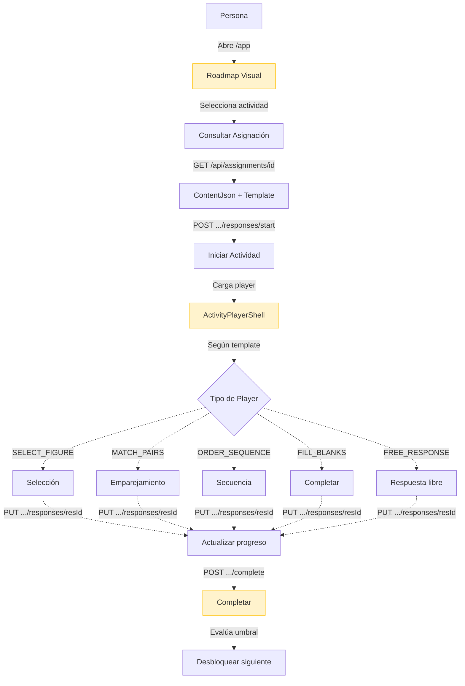

# Proceso 12 — Resolución de Actividades

**Área:** Ejecución

## Descripción
Proceso donde la persona con discapacidad realiza las actividades asignadas desde el portal AAC. Es el proceso core del alumno: accede a su roadmap visual (estilo Duolingo), selecciona una actividad desbloqueada, la realiza en un player interactivo y el sistema registra automáticamente tiempos, aciertos, errores y patrones. Corresponde a la Fase 4 del DOCX. Todo el proceso está pendiente de implementación.

## Participantes
- **Persona con discapacidad** — Realiza las actividades
- **Sistema** — Registra respuestas, evalúa resultados, desbloquea siguiente actividad

## Pasos del proceso

### 1. Visualización del Roadmap ⏳ Pendiente (FE-09)
La persona accede a su roadmap visual desde el portal AAC (`/app`). Ve las actividades agrupadas por área de habilidad, con indicador de estado (bloqueada, disponible, completada).
- **Endpoint previsto:** `GET /api/persons/{id}/roadmap`
- **Frontend previsto:** Componente tipo Duolingo en `/app`

### 2. Consulta de Asignación ⏳ Pendiente (BE-10)
Al seleccionar una actividad, el sistema carga los datos completos de la asignación incluyendo el contenido dinámico y el tipo de template.
- **Endpoints previstos:**
  - `GET /api/persons/{id}/assignments` (filtros: status, skillAreaId, isEvaluation)
  - `GET /api/assignments/{id}` (detalle con ContentJson + templateType.code)

### 3. Inicio de Actividad ⏳ Pendiente (BE-11)
La persona inicia la actividad. El sistema crea un `ActivityResponse` y cambia el estado a "En Progreso".
- **Endpoint previsto:** `POST /api/assignments/{id}/responses/start`

### 4. Ejecución en Player ⏳ Pendiente (FE-10, FE-11)
El `ActivityPlayerShell` carga dinámicamente el componente de player correcto según el `templateType.code`. Hay 5 tipos de player:
1. **Selección** — Elegir la opción correcta
2. **Emparejamiento** — Unir pares
3. **Secuencia** — Ordenar elementos
4. **Completar** — Rellenar espacios
5. **Respuesta libre** — Respuesta abierta

Durante la ejecución, el sistema actualiza nivel de frustración, intentos y patrones de respuesta.
- **Endpoint previsto:** `PUT /api/assignments/{id}/responses/{resId}`
- **Monitoreo:** `FrustrationMonitorService` controla intentos y frustración

### 5. Completar Actividad ⏳ Pendiente (BE-11)
Al finalizar, el sistema evalúa el porcentaje de éxito, registra el resultado y desbloquea la siguiente actividad del roadmap si se cumple el umbral.
- **Endpoint previsto:** `POST /api/assignments/{id}/responses/{resId}/complete`
- **Transacción:** Evaluar → Registrar resultado → Desbloquear siguiente

## Diagrama de flujo

## Estado resumen

| Paso | Estado | Referencia |
|------|--------|------------|
| Roadmap visual | ⏳ Pendiente | FE-09 |
| Consulta de asignación | ⏳ Pendiente | BE-10 |
| Inicio de actividad | ⏳ Pendiente | BE-11 |
| Players (5 tipos) | ⏳ Pendiente | FE-10, FE-11 |
| Completar actividad | ⏳ Pendiente | BE-11 |
