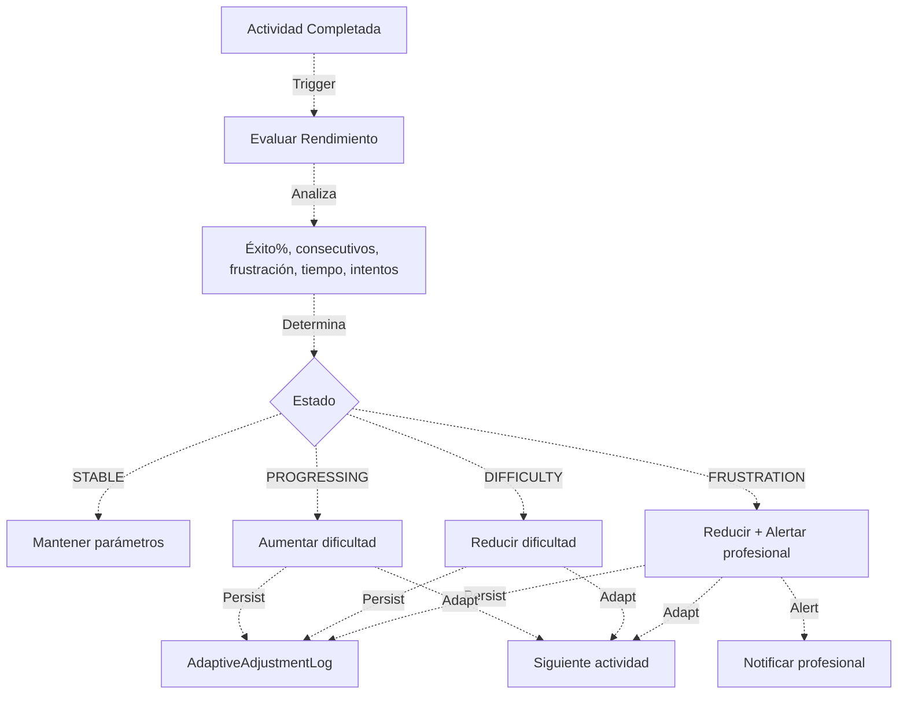

# Proceso 13 — Dificultad Adaptativa (MDA)

**Área:** Ejecución

## Descripción
Proceso automático del Motor de Dificultad Adaptativa que ajusta los parámetros de las actividades según el rendimiento del estudiante. Evalúa éxitos y fracasos consecutivos, detecta frustración y adapta dificultad, tiempo, pistas e intentos dentro de rangos configurados por el profesional. Las entidades de dominio existen pero la lógica de adaptación no está implementada.

## Participantes
- **Sistema** — Ejecuta automáticamente el ajuste tras cada actividad completada
- **Profesional** — Configura rangos y umbrales (ver Proceso 11)

## Estados del motor

| Estado | Descripción | Acción |
|--------|-------------|--------|
| STABLE | Rendimiento consistente | Mantener parámetros |
| PROGRESSING | Éxitos consecutivos superan umbral | Aumentar dificultad |
| DIFFICULTY | Fracasos consecutivos | Reducir dificultad |
| FRUSTRATION | Frustración detectada por patrones | Reducir agresivamente, alertar |

## Pasos del proceso

### 1. Evaluación de Rendimiento (BE-17)
Tras cada actividad completada, el sistema analiza:
- Porcentaje de éxito actual
- Éxitos/fracasos consecutivos
- Nivel de frustración (del `FrustrationMonitorService`)
- Tiempo empleado vs. tiempo límite
- Número de intentos vs. máximo

### 2. Cálculo de Ajuste (BE-17)
El sistema determina el nuevo estado y calcula ajustes dentro de los rangos configurados:
- **Dificultad:** Nivel numérico dentro del rango min-max
- **Tiempo límite:** Segundos permitidos para completar
- **Pistas:** Cantidad de ayudas disponibles
- **Intentos:** Número máximo de intentos

### 3. Aplicación de Ajuste (BE-17)
Se persisten los nuevos parámetros y se aplican a la siguiente actividad del roadmap.
- **Pipeline:** Persist → Adapt → Unlock → Alert

### 4. Registro de Auditoría (BE-17)
Cada ajuste se registra en `AdaptiveAdjustmentLog` para trazabilidad y análisis posterior.
- **Endpoint previsto:** `GET /api/persons/{id}/adaptive-log` (historial de ajustes)
- **Frontend previsto:** Timeline de ajustes adaptativos (FE-18)

## Entidades de dominio (existentes)
- `AdaptiveEngineConfig` — Rangos y umbrales configurados por el profesional (1:0..1 con PersonRoadmapActivity)
- `AdaptiveAdjustmentLog` — Registro de cada ajuste realizado

## Diagrama de flujo

**Referencia técnica completa:** `Features/MDA_Especificacion_Tecnica.md`
