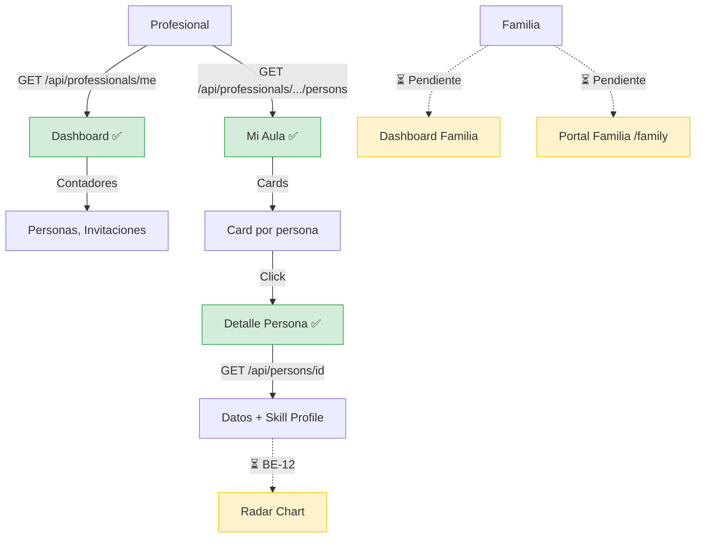

# Proceso 14 — Seguimiento de Avances

**Área:** Monitoreo y Reportes

## Descripción
Proceso de monitoreo del progreso de las personas con discapacidad por parte de profesionales y familiares. El profesional cuenta con un dashboard con contadores reales, una vista "Mi Aula" con cards de personas asignadas y acceso al detalle completo de cada persona. El radar chart de habilidades y el portal familia están pendientes.

## Participantes
- **Profesional** — Monitorea progreso desde dashboard y Mi Aula
- **Familia** — ⏳ Pendiente: consultará progreso desde el portal familia

## Pasos del proceso

### 1. Dashboard del Profesional ✅ Implementado
El profesional ve contadores reales: total de personas asignadas, invitaciones pendientes y aceptadas.
- **Datos obtenidos de:** `GET /api/professionals/me`, `GET /api/invitations`
- **Frontend:** `/pro/dashboard`

### 2. Mi Aula ✅ Implementado
Vista de cards con avatar coloreado de cada persona asignada. Cada card permite acceso rápido al detalle.
- **Datos obtenidos de:** `GET /api/professionals/{profId}/persons`
- **Frontend:** `/pro/dashboard` (sección Mi Aula)

### 3. Detalle de Persona ✅ Implementado
El profesional accede al detalle completo: datos personales, tipo de discapacidad, nivel de autonomía, perfil de accesibilidad, método de login y perfil de habilidades.
- **Endpoint:** `GET /api/persons/{id}`, `GET /api/persons/{id}/skill-profile`
- **Frontend:** `/pro/persons/{id}` con edición inline

### 4. Radar Chart de Habilidades ⏳ Pendiente (BE-12, FE-12)
Visualización gráfica tipo radar/spider del nivel de cada área de habilidad, calculado como promedio de `successPercentage` de las respuestas de actividades.
- **Endpoint previsto:** `GET /api/persons/{id}/radar`
- **Frontend previsto:** Chart.js radar chart en detalle de persona

### 5. Dashboard Familia ⏳ Pendiente (BE-12, FE-13)
La familia verá: nombre de la persona, últimas 3 actividades, mensajes no leídos y nuevos reportes.
- **Endpoint previsto:** `GET /api/dashboard/family`
- **Frontend previsto:** `/family/dashboard`

### 6. Portal Familia ⏳ Pendiente (FE-15)
La familia consultará el progreso completo de su familiar.
- El portal familia (`/family`) tiene layout y rutas pero el contenido es placeholder.

## Diagrama de flujo

## Estado resumen

| Paso | Estado | Referencia |
|------|--------|------------|
| Dashboard profesional | ✅ Implementado | — |
| Mi Aula | ✅ Implementado | — |
| Detalle de persona | ✅ Implementado | — |
| Radar chart | ⏳ Pendiente | BE-12, FE-12 |
| Dashboard familia | ⏳ Pendiente | BE-12, FE-13 |
| Portal familia | ⏳ Pendiente | FE-15 |
