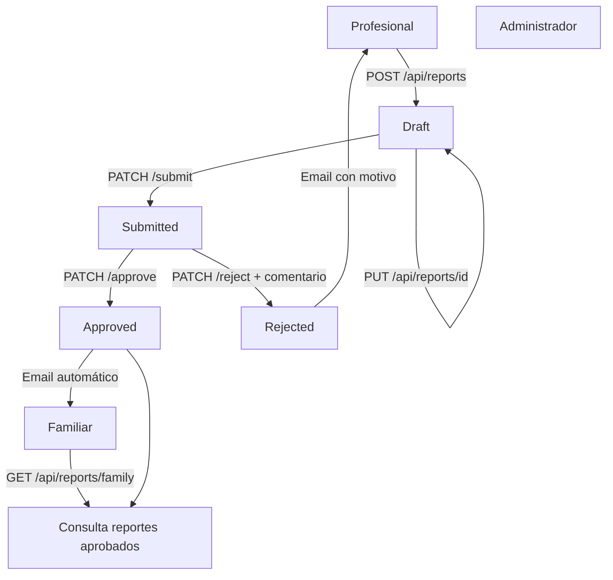

# Proceso 15 — Generación y Aprobación de Reportes de Progreso

**Área:** Monitoreo y Reportes

## Descripción

El profesional genera reportes de progreso para una persona a cargo. Antes de quedar visibles para la familia, los reportes pasan por un ciclo de revisión administrativo. El admin aprueba o rechaza con comentario; la familia solo accede a reportes aprobados.

## Participantes

- **Profesional** — Crea y edita borradores, envía al admin para revisión, recibe notificación si es rechazado
- **Administrador** — Revisa los reportes enviados, aprueba o rechaza con comentario obligatorio
- **Familiar** — Consulta los reportes aprobados de su persona a cargo, recibe notificación al aprobarse

---

## Pasos del proceso

### 1. Creación del borrador

El profesional genera un reporte en estado `Draft`. Puede editarlo libremente en este estado.

- **Endpoint:** `POST /api/reports`
- **Permiso:** `reports:create`
- **Campos:** `reportTypeId`, `title`, `reportDate`, `content`, `achievedGoals`, `areasToReinforce`, `futureRecommendations`, `nextObjectives`
- **Estado resultante:** `Draft`

### 2. Edición del borrador

El profesional puede modificar el reporte mientras esté en `Draft`. Cualquier otro estado devuelve `400 InvalidOperation`.

- **Endpoint:** `PUT /api/reports/{id}`
- **Permiso:** `reports:create`
- **Restricción:** Solo el autor puede editar; solo en estado `Draft`

### 3. Envío al administrador

El profesional envía el reporte para revisión. A partir de este punto no puede editarlo.

- **Endpoint:** `PATCH /api/reports/{id}/submit`
- **Permiso:** `reports:submit`
- **Estado resultante:** `Submitted`

### 4. Revisión por el administrador

El admin ve la cola de reportes pendientes y decide aprobar o rechazar.

- **Endpoint cola:** `GET /api/reports?status=Submitted`
- **Permiso:** `reports:approve` / `reports:reject`

#### 4a. Aprobación

- **Endpoint:** `PATCH /api/reports/{id}/approve`
- **Estado resultante:** `Approved`
- **Efecto colateral:** Email a todos los familiares activos vinculados a la persona (background)

#### 4b. Rechazo

- **Endpoint:** `PATCH /api/reports/{id}/reject`
- **Body requerido:** `{ "comment": "..." }` (obligatorio)
- **Estado resultante:** `Rejected`
- **Efecto colateral:** Email al profesional autor con el motivo del rechazo (background)
- **Nota:** Un reporte rechazado no puede reabrirse. El profesional crea un nuevo `Draft`.

### 5. Consulta por el familiar

El familiar accede solo a reportes aprobados de sus personas a cargo, con filtros por fecha y tipo.

- **Endpoint:** `GET /api/reports/family`
- **Permiso:** `reports:read`
- **Filtros:** `dateFrom`, `dateTo`, `reportTypeId`

### 6. Exportación a PDF *(pendiente)*

- **Endpoint previsto:** `GET /api/reports/{id}/export/pdf`
- **Tecnología prevista:** QuestPDF o HTML-to-PDF

---

## Máquina de estados

```
                    ┌─────────────────────────────────┐
                    │                                 │
                    ▼                                 │
             ┌────────────┐                           │
  POST       │            │  PUT /reports/{id}        │
  ──────────►│   DRAFT    │◄──────────────────────────┘
             │  (Borrador)│  (solo editable en este estado)
             └─────┬──────┘
                   │
                   │ PATCH /submit
                   ▼
             ┌─────────────┐
             │  SUBMITTED  │
             │  (Enviado)  │
             └──────┬──────┘
                    │
        ┌───────────┴────────────┐
        │                        │
        │ PATCH /approve          │ PATCH /reject + comentario
        ▼                        ▼
 ┌─────────────┐          ┌─────────────┐
 │  APPROVED   │          │  REJECTED   │
 │  (Aprobado) │          │  (Rechazado)│
 └─────────────┘          └─────────────┘
        │                        │
        │ Email → Familiar        │ Email → Profesional
```

---

## Visibilidad por actor

| Estado | Profesional | Admin | Familiar |
|--------|:-----------:|:-----:|:--------:|
| `Draft` | Ve y edita | No ve | No ve |
| `Submitted` | Solo lectura | Ve y decide | No ve |
| `Approved` | Ve | Ve | Ve |
| `Rejected` | Ve (con motivo) | Ve | No ve |

---

## Notificaciones

| Evento | Destinatario | Template | Implementación |
|--------|-------------|----------|----------------|
| Reporte aprobado | Familiares activos de la persona | `ReportApproved.html` | Fire-and-forget (`Task.Run`) |
| Reporte rechazado | Profesional autor | `ReportRejected.html` | Fire-and-forget (`Task.Run`) |

---

## Endpoints implementados

| Método | Endpoint | Permiso | Actor |
|--------|----------|---------|-------|
| GET | `/api/reports` | `reports:read` | Profesional |
| POST | `/api/reports` | `reports:create` | Profesional |
| PUT | `/api/reports/{id}` | `reports:create` | Profesional |
| PATCH | `/api/reports/{id}/submit` | `reports:submit` | Profesional |
| GET | `/api/reports?status=Submitted` | `reports:approve` | Admin |
| PATCH | `/api/reports/{id}/approve` | `reports:approve` | Admin |
| PATCH | `/api/reports/{id}/reject` | `reports:reject` | Admin |
| GET | `/api/reports/family` | `reports:read` | Familiar |

---

## Diagrama de flujo



---

## Archivos clave

| Capa | Archivo |
|------|---------|
| Dominio | `Report.cs`, `ReportStatus.cs` |
| Aplicación | `UseCases/Reports/Commands/` — Create, Update, Submit, Approve, Reject |
| Aplicación | `UseCases/Reports/Queries/` — GetReports, GetFamilyReports, GetReportById |
| Infraestructura | `Data/Repositories/ReportsRepository.cs` |
| Infraestructura | `Templates/Emails/ReportApproved.html`, `ReportRejected.html` |
| API | `Controllers/ReportsController.cs` |
| Migración | `20260414034350_AddReportApprovalWorkflow.cs` |
| Permisos | `Application/Constants/Permissions.cs` → `Reports.*` |
| Documentación | `Features/reportes-flujo-aprobacion.md`, `HU/HU-IN-151-flujo-aprobacion-reportes.md` |
