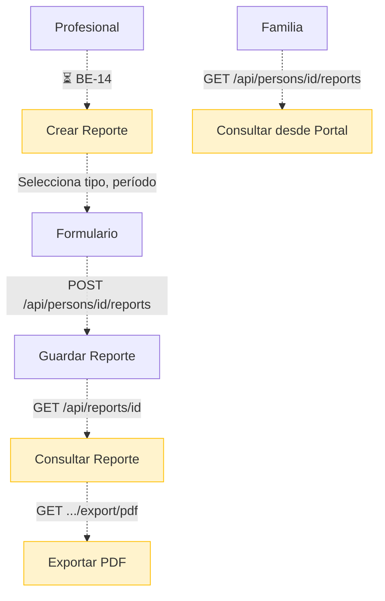

# Proceso 15 — Generación de Informes y Reportes

**Área:** Monitoreo y Reportes

## Descripción
Proceso de generación de reportes formales de progreso de la persona con discapacidad. Los reportes consolidan datos de actividades, respuestas, habilidades y diagnósticos en documentos consultables y exportables. El profesional crea los reportes; la familia puede consultarlos. Todo el proceso está pendiente de implementación.

## Participantes
- **Profesional** — Genera y consulta reportes
- **Familia** — Consulta reportes de su familiar

## Pasos del proceso

### 1. Creación de Reporte ⏳ Pendiente (BE-14, FE-15)
El profesional genera un reporte de progreso seleccionando tipo de reporte (del catálogo), período, título y contenido estructurado.
- **Endpoint previsto:** `POST /api/persons/{id}/reports`
- **Campos:** reportTypeId, title, periodStart, periodEnd, content, achievedGoals, areasToReinforce, futureRecommendations, nextObjectives
- **Catálogo:** `GET /api/catalogs/report-types`

### 2. Consulta de Reportes ⏳ Pendiente (BE-14)
El profesional y la familia consultan los reportes desde sus respectivos portales.
- **Endpoints previstos:**
  - `GET /api/persons/{id}/reports` (lista, visible para profesional y familia)
  - `GET /api/reports/{id}` (detalle completo)

### 3. Exportación a PDF ⏳ Pendiente (BE-14)
Los reportes podrán exportarse a PDF.
- **Endpoint previsto:** `GET /api/reports/{id}/export/pdf`
- **Tecnología prevista:** QuestPDF o HTML-to-PDF

### 4. Consulta por Familia ⏳ Pendiente (FE-15)
La familia accederá a los reportes desde el portal familia.
- **Frontend previsto:** Sección de reportes en `/family`

## Diagrama de flujo

## Estado resumen

| Paso | Estado | Referencia |
|------|--------|------------|
| Creación de reporte | ⏳ Pendiente | BE-14, FE-15 |
| Consulta de reportes | ⏳ Pendiente | BE-14 |
| Exportación PDF | ⏳ Pendiente | BE-14 |
| Consulta por familia | ⏳ Pendiente | FE-15 |
