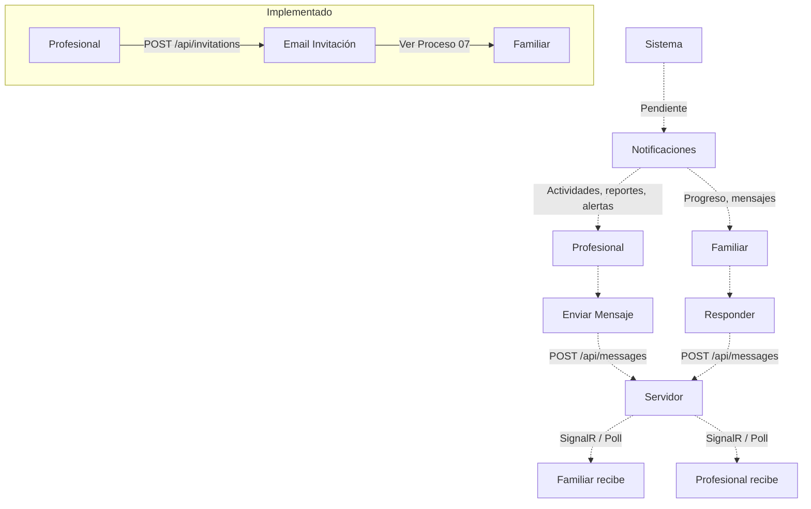

# Proceso 16 — Comunicación entre Actores

**Área:** Comunicación

## Descripción
Procesos de comunicación entre los distintos actores del sistema. Abarca la mensajería interna entre profesionales y familiares, y las notificaciones automáticas del sistema. Las invitaciones por email están implementadas (documentadas en Proceso 07); la mensajería interna y las notificaciones están pendientes.

## Participantes
- **Profesional** — Envía y recibe mensajes
- **Familia** — Envía y recibe mensajes
- **Sistema** — Genera notificaciones automáticas

## Canales de comunicación

### 1. Invitaciones por Email
Canal de comunicación unidireccional para el registro de familiares. Documentado en detalle en el **Proceso 07 — Gestión de Invitaciones**.

### 2. Mensajería Interna
Sistema de mensajes dentro de la plataforma entre profesional y familia, con bandeja de entrada, mensajes enviados y estado de lectura.

**Endpoints previstos:**
- `GET /api/messages` (bandeja de entrada, filtro `?unreadOnly=true`)
- `GET /api/messages/sent` (mensajes enviados)
- `GET /api/messages/{id}` (detalle, marca `ReadAt = now`)
- `POST /api/messages` (enviar: receiverId, subject, content, relatedPersonId?, parentMessageId?)
- `GET /api/messages/unread-count` (para badge en sidebar, polled cada 30s)

**Frontend previsto:**
- `/messages` — Bandeja de entrada con indicador read/unread
- `/messages/sent` — Mensajes enviados
- Composer para nuevo mensaje y respuesta
- `UnreadBadgeComponent` en sidebar (poll cada 30s)
- Se prevé integración con SignalR para tiempo real (dependencia `@microsoft/signalr` ya instalada)

### 3. Notificaciones
Alertas automáticas del sistema ante eventos relevantes:
- Nueva actividad asignada
- Actividad completada por la persona
- Nuevo reporte disponible
- Mensaje recibido
- Alerta de frustración del motor adaptativo

## Diagrama de flujo

