# DER — InclusiON

**Última actualización:** 2026-04-22  
**Fuente:** `InclusiON.Data/AppDbContext.cs` + `InclusiON.Domain/Models/`

```mermaid
erDiagram

    %% ─── IDENTITY / AUTH ────────────────────────────────────────────────────
    User {
        Guid     Id                PK
        string   Email
        string   Name
        string   Surname
        bool     IsActive
        bool     MustChangePassword
        datetime CreatedAt
        datetime LastLoginDate
    }
    RefreshToken {
        Guid     Id           PK
        Guid     UserId       FK
        string   Token
        datetime ExpiresAt
        datetime CreatedAt
        datetime RevokedAt
        bool     IsActive
    }
    TrustedDevice {
        int      Id                  PK
        Guid     UserId              FK
        Guid     AuthorizedByUserId  FK
        string   DeviceId
        string   DeviceName
        string   Browser
        datetime RegisteredAt
        datetime LastUsedAt
    }

    %% ─── CATÁLOGOS ──────────────────────────────────────────────────────────
    DisabilityType {
        int    Id          PK
        string Name
        string Description
        bool   IsActive
    }
    AutonomyLevel {
        int    Id                  PK
        string Name
        bool   RequiresSupervision
        int    DisplayOrder
        bool   IsActive
    }
    LoginMethod {
        int    Id                  PK
        string Code
        string Name
        bool   RequiresEmail
        bool   RequiresPassword
        bool   RequiresPin
        bool   RequiresSupervisor
        bool   IsActive
    }
    ActivityCategory {
        int    Id          PK
        string Name
        string Description
        bool   IsActive
    }
    ReportType {
        int    Id          PK
        string Name
        string Description
        bool   IsActive
    }
    SkillArea {
        int    Id           PK
        string Name
        string Icon
        string Color
        int    DisplayOrder
        bool   IsActive
    }
    ActivityTemplateType {
        int    Id            PK
        int    SkillAreaId   FK
        string Name
        string Code
        string ContentSchema
        string ComponentName
        bool   UsesPictograms
        bool   HasAudio
        int    DisplayOrder
        bool   IsActive
    }

    %% ─── INSTITUCIONES ───────────────────────────────────────────────────────
    EducationalInstitution {
        int    Id      PK
        string Name
        string Address
        string Phone
        string Email
        bool   IsActive
    }
    AdminInstitution {
        Guid     AdminUserId    FK
        int      InstitutionId  FK
        datetime AssignedAt
        bool     IsActive
    }

    %% ─── PERFILES DE USUARIO ─────────────────────────────────────────────────
    Professional {
        Guid     Id                 PK
        Guid     UserId             FK
        string   FirstName
        string   LastName
        string   DocumentNumber
        string   Specialty
        string   LicenseNumber
        string   Status
        datetime ValidatedAt
        bool     IsActive
    }
    ProfessionalStatusHistory {
        Guid   Id              PK
        Guid   ProfessionalId  FK
        string OldStatus
        string NewStatus
        string Observation
        Guid   ChangedByUserId FK
    }
    PersonWithDisability {
        Guid   Id               PK
        Guid   UserId           FK
        int    DisabilityTypeId FK
        int    AutonomyLevelId  FK
        int    LoginMethodId    FK
        Guid   SupervisorUserId FK
        string FirstName
        string LastName
        string DocumentNumber
        date   BirthDate
        string AvatarColor
        bool   UsesAAC
        bool   UsesSignLanguage
        bool   RequiresHighContrast
        bool   RequiresLargeFont
        bool   IsActive
    }
    FamilyRepresentative {
        Guid   Id             PK
        Guid   UserId         FK
        string FirstName
        string LastName
        string DocumentNumber
        string Phone
        string Relationship
        string Status
        bool   IsActive
    }
    FamilyStatusHistory {
        Guid   Id              PK
        Guid   FamilyId        FK
        string OldStatus
        string NewStatus
        string Observation
        Guid   ChangedByUserId FK
    }

    %% ─── RELACIONES ENTRE PERFILES ───────────────────────────────────────────
    ProfessionalInstitution {
        Guid     ProfessionalId  FK
        int      InstitutionId   FK
        datetime AssignedAt
        bool     IsActive
    }
    ProfessionalPerson {
        Guid     ProfessionalId       FK
        Guid     PersonId             FK
        bool     IsPrimaryProfessional
        bool     CanSuperviseLogin
        datetime AssignedAt
        bool     IsActive
    }
    PersonRepresentative {
        Guid     Id               PK
        Guid     PersonId         FK
        Guid     RepresentativeId FK
        string   Relationship
        bool     IsPrimary
        bool     HasInformedConsent
        bool     CanSuperviseLogin
        datetime CreatedAt
        datetime EndedAt
        bool     IsActive
    }
    PersonRepresentativeHistory {
        Guid   Id                    PK
        Guid   PersonRepresentativeId FK
        Guid   PersonId              FK
        Guid   RepresentativeId      FK
        string ChangeType
        string Relationship
        bool   WasPrimary
        Guid   ChangedByUserId       FK
    }
    PersonSkillProfile {
        Guid     PersonId      FK
        int      SkillAreaId   FK
        datetime AssignedAt
        bool     IsActive
    }

    %% ─── INVITACIONES ────────────────────────────────────────────────────────
    Invitation {
        int      Id                       PK
        Guid     CreatedByProfessionalId  FK
        Guid     ForPersonId              FK
        Guid     UsedByUserId             FK
        string   Email
        string   Code
        string   Relationship
        datetime ExpiresAt
        bool     IsUsed
        bool     IsActive
    }

    %% ─── ACTIVIDADES ─────────────────────────────────────────────────────────
    Activity {
        int    Id                 PK
        Guid   ProfessionalId     FK
        int    CategoryId         FK
        int    SkillAreaId        FK
        string Title
        int    ComplexityLevel
        bool   RequiresSupervision
        bool   IsStandardActivity
        bool   HasVisualSupport
        bool   HasAudioSupport
        bool   UsesPictograms
        bool   IsActive
    }
    ActivityContent {
        int    Id             PK
        int    ActivityId     FK
        int    TemplateTypeId FK
        string ContentJson
        bool   IsActive
    }
    ActivityEmbedding {
        int    ActivityId     PK "FK 1:1"
        string Model
        int    Dimensions
        string EmbeddingJson
    }

    %% ─── ROADMAP ─────────────────────────────────────────────────────────────
    PersonRoadmap {
        int  Id                      PK
        Guid PersonId                FK
        Guid CreatedByProfessionalId FK
        bool IsActive
    }
    PersonRoadmapArea {
        int  Id             PK
        int  PersonRoadmapId FK
        int  SkillAreaId    FK
        int  DisplayOrder
        bool IsActive
    }
    PersonRoadmapActivity {
        int      Id                    PK
        int      PersonRoadmapAreaId   FK
        int      ActivityId            FK
        int      SequenceOrder
        bool     IsUnlocked
        int      UnlockThresholdPercent
        int      DifficultyLevel
        bool     ShowHints
        int      TimeLimitSeconds
        int      MaxAttempts
        datetime UnlockedAt
        bool     IsActive
    }

    %% ─── ASIGNACIONES Y RESPUESTAS ───────────────────────────────────────────
    ActivityAssignment {
        int      Id                       PK
        int      ActivityId               FK
        Guid     PersonId                 FK
        Guid     AssignedByProfessionalId FK
        string   Status
        bool     IsEvaluationActivity
        datetime AssignedAt
        datetime DueDate
        bool     IsActive
    }
    ActivityResponse {
        int      Id                PK
        int      AssignmentId      FK
        string   Result
        decimal  SuccessPercentage
        int      AttemptCount
        bool     RequiredSupport
        int      FrustrationLevel
        datetime StartedAt
        datetime CompletedAt
        bool     IsActive
    }
    ActivityResult {
        int      Id                       PK
        int      PersonRoadmapActivityId  FK
        int      AttemptNumber
        float    ScorePercent
        int      TimeSpentSeconds
        datetime CompletedAt
    }

    %% ─── MDA ─────────────────────────────────────────────────────────────────
    AdaptiveEngineConfig {
        int  Id                          PK
        int  PersonRoadmapActivityId     FK
        bool IsEnabled
        int  MinDifficultyLevel
        int  MaxDifficultyLevel
        int  ConsecutiveSuccessToUpgrade
        int  ConsecutiveFailuresToDowngrade
        int  SuccessThresholdPercent
        int  FrustrationThreshold
        bool IsActive
    }
    AdaptiveAdjustmentLog {
        int      Id                       PK
        int      PersonRoadmapActivityId  FK
        int      ActivityResponseId       FK
        string   AdjustmentType
        string   PreviousValue
        string   NewValue
        string   Reason
        datetime AdjustedAt
        bool     IsActive
    }

    %% ─── CLÍNICO ─────────────────────────────────────────────────────────────
    Diagnosis {
        int      Id               PK
        Guid     PersonId         FK
        Guid     ProfessionalId   FK
        date     DiagnosisDate
        string   PrimaryDiagnosis
        bool     IsActive
    }
    Report {
        int    Id              PK
        Guid   PersonId        FK
        Guid   ProfessionalId  FK
        int    ReportTypeId    FK
        string Title
        string Status
        date   ReportDate
        date   PeriodStartDate
        date   PeriodEndDate
        Guid   ApprovedBy      FK
        bool   IsActive
    }

    %% ─── COMUNICACIÓN ────────────────────────────────────────────────────────
    Message {
        int      Id               PK
        Guid     SenderId         FK
        Guid     ReceiverId       FK
        Guid     RelatedPersonId  FK
        int      ParentMessageId  FK
        string   Subject
        bool     IsRead
        datetime SentAt
        bool     IsActive
    }

    %% ─── AUDITORÍA ───────────────────────────────────────────────────────────
    AccessAudit {
        int      Id               PK
        Guid     UserId           FK
        Guid     AccessedPersonId FK
        string   Role
        string   ActionType
        string   Result
        string   AffectedTable
        datetime Timestamp
    }


    %% ═══ RELACIONES ═══════════════════════════════════════════════════════════

    %% Auth
    User ||--o{ RefreshToken       : "tokens"
    User ||--o{ TrustedDevice      : "dispositivos"
    User ||--o{ AdminInstitution   : "admin de"

    %% User → perfiles (1:1)
    User ||--o| Professional         : "perfil"
    User ||--o| PersonWithDisability : "perfil"
    User ||--o| FamilyRepresentative : "perfil"

    %% Supervisor (User → PersonWithDisability)
    User ||--o{ PersonWithDisability : "supervisa login"

    %% Catálogos → PersonWithDisability
    DisabilityType ||--o{ PersonWithDisability : "tipo discapacidad"
    AutonomyLevel  ||--o{ PersonWithDisability : "nivel autonomía"
    LoginMethod    ||--o{ PersonWithDisability : "método auth"

    %% Catálogos → ActivityTemplateType
    SkillArea ||--o{ ActivityTemplateType : "agrupa templates"

    %% Instituciones
    EducationalInstitution ||--o{ AdminInstitution        : "admins"
    EducationalInstitution ||--o{ ProfessionalInstitution : "profesionales"
    Professional           ||--o{ ProfessionalInstitution : "trabaja en"

    %% Historiales de estado
    Professional         ||--o{ ProfessionalStatusHistory   : "historial estado"
    FamilyRepresentative ||--o{ FamilyStatusHistory          : "historial estado"

    %% Relaciones persona
    Professional         ||--o{ ProfessionalPerson : "atiende"
    PersonWithDisability ||--o{ ProfessionalPerson : "atendida por"

    PersonWithDisability ||--o{ PersonRepresentative      : "representada por"
    FamilyRepresentative ||--o{ PersonRepresentative      : "representa a"
    PersonRepresentative ||--o{ PersonRepresentativeHistory : "historial"

    PersonWithDisability ||--o{ PersonSkillProfile : "perfil habilidades"
    SkillArea            ||--o{ PersonSkillProfile : "asignada a"

    %% Invitaciones
    Professional         ||--o{ Invitation : "crea"
    PersonWithDisability ||--o{ Invitation : "destino"
    User                 ||--o{ Invitation : "usada por"

    %% Actividades
    Professional      ||--o{ Activity        : "crea"
    ActivityCategory  ||--o{ Activity        : "clasifica"
    SkillArea         ||--o{ Activity        : "área"
    Activity          ||--o| ActivityContent  : "contenido (1:1)"
    Activity          ||--o| ActivityEmbedding : "embedding (1:1)"
    ActivityTemplateType ||--o{ ActivityContent : "define estructura"

    %% Roadmap
    PersonWithDisability ||--|| PersonRoadmap     : "plan (1:1)"
    Professional         ||--o{ PersonRoadmap     : "crea"
    PersonRoadmap        ||--o{ PersonRoadmapArea : "áreas"
    SkillArea            ||--o{ PersonRoadmapArea : "define área"
    PersonRoadmapArea    ||--o{ PersonRoadmapActivity : "actividades"
    Activity             ||--o{ PersonRoadmapActivity : "incluida en"

    %% Asignaciones
    Activity             ||--o{ ActivityAssignment : "asignada"
    PersonWithDisability ||--o{ ActivityAssignment : "recibe"
    Professional         ||--o{ ActivityAssignment : "asigna"
    ActivityAssignment   ||--o{ ActivityResponse   : "respuestas"

    %% Resultados roadmap
    PersonRoadmapActivity ||--o{ ActivityResult : "resultados"

    %% MDA
    PersonRoadmapActivity ||--o| AdaptiveEngineConfig  : "config MDA (1:1)"
    PersonRoadmapActivity ||--o{ AdaptiveAdjustmentLog : "ajustes"
    ActivityResponse      ||--o{ AdaptiveAdjustmentLog : "dispara"

    %% Clínico
    PersonWithDisability ||--o{ Diagnosis : "evaluada"
    Professional         ||--o{ Diagnosis : "registra"
    PersonWithDisability ||--o{ Report    : "reportada"
    Professional         ||--o{ Report    : "genera"
    ReportType           ||--o{ Report    : "tipo"

    %% Comunicación
    User                 ||--o{ Message : "envía"
    User                 ||--o{ Message : "recibe"
    PersonWithDisability ||--o{ Message : "tema"
    Message              ||--o{ Message : "hilo"

    %% Auditoría
    User                 ||--o{ AccessAudit : "genera"
    PersonWithDisability ||--o{ AccessAudit : "accedida en"
```

---

## DbSets por nivel (AppDbContext)

| Nivel | Entidades |
|-------|-----------|
| 1 — Catálogos | DisabilityType, ActivityCategory, ReportType, EducationalInstitution, AutonomyLevel, LoginMethod, SkillArea, ActivityTemplateType |
| 2 — Auth/Perfiles | RefreshToken, Professional, PersonWithDisability, FamilyRepresentative, Invitation |
| 3 — Relaciones | AdminInstitution, TrustedDevice, ProfessionalInstitution, ProfessionalPerson, PersonRepresentative, PersonSkillProfile, Diagnosis, Activity, ActivityContent, PersonRoadmap, PersonRoadmapArea, PersonRoadmapActivity |
| 4 — Ejecución/Mensajería | ActivityAssignment, Report, Message, AccessAudit, ProfessionalStatusHistory, FamilyStatusHistory, PersonRepresentativeHistory |
| 5 — Respuestas/Embeddings | ActivityResponse, ActivityResult, ActivityEmbedding |
| 6 — MDA | AdaptiveEngineConfig, AdaptiveAdjustmentLog |
