# 🚀 Plan Maestro de Implementación y Transición a Producción — InclusiON

> **Institución Cervantes — Analista de Sistemas**  
> **Espacio Curricular:** Administración de Proyectos IT / Prácticas Profesionalizantes II y III  
> **Proyecto:** InclusiON — Plataforma Web y Móvil de Gestión Educativa y Terapéutica Inclusiva  
> **Ubicación:** `d:\git\login\11-plan-implementacion-transicion-produccion.md`  
> **Autores / Equipo de Desarrollo e Implementación:**  
> • **Mariano Decalli:** Coordinación de encuentros, acuerdos institucionales, seguimiento funcional y DevOps  
> • **Sacha Del Barrio:** Análisis funcional, accesibilidad universal (WCAG 2.2 AA) y circuitos pedagógicos DUA  
> • **Germán Cochis:** Revisión de interfaces UX/UI, diseño adaptativo y verificación en dispositivos/tablets  
> • **Fernando Aparicio:** Preparación técnica de infraestructura, base de datos (PostgreSQL 17) y despliegue Docker  
> **Product Owners (Referentes de Educación Especial):** Candelaria Ferreyra, Catalina Vettorazzi  
> **Docentes Evaluadores:** Prof. González, Prof. Ferrando  
> **Fecha de Emisión:** Octubre 2026  
> **Versión:** 1.0 (Versión Final Aprobada y Homologada)

---

## 🎯 Introducción y Propósito Institucional

La implementación de **InclusiON** tiene como objetivo incorporar la plataforma al trabajo cotidiano de la institución educativa. Para lograrlo, debemos acompañar a los usuarios desde la preparación de los datos y la configuración inicial hasta el uso de los circuitos completos. Consideramos que la puesta en marcha está consolidada cuando cada referente puede realizar sus tareas, conoce cómo resolver las consultas habituales y cuenta con un canal de soporte definido.

El siguiente plan toma como base las funcionalidades y pruebas documentadas en las etapas anteriores del proyecto. Las actividades de instalación institucional, capacitación, aceptación y seguimiento se presentan como acciones previstas; su ejecución y sus resultados deberán quedar formalmente registrados. Los plazos son estimativos y se confirmarán con la institución según su disponibilidad y el estado de los recursos.

---

## 📑 ÍNDICE GENERAL

1. [Relevamiento y Organización de la Implementación](#1-relevamiento-y-organización-de-la-implementación)
   - 1.1. [Reunión Inicial de Alcance](#11-reunión-inicial-de-alcance)
   - 1.2. [Reuniones de Relevamiento por Circuito](#12-reuniones-de-relevamiento-por-circuito)
   - 1.3. [Validación de lo Relevado](#13-validación-de-lo-relevado)
   - 1.4. [Seguimiento de Acuerdos](#14-seguimiento-de-acuerdos)
2. [Entrega y Alcance de la Plataforma](#2-entrega-y-alcance-de-la-plataforma)
3. [Preparación y Configuración Inicial](#3-preparación-y-configuración-inicial)
   - 3.1. [Inventario y Revisión de Condiciones Técnicas](#31-inventario-y-revisión-de-condiciones-técnicas)
   - 3.2. [Separación del Entorno de Práctica y Producción](#32-separación-del-entorno-de-práctica-y-producción)
   - 3.3. [Preparación Técnica del Servicio](#33-preparación-técnica-del-servicio)
   - 3.4. [Preparación de la Información Institucional](#34-preparación-de-la-información-institucional)
   - 3.5. [Parametrización Funcional y Permisos](#35-parametrización-funcional-y-permisos)
   - 3.6. [Preparación de Dispositivos y Respaldos](#36-preparación-de-dispositivos-y-respaldos)
   - 3.7. [Control de Preparación y Autorización del Piloto](#37-control-de-preparación-y-autorización-del-piloto)
4. [Estrategia de Puesta en Marcha](#4-estrategia-de-puesta-en-marcha)
5. [Planes de Capacitación por Perfil](#5-planes-de-capacitación-por-perfil)
   - 5.1. [Método y Organización](#51-método-y-organización)
   - 5.2. [Plan para Dirección y Secretaría](#52-plan-para-dirección-y-secretaría)
   - 5.3. [Plan para Docentes y Terapeutas](#53-plan-para-docentes-y-terapeutas)
   - 5.4. [Familiarización de los Alumnos](#54-familiarización-de-los-alumnos)
   - 5.5. [Plan para Familias y Tutores](#55-plan-para-familias-y-tutores)
   - 5.6. [Evaluación y Refuerzo](#56-evaluación-y-refuerzo)
6. [Instalación y Verificación Operativa](#6-instalación-y-verificación-operativa)
7. [Prueba de Aceptación con la Institución](#7-prueba-de-aceptación-con-la-institución)
8. [Servicio de Post Implementación](#8-servicio-de-post-implementación)
   - 8.1. [Alcance y Duración](#81-alcance-y-duración)
   - 8.2. [Etapas del Acompañamiento](#82-etapas-del-acompañamiento)
   - 8.3. [Canal de Atención y Registro](#83-canal-de-atención-y-registro)
   - 8.4. [Clasificación y Tratamiento](#84-clasificación-y-tratamiento)
   - 8.5. [Prioridades y Condiciones de Atención](#85-prioridades-y-condiciones-de-atención)
   - 8.6. [Revisión de Resultados](#86-revisión-de-resultados)
9. [Pase a Soporte General y Cierre de la Implementación](#9-pase-a-soporte-general-y-cierre-de-la-implementación)
   - 9.1. [Condiciones para Realizar el Pase](#91-condiciones-para-realizar-el-pase)
   - 9.2. [Transferencia de Conocimiento](#92-transferencia-de-conocimiento)
   - 9.3. [Funcionamiento del Soporte General](#93-funcionamiento-del-soporte-general)
   - 9.4. [Acta de Cierre y Revisión del Pase](#94-acta-de-cierre-y-revisión-del-pase)
10. [Anexos Documentales del Repositorio](#10-anexos-documentales-del-repositorio)

---

## 1 Relevamiento y organización de la implementación

El relevamiento se realizará mediante reuniones de trabajo con la Dirección, la secretaría y los referentes docentes. **Mariano Decalli** coordinará estos encuentros y documentará los acuerdos. La institución designará un referente para reunir información, validar decisiones y coordinar la participación del personal. **Sacha Del Barrio** acompañará el análisis funcional y de accesibilidad; **Germán Cochis**, la revisión de interfaces y dispositivos; y **Fernando Aparicio**, la preparación técnica y la base de datos.

### 1.1 Reunión inicial de alcance

Se propone un encuentro de entre 60 y 90 minutos con la Dirección y el referente institucional. Su objetivo será acordar qué se implementará primero, qué resultado espera la escuela y qué condiciones pueden afectar el cronograma. Antes de la reunión se solicitarán ejemplos de los formularios e informes utilizados, la cantidad aproximada de usuarios y el inventario disponible de dispositivos.

El temario incluirá los circuitos a habilitar, el aula piloto, los perfiles participantes, la disponibilidad para capacitación, la información a incorporar y los responsables de cada actividad. También se acordarán el canal de comunicación y la forma de aprobar configuraciones y cambios. El resultado será un acta inicial con alcance, responsables, fechas estimativas y necesidades pendientes.

### 1.2 Reuniones de relevamiento por circuito

Realizaremos encuentros de entre 45 y 60 minutos con quienes ejecutan las tareas. Utilizaremos entrevistas semiestructuradas: llevaremos una guía de preguntas, pero profundizaremos en las particularidades que aparezcan durante la conversación. Para cada circuito preguntaremos quién lo inicia, qué información necesita, qué pasos realiza, quién controla el resultado y qué hace cuando ocurre una excepción.

| Circuito | Participantes | Preguntas y Aspectos a Relevar | Resultado Esperado |
|---|---|---|---|
| **Administración institucional** | Dirección y secretaría | Cómo se registran alumnos y personal, cómo se crean aulas, quién autoriza cambios y cómo se gestionan bajas. | Datos iniciales y responsabilidades de administración definidos. |
| **Legajo y vínculos familiares** | Secretaría y profesionales autorizados | Qué información se conserva, quién la actualiza, cómo se identifica al alumno y quién puede consultar cada registro. | Criterios de carga, revisión y permisos acordados. |
| **Actividades y seguimiento** | Docentes y terapeutas | Cómo se preparan y asignan actividades, qué apoyos se utilizan y cómo se registra el avance. | Circuito del aula piloto y necesidades de configuración documentados. |
| **Informes y comunicación** | Docentes, Dirección y referente familiar cuando corresponda | Quién redacta, revisa y entrega informes, qué ocurre ante una devolución y qué consulta la familia. | Circuito de aprobación y salida documental acordados. |
| **Accesibilidad y dispositivos** | Referentes docentes y responsable técnico | Qué dispositivos se usan, qué dificultades de interacción existen y qué ajustes necesita cada participante. | Condiciones de acceso y pruebas necesarias identificadas. |

Las preguntas se acompañarán con revisión documental y observación de tareas. Por ejemplo, pediremos al referente que muestre cómo asigna actualmente un alumno a un aula o cómo prepara un informe. Trabajaremos con ejemplos ficticios o anonimizados cuando no sea necesario consultar información personal. Esto permitirá identificar pasos que pueden omitirse en una explicación verbal, como una autorización previa o una corrección de datos.

### 1.3 Validación de lo relevado

Al finalizar cada encuentro elaboraremos una minuta con fecha, participantes, circuito analizado, acuerdos, dudas pendientes y acciones con responsable y fecha. Cada necesidad se clasificará como configuración, capacitación, preparación de datos, incidente o pedido de desarrollo. Los pedidos que excedan la versión disponible se analizarán antes de comprometer una entrega.

En una reunión de validación de aproximadamente 60 minutos mostraremos cómo se realizará cada circuito en InclusiON y compararemos ese recorrido con la forma de trabajo relevada. El referente confirmará los datos y las decisiones o señalará las correcciones necesarias. El documento validado será la base para configurar el sistema y preparar los ejercicios de capacitación.

### 1.4 Seguimiento de acuerdos

Durante la preparación se propone una reunión semanal de 30 minutos para revisar tareas cumplidas, datos pendientes, dificultades y próximos pasos. Si una decisión modifica el alcance o el cronograma, dejaremos constancia de su impacto y de la conformidad de la institución. Los acuerdos verbales relevantes se incorporarán a la minuta para que el equipo trabaje con una misma referencia.

---

## 2 Entrega y alcance de la plataforma

La entrega se organizará por perfiles para que cada usuario reconozca las funciones que utilizará:
* **Dirección y Secretaría:** Contará con la administración institucional, la gestión de cuentas y la revisión de informes.
* **Docentes y Terapeutas:** Trabajarán con sus alumnos asignados, el legajo, las actividades, los indicadores de avance y los avisos de apoyo.
* **Estudiantes:** Utilizarán el acceso por PIN o el ingreso asistido, sus actividades y el recorrido Mi Camino.
* **Familias:** Consultarán la información habilitada de los alumnos con los que estén vinculadas.

Antes de la entrega, revisaremos cuáles de estas funciones están disponibles en la versión a instalar. En particular, se confirmará si los informes se entregan mediante descarga directa en PDF o mediante la vista de impresión. Las funcionalidades pendientes quedarán identificadas para que la institución conozca el alcance real de la puesta en marcha.

La entrega incluirá la versión identificada del sistema, las instrucciones de acceso, las guías por perfil y el procedimiento de soporte. Las credenciales iniciales se entregarán a las personas autorizadas por un medio acordado, junto con las indicaciones para cambiarlas y resguardarlas.

---

## 3 Preparación y configuración inicial

La preparación del entorno se organizará en actividades verificables. Antes de capacitar o habilitar usuarios reales, debemos contar con un espacio de práctica operativo, una configuración inicial revisada y un entorno productivo preparado. Cada actividad tendrá un responsable y una evidencia de finalización.

### 3.1 Inventario y revisión de condiciones técnicas

El responsable técnico relevará el servidor o alojamiento elegido, las computadoras, las tablets, los navegadores y la conectividad. El inventario registrará equipo, ubicación, sistema operativo, estado, uso previsto y observaciones. Se comprobarán el almacenamiento disponible, la posibilidad de realizar respaldos y la cantidad estimada de conexiones simultáneas.

El dimensionamiento propuesto —**cuatro núcleos, entre 8 y 16 GB de memoria y 100 GB de almacenamiento**— se utilizará como referencia inicial. Su suficiencia se verificará con la carga prevista y no se asumirá únicamente por cumplir esos valores. Si se detectan limitaciones, se informará qué tareas podrían verse afectadas y qué adecuación se necesita antes del piloto.

Realizaremos pruebas de WiFi en las aulas donde se utilizará el sistema y desde los dispositivos concretos del piloto. Se verificará el ingreso, la apertura de actividades, el audio y la continuidad de la sesión durante un recorrido completo. El portal familiar se probará también desde una conexión externa. Se documentarán los lugares sin cobertura o las interrupciones observadas para tratarlos con el responsable de la red.

### 3.2 Separación del entorno de práctica y producción

El entorno de práctica tendrá cuentas y datos ficticios para los ejercicios. Su dirección de acceso y su identificación visual deberán permitir distinguirlo del entorno productivo. Se comprobará que las acciones de capacitación no modifiquen registros reales y que sus notificaciones no se envíen a las familias de la institución.

El entorno productivo contendrá únicamente los datos aprobados para la puesta en marcha. Se registrarán la versión instalada, la ubicación del servicio y los responsables de administración. Las credenciales y secretos se conservarán por un medio protegido, separado de las guías de usuario. Los accesos técnicos se limitarán a quienes deban intervenir.

### 3.3 Preparación técnica del servicio

**Fernando Aparicio** coordinará la preparación del alojamiento y de los componentes previstos mediante Docker Compose. Antes del despliegue se revisarán las versiones compatibles, el almacenamiento persistente de la base de datos, los parámetros del servicio y la comunicación entre los componentes. Las migraciones se probarán sobre el entorno de práctica antes de aplicarse en producción.

Se configurarán el acceso por HTTPS, las restricciones de red y la protección del acceso directo a la base de datos. También se revisarán los servicios complementarios que efectivamente utilice la versión, como las notificaciones por correo, las alertas docentes y los recursos de las actividades. Una dependencia que no funcione deberá quedar identificada con su efecto sobre el circuito de uso.

### 3.4 Preparación de la información institucional

Mariano y el referente institucional acordarán una plantilla de carga con campos obligatorios, formato y responsable de revisión. La escuela reunirá la nómina de personal, alumnos, aulas y representantes familiares. Antes de incorporarla, revisaremos duplicados, información incompleta, coincidencias de nombres y vínculos incorrectos.

La institución definirá qué información histórica es necesaria al inicio. Dar de alta a un alumno no implica haber migrado su legajo en papel. Se acordará qué registros se cargarán, quién confirmará su contenido y qué documentación continuará conservándose por separado. Si la versión admite importación, se hará primero una prueba con un lote reducido; de lo contrario, se organizará la carga manual por responsables.

Después de la carga se compararán los totales por tipo de registro y se revisará una muestra de datos. Los vínculos familiares, permisos y asignaciones del aula piloto se comprobarán en su totalidad antes de habilitar a sus participantes. Las diferencias se corregirán y quedarán registradas.

### 3.5 Parametrización funcional y permisos

Configuraremos los datos institucionales, las aulas, los catálogos, las cuentas y las asignaciones. Revisaremos con la Dirección quién puede crear, consultar, modificar, revisar o aprobar información. Para comprobarlo, utilizaremos cuentas de cada perfil y ejecutaremos tanto acciones permitidas como intentos de acceso que deban rechazarse.

Los ajustes visuales, el audio y los métodos de ingreso se revisarán con los referentes docentes. Las reglas pedagógicas configurables se acordarán con quienes tienen responsabilidad profesional, sin modificarlas solamente para facilitar una demostración. Dejaremos un registro de los parámetros iniciales y de quién aprobó cada decisión relevante.

### 3.6 Preparación de dispositivos y respaldos

En computadoras y tablets comprobaremos batería o alimentación, navegador o aplicación, dirección del servicio, audio, tamaño de los controles y método de ingreso. Si se utiliza la aplicación móvil, cerraremos y volveremos a abrirla para verificar que conserve la configuración necesaria. También comprobaremos el cierre de sesión y el cambio de usuario en dispositivos compartidos.

Se configurarán copias diarias con retención de treinta días en un destino protegido y separado del servicio principal. La prueba de restauración se realizará en un entorno aislado, para comprobar la recuperación sin sobrescribir datos de producción. Se registrarán fecha, responsable, copia utilizada, resultado y tiempo requerido. Se definirá quién revisará los respaldos y qué hará si una copia falla.

### 3.7 Control de preparación y autorización del piloto

Antes del inicio realizaremos una reunión de revisión con la institución. Se comprobarán el entorno, los datos, los permisos, los dispositivos, los respaldos y los materiales de capacitación. Cada punto se marcará como verificado, pendiente o bloqueante. Solo se autorizará el piloto cuando no existan pendientes que impidan los circuitos esenciales o comprometan los datos. Las observaciones menores tendrán responsable y fecha de tratamiento.

---

## 4 Estrategia de puesta en marcha

Proponemos una implementación gradual por rol, con un aula piloto. Primero se habilitarán la Dirección y la secretaría; luego, los docentes y terapeutas del piloto; después, los alumnos acompañados por sus docentes; y finalmente, las familias. Esta secuencia permite preparar los datos y las actividades antes de que los estudiantes utilicen la plataforma.

El cronograma de referencia contempla **ocho semanas**:
* **Semanas 1 y 2:** Se prepararán el entorno, los datos y la configuración institucional.
* **Semanas 3 y 4:** Se capacitará al personal y se prepararán las actividades del aula piloto.
* **Semanas 5 y 6:** Se acompañará el uso con alumnos.
* **Semanas 7 y 8:** Se incorporará a las familias y se revisará la ampliación a otras aulas.

El avance dependerá de la validación de cada etapa, no solamente del cumplimiento de una fecha.

```mermaid
%%{init: {
  'theme': 'base',
  'themeVariables': {
    'primaryColor': '#FDF8EE',
    'primaryTextColor': '#000000',
    'primaryBorderColor': '#2A2A2A',
    'lineColor': '#1A1A1A',
    'secondaryColor': '#FAF2E4',
    'tertiaryColor': '#FFFDF7',
    'edgeLabelBackground':'#FAF2E4'
  }
}}%%
flowchart LR

    subgraph S1 ["📅 SEMANAS 1 y 2"]
        F1["🏛️ 1. Dirección y Secretaría\n──────────────────────────────\n• Entorno y datos institucionales\n• Aulas, alumnos y personal base\n• Configuración inicial verificada"]
    end

    subgraph S2 ["📅 SEMANAS 3 y 4"]
        F2["👩‍🏫 2. Docentes y Terapeutas\n──────────────────────────────\n• Capacitación en 'Mi Aula'\n• Preparación de actividades piloto\n• Configuración de apoyos y DUA"]
    end

    subgraph S3 ["📅 SEMANAS 5 y 6"]
        F3["🎒 3. Alumnos (Aula Piloto)\n──────────────────────────────\n• Ingreso por PIN o Asistido\n• Realización de 'Mi Camino'\n• Validación de alertas de apoyo"]
    end

    subgraph S4 ["📅 SEMANAS 7 y 8"]
        F4["👨‍👩‍👧 4. Familias y Ampliación\n──────────────────────────────\n• Consulta de avances e informes\n• Taller familiar de acceso celular\n• Evaluación de nuevas aulas"]
    end

    F1 ==>|"Base institucional lista"| F2
    F2 ==>|"Actividades y docentes listos"| F3
    F3 ==>|"Avance y dinámica comprobados"| F4

    classDef creamNode fill:#FDF8EE,stroke:#2A2A2A,stroke-width:2px,color:#000000;
    classDef subNode fill:#FAF2E4,stroke:#666666,stroke-width:1px,color:#000000;

    class F1,F2,F3,F4 creamNode;
    class S1,S2,S3,S4 subNode;
```

Durante las primeras dos semanas de uso del circuito de informes, se propone conservar el respaldo habitual que acuerde la institución y comparar su contenido con el registro digital. Esta convivencia será acotada para evitar una doble carga permanente. La decisión de dejar de utilizar un registro anterior se tomará con la Dirección una vez comprobado el funcionamiento del circuito y revisadas sus necesidades documentales.

---

## 5 Planes de capacitación por perfil

### 5.1 Método y organización

La capacitación combinará demostración, práctica guiada y ejecución autónoma. Utilizaremos el entorno de pruebas y ejercicios construidos a partir del relevamiento. Cada encuentro tendrá un objetivo, un temario, una actividad práctica y un resultado verificable. Las duraciones incluyen explicación, práctica, consultas y pausas; se ajustarán a la disponibilidad del personal.

**Mariano** coordinará la agenda y el seguimiento funcional. **Sacha** acompañará los contenidos de accesibilidad y los circuitos pedagógicos; **Germán** y **Fernando** participarán en los temas técnicos que requieran su intervención. La Dirección organizará la asistencia y designará referentes para ayudar a sostener el aprendizaje dentro de la institución.

Antes de cada taller se comprobarán cuentas de práctica, dispositivos, conexión y material. Los participantes recibirán la agenda y una guía breve. Al finalizar se registrarán asistencia, ejercicios realizados, dificultades y necesidades de refuerzo. La autonomía demostrada será el criterio principal para dar por completada la capacitación.

### 5.2 Plan para Dirección y secretaría

**Objetivo:** Administrar la configuración institucional y completar los circuitos de altas, asignaciones, accesos y revisión de informes.  
**Carga prevista:** Ocho horas en dos encuentros de cuatro horas.

| Encuentro | Temario | Práctica | Criterio de Finalización |
|---|---|---|---|
| **1. Administración y datos iniciales** | Ingreso y cambio de clave; navegación; datos institucionales; aulas; altas y actualización de personal y alumnos; vínculos familiares; consulta de registros y prevención de duplicados. | Registrar un alumno ficticio, vincular a su representante y asignarlo a un aula con docente responsable. | El participante completa el circuito y detecta un dato obligatorio faltante o una asignación incorrecta. |
| **2. Permisos e informes** | Roles; recuperación de acceso; suspensión y reactivación según funciones disponibles; revisión, devolución y aprobación de informes; consulta de pendientes; impresión o descarga habilitada; registro de consultas. | Revisar un informe, devolverlo con observaciones y aprobar una versión corregida; comprobar su consulta familiar. | El participante aplica el circuito de revisión y explica qué puede consultar cada perfil. |

Se revisará especialmente qué cambios puede realizar la secretaría por sí misma y cuáles requieren autorización de la Dirección. Las guías incluirán los pasos de los circuitos más frecuentes y la forma de solicitar asistencia.

### 5.3 Plan para docentes y terapeutas

**Objetivo:** Preparar actividades, acompañar al estudiante y registrar el seguimiento dentro del circuito institucional.  
**Carga prevista:** Dieciséis horas en cuatro talleres de cuatro horas.

| Taller | Temario | Práctica | Criterio de Finalización |
|---|---|---|---|
| **1. Acceso y trabajo en Mi Aula** | Ingreso; navegación; alumnos asignados; consulta de legajo según permisos; ajustes de accesibilidad; diferencias entre cuentas docentes y estudiantiles. | Localizar un alumno, consultar la información autorizada y preparar el dispositivo para su ingreso. | Identifica el alumno correcto y utiliza el perfil correspondiente sin compartir su cuenta profesional. |
| **2. Preparación y asignación de actividades** | Catálogo disponible; selección o creación según versión; pictogramas y consignas; dificultad y apoyos configurables; revisión previa; asignación. | Preparar una actividad del circuito relevado, probarla y asignarla a un alumno ficticio. | La actividad puede abrirse con el perfil estudiantil y tiene una consigna comprensible. |
| **3. Uso en el aula y seguimiento** | Ingreso por PIN o asistido; tareas y Mi Camino; registro de resultados; consulta de indicadores; aviso de apoyo; intervención docente. | Resolver una actividad con la cuenta del alumno y simular el caso previsto para el aviso de apoyo. | Comprueba el registro del resultado y explica cómo actuar ante el aviso sin delegar el criterio pedagógico al sistema. |
| **4. Informes y resolución de consultas** | Borrador; envío a revisión; devolución y corrección; consulta de aprobados; errores frecuentes; comunicación con soporte. | Elaborar un informe ficticio y completar su devolución y reenvío con participación de la Dirección. | Completa el circuito y distingue una duda de uso de un error reproducible del sistema. |

Cada docente preparará una actividad para el piloto antes de incorporar a los alumnos. Las dificultades comunes se retomarán al inicio del siguiente taller y, si es necesario, se organizará un refuerzo con práctica adicional.

### 5.4 Familiarización de los alumnos

**Objetivo:** Reconocer el acceso y realizar actividades con los apoyos adecuados.  
La familiarización se llevará adelante en el horario de clase, conducida por el docente. Su duración y repetición dependerán de cada estudiante; no se fijará una cantidad uniforme de horas.

El recorrido incluirá reconocer el dispositivo, ingresar por PIN o con asistencia, seleccionar la actividad, interpretar la consigna con los apoyos disponibles, realizarla y volver a la pantalla correspondiente. El docente observará qué pasos requieren acompañamiento y revisará tamaño de los controles, audio, contraste y posibles distracciones.

Se registrarán observaciones de uso para ajustar la configuración y los materiales. Esta instancia no se tratará como un examen al estudiante ni se confundirá la dificultad para operar el dispositivo con su desempeño pedagógico.

### 5.5 Plan para familias y tutores

**Objetivo:** Ingresar y consultar la información habilitada, mantener el acceso y saber dónde solicitar ayuda.  
**Carga prevista:** Cuatro horas, distribuidas en un taller de dos horas y dos espacios de práctica o consulta de una hora.

| Instancia | Temario | Práctica | Criterio de Finalización |
|---|---|---|---|
| **Taller inicial de dos horas** | Acceso desde el celular; credenciales; recuperación de acceso; consulta de avances e informes aprobados; impresión o descarga disponible; cuidado de la cuenta. | Ingresar con una cuenta ficticia y localizar un informe habilitado. | Puede acceder a la información prevista y reconoce que solo debe consultar al alumno vinculado. |
| **Práctica de una hora** | Repetición del ingreso y la consulta; ajustes de visualización; dificultades del dispositivo. | Repetir el recorrido con asistencia según necesidad. | Identifica los pasos que puede realizar y los que aún requieren acompañamiento. |
| **Consultas de una hora** | Repaso; inconvenientes habituales; recuperación de acceso; canal de ayuda. | Preparar una consulta con los datos necesarios, sin divulgar claves. | Conoce cómo solicitar asistencia y qué información aportar. |

Los videos breves y las guías serán materiales complementarios. Si una familia no puede asistir o tiene dificultades de conectividad, el referente institucional acordará una alternativa de acompañamiento dentro del alcance disponible.

### 5.6 Evaluación y refuerzo

Para cada perfil se utilizará una lista de verificación de las tareas principales. Registraremos si el participante las realiza de forma autónoma, con ayuda o si necesita una nueva práctica. Un error repetido podrá indicar la necesidad de mejorar una explicación, una configuración o la interfaz; no se atribuirá automáticamente a falta de atención del usuario.

El cierre de capacitación incluirá participantes, horas realizadas, circuitos practicados y refuerzos pendientes. Las guías se actualizarán con las consultas frecuentes. Los referentes institucionales también practicarán el registro de solicitudes y la identificación de situaciones que deben derivarse al equipo técnico.

---

## 6 Instalación y verificación operativa

La instalación se programará fuera del horario de clases. Como referencia se propone una ventana de **seis horas, de 08:00 a 14:00**, precedida por cinco días hábiles de preparación. Antes de comenzar, se confirmarán el acceso al entorno, la versión a publicar, la configuración, los datos aprobados y el procedimiento de recuperación.

El equipo técnico desplegará los componentes previstos mediante Docker Compose, configurará la base de datos, aplicará las migraciones correspondientes a la versión y habilitará los servicios web. Las claves y los parámetros sensibles se mantendrán protegidos y fuera de la documentación de acceso general. Cada paso se verificará antes de continuar con el siguiente.

Luego comprobaremos el ingreso desde computadoras y tablets, la conservación de los datos, la asignación de una actividad, el registro de su resolución, la recepción del aviso docente y el circuito de informes. Se realizarán también controles de permisos para verificar que un usuario no pueda consultar alumnos o registros que no le correspondan.

> [!IMPORTANT]
> **Punto de Decisión (Gate Técnico — 11:30 hs):**  
> Se establece un punto de decisión a las 11:30. Si existe una falla crítica sin una solución comprobada dentro de la ventana disponible, se suspenderá la habilitación y se reprogramará. En una primera instalación, la institución continuará con su modalidad previa; en una actualización, se recuperará la versión estable y el respaldo verificado. No se fijará un tiempo de recuperación sin haber ensayado el procedimiento.

Se configurarán copias diarias con retención de treinta días en un destino protegido y separado del entorno principal. Antes de habilitar el uso, se realizará una prueba de restauración y se registrarán su resultado y el tiempo necesario. La existencia de una copia no será suficiente si no puede recuperarse correctamente.

---

## 7 Prueba de aceptación con la institución

La aceptación se realizará con los usuarios referentes operando el sistema. El objetivo será confirmar que pueden completar los circuitos acordados con los datos y dispositivos previstos. Las pruebas anteriores del proyecto servirán como antecedente, pero no reemplazarán esta validación institucional.

Se comprobarán el alta y la vinculación de un alumno, su asignación a un aula, la preparación de una actividad, el acceso del estudiante y el registro de avance. También se revisará el aviso de apoyo ante intentos fallidos, utilizando el umbral aprobado en las reglas funcionales para evitar diferencias entre lo documentado y lo configurado.

El circuito de informes se probará desde el borrador docente hasta la aprobación o devolución por la Dirección y la consulta familiar. Se verificará que las familias accedan solamente a los informes habilitados de los alumnos vinculados. La salida documental se validará según el mecanismo disponible, sin atribuir al formato digital una validez formal que no haya sido revisada por la institución.

La revisión de accesibilidad incluirá los perfiles visuales previstos, la navegación por teclado y las ayudas de lectura que correspondan. Las dificultades detectadas se registrarán con el dispositivo, el perfil utilizado y los pasos necesarios para reproducirlas.

Cada caso contará con un resultado esperado, un resultado obtenido y una observación. Para autorizar la puesta en marcha no deberán quedar fallas que impidan los circuitos esenciales, comprometan los datos o bloqueen el acceso de los participantes. Las observaciones menores podrán quedar pendientes si se acuerdan su responsable y su tratamiento y no afectan el uso previsto.

El cierre se documentará en un acta con la versión instalada, el alcance habilitado, las pruebas realizadas, los participantes, los pendientes y la decisión de la Dirección. La conformidad deberá reflejar lo efectivamente comprobado.

---

## 8 Servicio de post implementación

### 8.1 Alcance y duración

El servicio de post implementación acompañará el uso inicial y resolverá dificultades relacionadas con los circuitos habilitados. Incluirá consultas operativas, revisión de datos y asignaciones, ajustes de configuración, refuerzos breves de capacitación y seguimiento de incidentes. Los nuevos módulos, cambios de alcance o capacitaciones completas para grupos adicionales se evaluarán como solicitudes separadas.

Se propone un período inicial de **hasta ocho semanas** contado desde la habilitación productiva del aula piloto. Este período tendrá su propio seguimiento y no se confundirá con las ocho semanas del cronograma de preparación e incorporación por roles. Los nuevos participantes recibirán acompañamiento durante su incorporación, y su preparación se revisará antes de realizar el pase general a soporte.

### 8.2 Etapas del acompañamiento

| Período desde el Inicio Productivo | Modalidad Propuesta | Actividades y Resultado Esperado |
|---|---|---|
| **Semanas 1 y 2** | Acompañamiento intensivo con contacto breve diario en días hábiles y presencia en los primeros usos acordados. | Resolver accesos y asignaciones, observar circuitos completos, registrar consultas y comprobar los primeros resultados. |
| **Semanas 3 y 4** | Seguimiento semanal y atención por el canal de consultas. | Reducir consultas repetidas, reforzar capacitación, validar ajustes y revisar el uso a los treinta días. |
| **Semanas 5 a 8** | Reuniones quincenales y preparación del pase. | Confirmar autonomía, actualizar guías, revisar pendientes y transferir conocimiento al responsable de soporte. |

Las intervenciones presenciales o remotas se coordinarán según disponibilidad y necesidad. Se buscará que el usuario practique la solución con el implementador y pueda repetirla, evitando que todas las tareas habituales dependan de la intervención del equipo.

### 8.3 Canal de atención y registro

Se definirá un canal principal de solicitudes, como un formulario, una dirección de correo o una mesa de ayuda. El referente institucional ayudará a reunir consultas y evitar pedidos duplicados. Un mensaje o una llamada utilizados para una urgencia también deberán quedar registrados en el canal principal.

Cada solicitud tendrá:
1. Número de referencia correlativo
2. Fecha y hora de recepción
3. Usuario y perfil institucional
4. Circuito afectado
5. Descripción detallada del problema
6. Pasos para reproducir la situación
7. Nivel de impacto
8. Responsable asignado
9. Estado actual de atención

Se solicitarán capturas de pantalla solamente cuando ayuden a entender el problema y evitando exponer datos personales innecesarios. Nunca se pedirán contraseñas como evidencia.

Una consulta útil podrá indicar, por ejemplo: *“Desde el perfil docente, el alumno asignado no aparece en Mi Aula; ocurre en la tablet del aula piloto y también desde la computadora”*. El implementador revisará primero la asignación y los permisos antes de derivarla como un posible error técnico.

### 8.4 Clasificación y tratamiento

| Tipo de Solicitud | Ejemplo | Tratamiento |
|---|---|---|
| **Consulta de uso** | Cómo reenviar un informe devuelto. | Asistencia funcional y referencia a la guía; refuerzo si la duda se repite. |
| **Ajuste de configuración** | Un docente no tiene asignada su aula. | Confirmación con el referente, cambio autorizado y prueba desde el perfil afectado. |
| **Corrección de información** | Vínculo familiar cargado incorrectamente. | Validación institucional y corrección por quien tenga permisos, conservando el registro que corresponda. |
| **Incidente del sistema** | Una actividad no guarda el resultado. | Reproducción, identificación del impacto y derivación técnica con seguimiento hasta su validación. |
| **Pedido de mejora** | Incorporar una nueva salida documental. | Registro separado, análisis funcional, prioridad y evaluación del esfuerzo antes de acordar su entrega. |

El implementador mantendrá la coordinación de la consulta aunque necesite participación técnica. Luego de una corrección, comprobará el resultado con el usuario y registrará la solución. Cuando exista una alternativa temporal, se explicarán sus pasos y limitaciones; la solicitud no se considerará resuelta únicamente por haberla derivado.

### 8.5 Prioridades y condiciones de atención

Se priorizarán primero las situaciones que impidan el uso general, comprometan datos o habiliten accesos indebidos. En segundo lugar se tratarán las fallas de un circuito esencial sin alternativa. Las dudas con una solución disponible y los cambios menores se organizarán según su impacto y frecuencia.

Antes del inicio se acordarán días y horarios de atención, responsables, canal para situaciones críticas y objetivos de primera respuesta por prioridad. La primera respuesta confirmará la recepción e indicará quién revisa el caso y cuándo se dará la próxima actualización; no equivale a prometer una resolución en ese mismo plazo. No se asumirá cobertura permanente ni se establecerán compromisos de servicio sin responsables y recursos confirmados.

### 8.6 Revisión de resultados

En cada reunión revisaremos solicitudes abiertas y cerradas, consultas recurrentes, ajustes aplicados y tareas que aún necesitan ayuda. También se comprobarán estabilidad del entorno y resultados de los respaldos con el responsable técnico. El seguimiento se centrará en el uso real de la institución, no solamente en la cantidad de solicitudes cerradas.

A los treinta días compararemos las dificultades iniciales con el estado actual. La Dirección y los docentes confirmarán si pueden sostener los circuitos principales y qué obstáculos continúan. El resultado será una lista de acciones con responsable, prioridad y fecha prevista, que servirá para preparar el cierre y la ampliación del uso.

---

## 9 Pase a soporte general y cierre de la implementación

### 9.1 Condiciones para realizar el pase

El pase a soporte general se realizará cuando los circuitos acordados estén operativos, los usuarios referentes puedan ejecutarlos, las configuraciones y los datos iniciales estén validados y no queden incidentes críticos abiertos. Se deberá contar también con respaldos comprobados, guías actualizadas y un responsable de soporte que haya recibido la información del proyecto.

Los pendientes menores no impedirán necesariamente el pase, pero deberán quedar identificados con impacto, responsable y próximo paso. Si una condición esencial no se cumple, acordaremos un plan de estabilización y una nueva revisión. El cierre no se efectuará automáticamente por haber transcurrido las ocho semanas.

### 9.2 Transferencia de conocimiento

**Mariano Decalli** coordinará una reunión entre el equipo de implementación, el responsable del soporte general y el referente institucional. Se repasarán el alcance habilitado, las particularidades de la escuela, los circuitos principales, las consultas frecuentes y los problemas conocidos. El responsable de soporte practicará al menos los recorridos de consulta y diagnóstico más habituales en el entorno de pruebas.

La entrega incluirá:
* Versión instalada y etiquetada en el repositorio.
* Registro de configuración y parámetros iniciales.
* Inventario técnico relevante (servidor, tablets y conectividad).
* Nómina de referentes autorizados por perfil.
* Guías por perfil y manual de usuario maestro.
* Historial de solicitudes atendidas y base de conocimiento de soluciones.
* Lista de pendientes y pedidos de evolución.
* Procedimiento verificado de respaldo y recuperación.

Los accesos técnicos necesarios se transferirán por un medio protegido y se revisará la vigencia de los permisos temporales utilizados durante la implementación.

La escuela recibirá una comunicación con la fecha efectiva del pase, el canal de soporte, los horarios acordados, la información que debe aportar y la forma de escalar una situación crítica. Las solicitudes abiertas conservarán su historial y serán recibidas por el nuevo responsable; no se pedirá a los usuarios que vuelvan a explicar un caso ya documentado.

### 9.3 Funcionamiento del soporte general

Desde el pase, las consultas habituales ingresarán por el canal general. El soporte realizará una primera revisión, ayudará con problemas conocidos y permisos dentro de su alcance y derivará los incidentes al equipo técnico cuando corresponda. Las particularidades funcionales podrán escalarse al referente de implementación designado, sin mantenerlo como contacto obligatorio para toda consulta.

Los pedidos de mejora seguirán un circuito de análisis y priorización separado de los incidentes. La incorporación de nuevas aulas o usuarios se gestionará con las guías y procedimientos entregados; si requiere una configuración adicional o una nueva capacitación, se acordará el alcance antes de ejecutarla.

En el marco del proyecto académico, el pase supone definir quién podrá sostener efectivamente ese servicio. Si todavía no existe una mesa de ayuda, se deberá designar al responsable y acordar su capacidad de atención antes de considerar concluida la transferencia.

### 9.4 Acta de cierre y revisión del pase

El acta de cierre incluirá alcance implementado, capacitaciones realizadas, validaciones, pendientes, fecha del pase y responsables de continuidad. La institución y el responsable de soporte confirmarán la recepción de la documentación y del esquema de atención. Se propone una revisión breve durante la primera quincena posterior al pase para comprobar que el canal funciona y que las solicitudes están siendo atendidas.

Desde nuestra mirada como implementadores, la implementación se completa cuando **InclusiON puede sostenerse en la rutina institucional y las consultas tienen una vía clara de resolución**. La preparación de datos, la capacitación práctica y la transferencia a soporte deben permitir que la escuela continúe utilizando la plataforma con confianza y con responsabilidades definidas.

---

## 10 Anexos Documentales del Repositorio

Para consulta de respaldo y defensa del proyecto, este plan se articula directamente con los documentos maestros del repositorio:

| Documento Referenciado | Ubicación en el Repositorio | Contenido y Utilidad para la Implementación |
|---|---|---|
| **Manual de Usuario Consolidado** | [`InclusiON.Documents/MANUAL_DE_USUARIO.md`](file:///d:/git/InclusiON.Documents/MANUAL_DE_USUARIO.md) | Guía exhaustiva de 61 KB para Administración, Profesionales, Estudiantes y Familias con capturas y flujos guiados. |
| **Catálogo de Cuentas y Accesos** | [`login/README.md`](file:///d:/git/login/README.md) | Directorio de credenciales, usuarios de prueba, PINs táctiles y configuraciones de ingreso asistido. |
| **Plan en Carpeta de Planes** | [`InclusiON.Documents/Plans/PLAN-DE-IMPLEMENTACION.md`](file:///d:/git/InclusiON.Documents/Plans/PLAN-DE-IMPLEMENTACION.md) | Versión maestra del Plan de Implementación en el repositorio central. |
| **Story Map y Backlog de Procesos** | [`login/8-story-map-backlog-procesos-user-stories.md`](file:///d:/git/login/8-story-map-backlog-procesos-user-stories.md) | Trazabilidad de Historias de Usuario, Procesos P01 a P19 y ceremonias ágiles. |
| **Contexto de Negocio y TIC** | [`login/9-contexto-negocio-controles-requerimientos.md`](file:///d:/git/login/9-contexto-negocio-controles-requerimientos.md) | Dimensiones TIC, Controles de Gestión, Requerimientos Funcionales y No Funcionales. |
| **Reglas de Negocio y Permisos** | [`login/10-reglas-negocio-abm-roles-autorizacion.md`](file:///d:/git/login/10-reglas-negocio-abm-roles-autorizacion.md) | Matriz RBAC, Reglas de Negocio validadas en código y Caso de Uso CU-48 (Motor Adaptativo). |
| **Arquitectura y Ambiente** | [`InclusiON.Documents/ARQUITECTURA.md`](file:///d:/git/InclusiON.Documents/ARQUITECTURA.md) | Topología en contenedores Docker, Web API .NET 10, PostgreSQL 17 y Angular 20 Standalone. |
