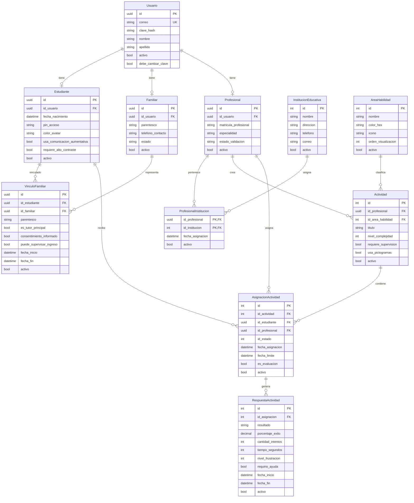

# 📘 Contexto y Planificación: Relevamiento, DER y Backlog Sprint 1 — InclusiON

**Marco Académico:** Práctica Profesionalizante II — Institución Cervantes  
**Ubicación:** `d:\git\login\6-sprint-1-relevamiento-backlog-der.md`  
**Fecha de consolidación:** Septiembre 2026  

---

## 📑 Índice de Contenidos
1. [Cuadro Oficial de los 7 Encuentros](#1-cuadro-oficial-de-los-7-encuentros)
2. [Actores del Negocio](#2-actores-del-negocio)
3. [Los 19 Procesos Relevados (P01 a P19)](#3-los-19-procesos-relevados-p01-a-p19)
4. [Story Map y Releases (MVP vs Release 2)](#4-story-map-y-releases-mvp-vs-release-2)
5. [Diagrama Entidad-Relación (DER) — 11 Entidades](#5-diagrama-entidad-relación-der--11-entidades)
6. [Backlog Exhaustivo del Sprint 1 (Encuentro 3)](#6-backlog-exhaustivo-del-sprint-1-encuentro-3)
7. [Proyección de Backlog: Sprints 2 al 5](#7-proyección-de-backlog-sprints-2-al-5)

---

## 1. Cuadro Oficial de los 7 Encuentros

| Encuentro | Pregunta Eje | Requisito de análisis (FN) | Requisito técnico (DEV) | Requisito de gestión (SM / PO) | Quién responde qué en el grupo |
| :--- | :--- | :--- | :--- | :--- | :--- |
| **Encuentro 1** Informativo | ¿Cómo vamos a trabajar? | • Presentación del Proyecto | • Presentación del sistema base • Tecnología elegidas y justificadas | • Presentación del Sprint 0: equipo, roles, backlog inicial, herramienta. | • Cada miembro del grupo responde según su rol. |
| **Encuentro 2** Validación de dominio | ¿De qué trata esto y tiene sentido el modelo? | • Procesos relevados del negocio (sin sistema) • Justificación de cada entidad del DER desde el negocio real • Actores del negocio identificados | • DER con 8–12 entidades • Al menos una entidad transaccional • Relaciones reales entre entidades | • Story Map inicial • Template de US definido | • **FN:** presenta el negocio, justifica cada entidad desde el proceso real • **SM:** presenta el Sprint 0 y el plan del cuatrimestre • **Dev:** explica las relaciones del modelo y las decisiones técnicas |
| **Encuentro 3** Datos base *(Sprint 1)* | ¿Puedo cargar los datos base del sistema? | • Casos de uso • Cada ABM justificado por un actor que lo necesita • Diccionario de datos: qué significa cada campo en el negocio • Distinción entre entidades maestras y transaccionales | • ABM completo de TODAS las entidades del DER • Alta, baja, modificación y listado con persistencia real • Validaciones básicas de integridad | • Sprint 1 documentado • Backlog consistente con lo mostrado • Daily meetings registradas • Retrospectiva del sprint | • **FN:** valida que cada ABM corresponde a un actor real del negocio • **SM:** defiende el sprint y muestra métricas • **Dev:** demuestra cada ABM ante pedido imprevisto del docente |
| **Encuentro 4** Identidad del sistema *(Sprint 2)* | ¿Puedo entrar y el sistema sabe quién soy? | • Diagrama de actores del negocio • Cada rol del sistema surge de un actor real • Qué proceso del negocio realiza cada actor • Permisos justificados desde el negocio, no desde lo técnico | • Login funcionando • Mínimo dos roles con vistas distintas • Landing que refleja el rol del usuario • ABMs del encuentro anterior siguen funcionando | • Sprint 2 documentado • Roles validados con el cliente o decisión documentada si no respondió • Backlog actualizado y priorizado | • **FN:** explica por qué esos roles desde el negocio, no desde la tecnología • **SM:** muestra cómo gestionaron la comunicación con el cliente • **Dev:** demuestra que cada rol ve exactamente lo que debe ver |
| **Encuentro 5** Lógica de negocio *(Sprint 3)* | ¿El sistema hace lo que dice que hace? | • Reglas de negocio documentadas en lenguaje del cliente (no en código) • Diagrama de flujo o BPMN del proceso principal • Trazabilidad: cada regla implementada tiene origen en un requerimiento real | • Proceso central funcionando de punta a punta • Lógica de negocio implementada (el sistema decide, no solo guarda) • Procesamiento automático de datos • Al menos una automatización real | • Sprint 3 documentado • Si el cliente no apareció: SM documenta el bloqueo, la decisión tomada y el impacto en el backlog • Métricas del sprint | • **FN:** defiende cada regla de negocio desde el cliente • **SM:** muestra cómo gestionaron la tensión con el cliente • **Dev:** demuestra el proceso completo ante pedido imprevisto del docente |
| **Encuentro 6** Casos borde *(Sprint 4)* | ¿Qué pasa cuando algo sale mal? | • Diagramas de estado de las entidades principales • Casos borde identificados desde los estados (no inventados) • Lista de excepciones: qué situaciones el sistema debe rechazar y por qué • Validaciones justificadas desde reglas del negocio | • Validaciones reales implementadas • El sistema rechaza lo que debe rechazar • El sistema explica por qué rechaza • Casos borde contemplados y demostrables | • Sprint 4 documentado • Casos borde validados con el cliente o justificados por el equipo • Retrospectiva con decisiones concretas tomadas | • **FN:** lista los casos bordes validados con el cliente • **SM:** muestra métricas y estado real del backlog • **Dev:** responde ante pedidos del docente intentando romper el sistema |
| **Encuentro 7** Entregables del sistema *(Sprint 5)* | ¿El sistema produce algo que el cliente puede llevarse? | • Especificación de cada reporte: quién lo pide, para qué decisión lo usa, con qué datos • Trazabilidad: cada reporte responde a un requerimiento real del negocio • Descripción del valor que entrega cada salida del sistema | • Reportes o exportaciones funcionando • El sistema transforma datos en información útil • Los reportes responden preguntas reales del negocio • Todo lo anterior sigue funcionando en conjunto | • Sprint 5 documentado • Estado honesto del backlog: qué está hecho, qué falta, qué entra a Práctica III • Plan de entrega a Práctica III | • **FN:** demuestra que cada reporte responde a un requerimiento real del cliente • **SM:** presenta el estado del proyecto con honestidad sobre qué queda para Práctica III • **Dev:** genera reportes en vivo ante pedido del docente |

---

## 2. Actores del Negocio

| Actor del Negocio | ¿Quién es en la vida real? | ¿Qué hace hoy en el mundo real (SIN SISTEMA)? | ¿Qué hace y gana con la Plataforma InclusiON? |
|---|---|---|---|
| **Persona con Discapacidad (Estudiante / Alumno)** | Es el niño, joven o adulto que asiste a una escuela común (con proyecto de inclusión) o a un centro terapéutico. | Realiza ejercicios en hojas fotocopiadas, cuadernos o fichas de cartón con velcro. Si se frustra o se cansa, depende de que el docente lo note a tiempo. | Accede a un entorno visual amigable ("Mi Camino"), adaptado a su condición visual. Juega a su propio ritmo sin sentirse examinado, con refuerzos positivos y pausas preventivas. Refuerza conocimientos y adquiere o afianza los nuevos mediante las actividades generadas por el profesional. |
| **Profesional (Docente integrador, psicopedagogo, terapeuta)** | Es el especialista a cargo del acompañamiento pedagógico o la rehabilitación cognitiva/motriz. | Diseña material a mano, cronometra tiempos a ojo, anota aciertos y errores en libretas personales y redacta informes en Word a fin de trimestre recopilando papeles. | Arma planes de trabajo secuenciales en minutos, reutiliza actividades lúdicas con pictogramas oficiales, recibe alertas si el alumno se bloquea y genera reportes automáticos con gráficos objetivos. |
| **Representante Familiar (Padre, madre o tutor legal)** | Es el adulto legalmente responsable del bienestar y la trayectoria escolar de la persona. | Se entera de lo que pasa a través del cuaderno de comunicaciones en papel, llamadas telefónicas o reuniones formales cada tres meses. Vive con incertidumbre sobre el avance real. | Ingresa a su portal seguro para ver la evolución de su hijo en gráficos sencillos, recibe informes aprobados y mantiene un canal de comunicación directo y ordenado con los terapeutas. |
| **Directivo / Administrador Institucional** | Es la directora de la escuela, coordinadora pedagógica o administradora del centro terapéutico. | Lleva el legajo de alumnos y docentes en carpetas de cartón o planillas Excel separadas. No puede auditar fácilmente el avance global de la institución. | Coordina la nómina de docentes, valida el alta de nuevos profesionales, asigna qué terapeuta atiende a qué alumno y garantiza que la información no salga de la institución. |

---

## 3. Los 19 Procesos Relevados (P01 a P19)

| ID | Proceso Relevado | Objetivo del Negocio | Entidades Centrales y Definición Relevada | Actor Responsable |
|:---:|---|---|---|---|
| **01** | **Gestión de Instituciones Educativas** | Registrar las sedes, colegios o centros terapéuticos que coordinan la atención de los estudiantes. | **Escuela / Centro Educativo:** La entidad física y administrativa con nombre oficial, CUE/código institucional, dirección, teléfono y directivos a cargo. | Directivo General |
| **02** | **Seguridad y Permisos del Personal** | Establecer qué pantallas y expedientes puede ver y editar cada miembro del equipo escolar y las familias, protegiendo la confidencialidad. | **Perfil de Seguridad y Accesos:** La habilitación formal que delimita qué información sensible puede consultar cada integrante, garantizando que nadie pueda ver estudiantes de otra escuela. | Directivo de la Escuela |
| **03** | **Catálogos de Apoyo y Accesibilidad** | Estandarizar los criterios de atención pedagógica y de salud según marcos internacionales de inclusión (OMS / CIF). | **Áreas de Aprendizaje y Niveles de Autonomía:** Tablas maestras oficiales que definen qué áreas se estimulan (Comunicación, Lógica, Motricidad) y el grado de asistencia requerido. | Coordinador Pedagógico |
| **04** | **Legajo y Matriculación del Estudiante** | Registrar al alumno en la plataforma adaptando la pantalla a su condición visual, cognitiva y motriz. | **Estudiante / Alumno:** Legajo con datos personales, condición de salud, grado de independencia, método de acceso simplificado (PIN de 4 dígitos o asistido) y perfil visual adaptado. | Equipo Directivo y Admisión |
| **05** | **Habilitación de Docentes y Terapeutas** | Registrar y validar a los maestros integradores, fonoaudiólogos y psicopedagogos que intervienen en las salas. | **Docente / Profesional de Apoyo:** Especialista a cargo del estudiante. Reúne matrícula habilitante, especialidad terapéutica, escuela de pertenencia y estado de aprobación. | Directivo de la Escuela |
| **06** | **Padrón y Vinculación Familiar** | Reconocer formalmente a los padres, madres o tutores legales responsables del cuidado del alumno. | **Tutor / Familiar Legal:** Adulto a cargo en el hogar. Releva parentesco, canales de contacto y firma de consentimiento informado para el seguimiento pedagógico digital. | Familiar y Escuela |
| **07** | **Invitación Digital a Familias** *(Release 2)* | Facilitar el ingreso de los padres al sistema mediante un enlace seguro enviado por correo electrónico. | **Pase de Invitación Familiar:** Enlace digital temporal y seguro que conecta de forma automática al tutor con su hijo en la plataforma, evitando trámites presenciales. | Docente o Directivo |
| **08** | **Asignación de Estudiantes a Docentes y Aulas** | Conformar los equipos de trabajo vinculando qué profesionales atienden a cada alumno en su sala o grado. | **Equipo de Apoyo del Alumno:** Vínculo pedagógico formal que autoriza a un docente específico a consultar el legajo, armar tareas y evaluar el avance de un estudiante. | Directivo de la Escuela |
| **09** | **Banco de Actividades Pedagógicas** | Crear y clasificar ejercicios didácticos interactivos basados en pictogramas, imágenes claras y audios de apoyo. | **Actividad Pedagógica / Ejercicio Didáctico:** Tareas interactivas diseñadas por docentes (emparejar, ordenar secuencias, sumas visuales, discriminación de figuras) con consignas sonoras. | Docente o Terapeuta |
| **09b**| **Evaluación y Diagnóstico Funcional** | Registrar la evaluación inicial de ingreso del estudiante para definir sus metas pedagógicas anuales. | **Diagnóstico y Perfil Funcional:** Valoración diagnóstica inicial que documenta fortalezas, dificultades, apoyos requeridos, objetivos anuales y estrategias pedagógicas sugeridas. | Docente o Terapeuta |
| **10** | **PROCESO CORE: Realización y Entrega de Actividades** | Permitir que el estudiante resuelva sus ejercicios interactivos desde una interfaz adaptada a sus posibilidades motrices. | **Asignación y Entrega del Alumno:** Tarea enviada y recolección de resultados: porcentaje de aciertos, tiempo empleado, cantidad de equivocaciones y si requirió ayuda presencial. | Estudiante (Alumno) |
| **11** | **Plan Pedagógico Individual (PPI / Trayectoria)** | Diseñar la hoja de ruta personalizada de desafíos que el alumno irá desbloqueando a su propio ritmo. | **Trayectoria / Hoja de Ruta (Roadmap):** Camino de aprendizaje secuencial organizado por áreas, donde superar una actividad con éxito (≥60%) habilita el siguiente desafío. | Docente o Terapeuta |
| **12** | **Emisión de Informes de Progreso** | Generar el boletín o reporte oficial que resume los logros del estudiante para compartir con padres y directivos. | **Informe Pedagógico Escolar:** Documento oficial donde el docente expone el progreso cuantitativo y cualitativo alcanzado por el alumno durante el período evaluado. | Docente o Terapeuta |
| **13** | **Adaptación Inteligente de Dificultad (MDA)** *(Release 2)* | Calibrar en tiempo real la exigencia de las tareas para evitar que el alumno se frustre o se desmotive. | **Motor Adaptativo de Dificultad:** Asistente virtual que detecta si el estudiante acierta con facilidad (aumenta desafío) o si comete errores reiterados (más pistas/tiempo). | Sistema Automático |
| **14** | **Tablero de Seguimiento Escolar ("Mi Aula")** | Brindar al docente un panel panorámico con el rendimiento de todos sus estudiantes y su evolución en competencias. | **Panel del Aula y Gráfico de Competencias:** Fichas visuales con alertas tempranas y un gráfico tipo "telaraña" (radar) del nivel alcanzado por área de habilidad. | Docente de Apoyo |
| **15** | **Circuito de Aprobación de Informes** *(Release 2)* | Revisar, corregir y avalar los informes evolutivos antes de que sean visibles para los tutores legales. | **Borrador y Validación de Informe:** Circuito de revisión (Borrador → Enviado → Aprobado) que asegura que ningún informe llegue a las familias sin revisión previa. | Docente y Directivo |
| **16** | **Cuaderno de Comunicaciones Digital** *(Release 2)* | Establecer un canal oficial y seguro de mensajería entre la escuela y el hogar para el día a día. | **Comunicado y Mensaje Escolar:** Mensajes individuales o grupales entre docentes y familiares con confirmación de lectura, reemplazando notas en papel. | Docente y Familiar |
| **17** | **Administración Centralizada de Cuentas** *(Release 2)* | Gestionar el mantenimiento de usuarios escolares, blanqueo de accesos y suspensiones por egreso. | **Cuenta Institucional de Acceso:** Registro de credenciales seguras, blanqueo de claves/PIN olvidados y bajas lógicas preservando el historial. | Administrador Escolar |
| **18** | **Primer Ingreso Asistido (Onboarding)** *(Release 2)* | Guiar a cada miembro de la comunidad educativa en su primera interacción según su rol. | **Guía de Inicio Rápido:** Recorrido visual paso a paso que capacita al docente en la creación de tareas, a la familia en la lectura de boletines y al alumno en la pantalla táctil. | Todos los Usuarios |
| **19** | **Mesa de Ayuda y Soporte Pedagógico** *(Release 2)* | Dar asistencia ante dudas de uso o dificultades técnicas en el aula o en el hogar. | **Consulta y Solicitud de Asistencia:** Instructivos interactivos, preguntas frecuentes ilustradas y canal de reporte de inconvenientes técnicos. | Docente y Familiar |

---

## 4. Story Map y Releases (MVP vs Release 2)

### 📌 Release MVP (Práctica II)
* **Apertura Institucional:** P01 (Configurar Escuela), P02 (Perfiles y Accesos), P03 (Catálogos Oficiales).
* **Comunidad Educativa:** P04 (Matricular Alumno), P05 (Habilitar Docentes), P06 (Registrar Tutores), P08 (Asignar Alumnos a Docentes y Aulas).
* **Diagnóstico Inicial:** P09b (Diagnóstico de Partida).
* **Banco Didáctico:** P09 (Crear Actividades), P11 (Plan Individual / PPI), P10 (Asignar Tareas).
* **Aprendizaje (CORE):** P04/P10 (Ingreso Accesible por PIN), P10 (Resolver Ejercicio Táctil), P10 (Registrar Entrega Automática).
* **Monitoreo e Informes:** P14 (Panel Mi Aula básico), P12 (Informe Pedagógico Escolar).

### 🚀 Release 2 / Práctica III
* **Comunidad y Soporte:** P07 (Invitaciones Digitales por Correo), P04/P10 (Ingreso Asistido Supervisado), P17 (Mantenimiento y Blanqueo de Claves), P18 (Onboarding Guiado), P19 (Centro de Ayuda).
* **Didáctica y Calibración Avanzada:** P09 (Búsqueda Semántica de Actividades), P11 (Desbloqueo Automático Completo), P13 (Motor Adaptativo de Dificultad en Vivo), P14 (Radar de Competencias Multidimensional).
* **Vínculo y Acreditación:** P15 (Circuito Formal de Aprobación Directiva), P16 (Cuaderno de Comunicaciones Digital).

---

## 5. Diagrama Entidad-Relación (DER) — 11 Entidades

---

## 6. Backlog Exhaustivo del SPRINT 1 (Encuentro 3)

### 🛠️ Módulo A: ABMs del DER (Requisito Técnico DEV)

#### Tarea 1: ABM de Instituciones Educativas (P01)
* **Qué hay que hacer:** Desarrollar el ABM completo de la entidad `InstitucionEducativa` con persistencia en base de datos.
* **Breve descripción:** Permite al Directivo General registrar escuelas y centros terapéuticos con nombre, dirección, teléfono, correo y estado activo, garantizando la unicidad institucional y el aislamiento de los datos escolares.

#### Tarea 2: ABM de Cuentas de Acceso y Credenciales (P02)
* **Qué hay que hacer:** Implementar el alta, edición, baja lógica y listado de la entidad `Usuario`.
* **Breve descripción:** Gestiona la identidad base de todos los actores en el sistema (correo único, contraseña hasheada, nombre, apellido, estado activo y la bandera `debe_cambiar_clave`), asegurando la integridad de autenticación inicial.

#### Tarea 3: ABM de Áreas de Aprendizaje y Habilidad (P03)
* **Qué hay que hacer:** Construir el mantenimiento del catálogo maestro de la entidad `AreaHabilidad`.
* **Breve descripción:** Permite al Coordinador Pedagógico registrar y parametrizar las áreas oficiales (Comunicación, Lógica, Motricidad) definiendo su nombre, color distintivo (`color_hex`), ícono visual, orden de visualización y estado activo.

#### Tarea 4: Matriculación y Legajo del Estudiante (P04)
* **Qué hay que hacer:** Desarrollar el registro, edición y consulta de la entidad `Estudiante` vinculada a `Usuario`.
* **Breve descripción:** Permite al Equipo de Admisión registrar al alumno guardando su fecha de nacimiento, color de avatar preferido, si usa comunicación aumentativa, si requiere alto contraste y configurando su `pin_acceso` numérico obligatorio de 4 dígitos.

#### Tarea 5: Habilitación de Docentes y Profesionales (P05)
* **Qué hay que hacer:** Implementar el ABM de la entidad `Profesional` asociada a su cuenta de `Usuario`.
* **Breve descripción:** Permite al Directivo dar de alta a maestros integradores y terapeutas registrando su matrícula profesional habilitante, especialidad médica/pedagógica y estado de validación institucional.

#### Tarea 6: Padrón de Tutores Legales y Familiares (P06)
* **Qué hay que hacer:** Desarrollar el alta, modificación y listado de la entidad `Familiar` asociada a `Usuario`.
* **Breve descripción:** Registra a los padres o tutores con su parentesco declarado, teléfono de contacto directo y estado de cuenta, dejándolos habilitados para la vinculación con sus representados.

#### Tarea 7: Vinculación Profesional ↔ Institución Educativa (P05, P08)
* **Qué hay que hacer:** Implementar la persistencia relacional en la entidad intermedia `ProfesionalInstitucion`.
* **Breve descripción:** Permite asignar qué docentes prestan servicios en qué escuelas, registrando la fecha de asignación y estado activo, impidiendo que un profesional opere en colegios a los que no pertenece.

#### Tarea 8: Vinculación Formal Alumno ↔ Tutor Legal (P06)
* **Qué hay que hacer:** Construir el registro transaccional en la entidad `VinculoFamiliar`.
* **Breve descripción:** Formaliza el lazo legal entre el estudiante y su tutor, registrando parentesco, fecha de inicio y fin, si es el tutor principal, si firmó el consentimiento informado y si tiene permiso para supervisar el ingreso del alumno.

#### Tarea 9: Banco de Actividades Pedagógicas (P09)
* **Qué hay que hacer:** Desarrollar el alta, edición, consulta y baja lógica de la entidad `Actividad`.
* **Breve descripción:** Permite al docente diseñar ejercicios interactivos asociándolos a un área de habilidad (`AreaHabilidad`), definiendo título, nivel de complejidad inicial, si requiere supervisión humana y si utiliza pictogramas ARASAAC.

#### Tarea 10: Asignación de Tareas al Alumno (P08, P10)
* **Qué hay que hacer:** Implementar la creación y listado de la entidad transaccional `AsignacionActividad`.
* **Breve descripción:** Permite al docente vincular una actividad pedagógica con un estudiante determinado, fijando la fecha de asignación, fecha límite de entrega, estado inicial (Pendiente) y si corresponde a una evaluación diagnóstica.

#### Tarea 11: Registro de Resultados de Actividad (P10)
* **Qué hay que hacer:** Crear la persistencia transaccional de la entidad `RespuestaActividad`.
* **Breve descripción:** Almacena el resultado de la tarea asignada: porcentaje de éxito obtenido, cantidad de intentos realizados, tiempo empleado en segundos, nivel de frustración detectado, si requirió ayuda y marcas de tiempo de inicio y fin.

---

### 📐 Módulo B: Análisis y Modelado de Negocio (Requisito Análisis FN)

#### Tarea 12: Especificación de Casos de Uso Justificados por Actor
* **Qué hay que hacer:** Redactar y documentar formalmente los casos de uso para cada uno de los 11 ABMs.
* **Breve descripción:** FN justifica ante el docente para qué necesita cada pantalla y operación cada actor real (Directivo, Docente, Tutor y Estudiante), garantizando que no existan entidades vacías o sin sustento operativo real.

#### Tarea 13: Diccionario de Datos Oficial del DER
* **Qué hay que hacer:** Confeccionar el diccionario de datos describiendo el propósito y restricciones de cada atributo del DER.
* **Breve descripción:** Documentar el significado en el mundo real de campos clave como `pin_acceso`, `consentimiento_informado`, `nivel_complejidad`, `porcentaje_exito` y `debe_cambiar_clave`.

#### Tarea 14: Matriz de Clasificación: Entidades Maestras vs. Transaccionales
* **Qué hay que hacer:** Documentar la clasificación formal de las 11 entidades según su ciclo de vida y volatilidad.
* **Breve descripción:** FN defiende la distinción entre entidades maestras (configuración y referencia: `InstitucionEducativa`, `AreaHabilidad`, `Usuario`, `Estudiante`, `Profesional`, `Familiar`, `Actividad`) y transaccionales (eventos y resultados: `ProfesionalInstitucion`, `VinculoFamiliar`, `AsignacionActividad`, `RespuestaActividad`).

---

### 📈 Módulo C: Gestión Ágil del Sprint (Requisito Gestión SM / PO)

#### Tarea 15: Configuración del Tablero del Sprint 1 y Backlog Consistente
* **Qué hay que hacer:** Cargar y mantener actualizado el tablero de tareas en Jira asegurando consistencia con el código.
* **Breve descripción:** SM verifica que cada una de las tareas del sprint coincida exactamente con las pantallas y endpoints implementados, evitando discrepancias entre la documentación y la demo en vivo.

#### Tarea 16: Registro de Reuniones Diarias (Daily Meetings)
* **Qué hay que hacer:** Documentar las minutas formales de las reuniones diarias del equipo durante el Sprint 1.
* **Breve descripción:** Registrar qué hizo cada miembro, qué va a hacer y qué bloqueos u obstáculos se detectaron (por ejemplo, alineación del entorno de desarrollo compartido entre frontend y backend).

#### Tarea 17: Retrospectiva y Métricas del Sprint 1
* **Qué hay que hacer:** Confeccionar el informe de cierre, retrospectiva y cálculo de velocidad del Sprint 1.
* **Breve descripción:** SM documenta los puntos positivos (Start/Keep) y aspectos a corregir (Stop), registrando acciones de mejora concretas y calculando el porcentaje de historias completadas frente a las planificadas.

---

## 7. Proyección de Backlog: Sprints 2 al 5

* **Sprint 2 (Encuentro 4 — Identidad del Sistema):** Autenticación estándar, login por PIN numérico para alumnos, layouts diferenciados (Admin, Profesional, Familia y Alumno AAC), guards de ruta y protección de perfiles escolares.
* **Sprint 3 (Encuentro 5 — Lógica de Negocio):** Ejecución interactiva del Proceso Core (P10), desbloqueo automático de trayectoria al alcanzar el 60% (P11), calibración adaptativa inicial (P13) y documentación formal del bloqueo con el cliente.
* **Sprint 4 (Encuentro 6 — Casos Borde):** Máquinas de estado en asignaciones y reportes, rechazos explicativos con HTTP 409/403/422, aislamiento estricto entre colegios y pruebas de estrés.
* **Sprint 5 (Encuentro 7 — Entregables del Sistema):** Emisión del informe pedagógico escolar (P12), tablero "Mi Aula" con gráfico radar de habilidades (P14) y balance honesto del backlog hacia Práctica III / Release 2.
