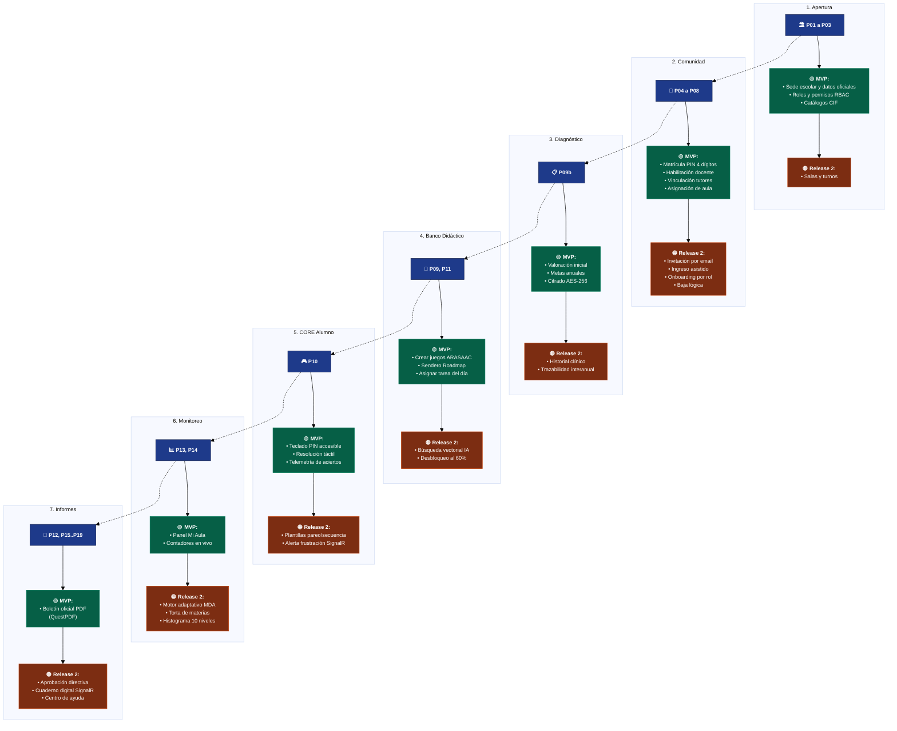

# 📘 Story Map Maestro: Procesos de Negocio, Backlog y User Stories — InclusiON

**Marco Académico:** Práctica Profesionalizante II / III — Institución Cervantes — Analista de Sistemas  
**Ubicación:** `d:\git\login\8-story-map-backlog-procesos-user-stories.md`  
**Fecha de consolidación:** Septiembre 2026  
**Proyecto:** InclusiON — Plataforma de Gestión y Aprendizaje para la Inclusión Educativa  
**Referentes Académicos y de Calidad:** Mariano Decalli, Sacha Del Barrio, Germán Cochis, Fernando Aparicio  

---

## 📑 Índice de Contenidos

1. [Marco Conceptual y Decisiones de Negocio](#1-marco-conceptual-y-decisiones-de-negocio)
   * [1.1. Por qué 7 Sprints Oficiales (312 Story Points)](#11-por-qué-7-sprints-oficiales-312-story-points)
   * [1.2. Terminología Escolar: Alumno vs. Estudiante](#12-terminología-escolar-alumno-vs-estudiante)
   * [1.3. Certificación Digital bajo Resolución CFE 311/16](#13-certificación-digital-bajo-resolución-cfe-31116)
2. [Story Map en Diagramas Mermaid](#2-story-map-en-diagramas-mermaid)
   * [2.1. Tablero Story Map Compacto (Backbone → MVP → Release 2)](#21-tablero-story-map-compacto-backbone--mvp--release-2)
   * [2.2. Mindmap Ejecutivo de Procesos](#22-mindmap-ejecutivo-de-procesos)
3. [Tabla Maestra de los 19 Procesos Relevados (P01 a P19)](#3-tabla-maestra-de-los-19-procesos-relevados-p01-a-p19)
4. [Catálogo Detallado de Historias de Usuario (31 HUs por Eje)](#4-catálogo-detallado-de-historias-de-usuario-31-hus-por-eje)
5. [Trazabilidad del Sprint 0 (Hitos IN-14 a IN-20 en Jira)](#5-trazabilidad-del-sprint-0-hitos-in-14-a-in-20-en-jira)

---

## 1. Marco Conceptual y Decisiones de Negocio

### 1.1. Por qué 7 Sprints Oficiales (312 Story Points)
El Product Backlog inicial formuló **12 Épicas de Negocio macro** para abarcar la visión total de inclusión del Product Owner. Para la ejecución curricular y la defensa académica en Cervantes, el alcance se organizó de forma óptima:
* **Sincronización con los 7 Encuentros Evaluativos:** La cursada oficial se estructura en 7 hitos correlativos (del Encuentro 1 al 7). Cada sprint responde a un requerimiento de entrega de la cátedra.
* **Consolidación en 7 Sprints:** Culmina en el **Sprint 6** con el sendero gamificado "Mi Camino" y en el **Sprint 7** con los Dashboards Analíticos de alto contraste (Torta y Barras de 10 Niveles) y la **Prueba del Sistema con 433 casos aprobados al 100%** (documentado en [7-arquitectura-tecnologias-pruebas-sistema.md](file:///d:/git/login/7-arquitectura-tecnologias-pruebas-sistema.md)).
* **Volumen de Esfuerzo Equilibrado:** Los 7 sprints acumulan **312 Story Points** reales (velocidad crucero de 30 a 35 SP por sprint tras la base inicial), evitando la sobrecarga artificial de extender tareas de mantenimiento a 12 sprints.

### 1.2. Terminología Escolar: Alumno vs. Estudiante
Bajo las directivas de Educación Especial en Argentina (Resolución CFE 311/16, Ley 26.206 y escuelas especiales de Córdoba), en los registros oficiales y en el aula no se utiliza "estudiante" (asociado a niveles terciarios/universitarios), sino **Alumno** (o *"Persona con Discapacidad / Alumno"*). Todas las historias de usuario y pantallas del sistema respetan este léxico oficial ([3-alumnos.md](file:///d:/git/login/3-alumnos.md)).

### 1.3. Certificación Digital bajo Resolución CFE 311/16
La plataforma no emite textos editables en Word. El Proceso P12 y P15 implementan la **emisión de boletines oficiales vectoriales inmutables en PDF con QuestPDF**. Cuentan con:
1. Membrete oficial de la escuela y datos institucionales de contacto.
2. Circuito de firma y aval directivo (`Draft` $\rightarrow$ `Submitted` $\rightarrow$ `Approved`).
3. Validez legal probatoria ante el Ministerio de Educación e Inspección Escolar para acreditar la promoción de grado según el PPI, y ante Obras Sociales para la cobertura de tratamientos terapéuticos.

---

## 2. Story Map en Diagramas Mermaid

### 2.1. Tablero Story Map Compacto (Backbone → MVP → Release 2)



---

### 2.2. Mindmap Ejecutivo de Procesos

```mermaid
mindmap
  root((Plataforma InclusiON))
    Apertura y Seguridad (P01-P03)
      ::icon(fa fa-school)
      [MVP] US-01 Configurar Sede y Datos Institucionales
      [MVP] US-02 Seguridad y Roles RBAC
      [MVP] US-03 Catálogos Oficiales CIF
      [R2] US-04 Gestión de Salas y Turnos
    Comunidad Educativa (P04-P08, P17, P18)
      ::icon(fa fa-users)
      [MVP] US-05 Matrícula con PIN 4 Dígitos
      [MVP] US-06 Habilitación de Docentes
      [MVP] US-07 Vinculación de Tutores Legales
      [MVP] US-08 Asignación Alumno-Docente en Aula
      [R2] US-09 Invitaciones Digitales por Correo
      [R2] US-10 Ingreso Asistido Supervisado
      [R2] US-11 Onboarding Guiado por Rol
      [R2] US-12 Mantenimiento y Baja Lógica
    Diagnóstico Inicial (P09b)
      ::icon(fa fa-stethoscope)
      [MVP] US-13 Diagnóstico de Partida Cifrado AES-256
      [R2] US-14 Historial y Trazabilidad Interanual
    Planificación Didáctica (P09, P11, P10a)
      ::icon(fa fa-book)
      [MVP] US-15 Crear Actividad con ARASAAC
      [MVP] US-16 Roadmap Sendero de 10 Hitos
      [MVP] US-17 Asignar Tarea del Día (CB-20)
      [R2] US-18 Búsqueda Semántica con pgvector
      [R2] US-19 Alerta Pedagógica al Profesional por Desempeño (CB-21)
    Aprendizaje CORE (P10b)
      ::icon(fa fa-gamepad)
      [MVP] US-20 Teclado Táctil PIN Autónomo
      [MVP] US-21 Resolución sin Punición ni Límites
      [MVP] US-22 Registro Automático de Desempeño
      [R2] US-23 Plantillas Avanzadas Secuencia y Pareo
      [R2] US-24 Alerta Silenciosa de Frustración SignalR (CB-07)
    Calibración y Monitoreo (P13, P14)
      ::icon(fa fa-chart-line)
      [MVP] US-25 Panel Mi Aula en Vivo
      [R2] US-26 Motor Adaptativo MDA Clamping (CB-08)
      [R2] US-27 Gráficos Torta e Histograma 10 Niveles
    Acreditación y Vínculo (P12, P15, P16, P19)
      ::icon(fa fa-file-pdf)
      [MVP] US-28 Informe Pedagógico Oficial QuestPDF
      [R2] US-29 Circuito Aprobación Directiva (CB-14)
      [R2] US-30 Cuaderno de Comunicaciones SignalR
      [R2] US-31 Centro de Ayuda con Pictogramas
```

---

## 3. Tabla Maestra de los 19 Procesos Relevados (P01 a P19)

| ID | Proceso Relevado | Entidades Centrales y Definición Relevada | Actor Principal | Épica Story Map y Release | Historia de Usuario Definida | Criterios de Aceptación Clave |
|:---:|---|---|---|---|---|---|
| **01** | **Gestión y Configuración Institucional** | **Escuela / Centro Educativo:** La entidad física y administrativa oficial con nombre, domicilio, teléfono y correo de contacto. | Directivo Escolar | Apertura Institucional<br><br>*(Release MVP)* | **Como Directivo Escolar**, quiero configurar la sede de mi escuela con sus datos oficiales de contacto, para habilitar el espacio institucional seguro y garantizar que los informes y constancias tengan validez formal. | • Valida obligatoriedad de nombre institucional y correo electrónico (`409 Conflict` en duplicados).<br>• Configura membrete oficial con domicilio y teléfonos de la sede para boletines y constancias.<br>• Habilita el entorno institucional para matriculación y vinculación del personal. |
| **02** | **Seguridad y Permisos del Personal** | **Perfil de Seguridad y Accesos:** Habilitación formal que determina qué pantallas y legajos puede ver cada usuario, impidiendo accesos cruzados. | Directivo Escolar | Apertura Institucional<br><br>*(Release MVP)* | **Como Directivo Escolar**, quiero asignar permisos a mi equipo de trabajo, para que cada docente acceda solo a las salas y alumnos que le corresponden bajo secreto profesional. | • El docente solo ve alumnos formalmente asignados a su cargo.<br>• Las familias no acceden a paneles de docentes ni borradores.<br>• Denegación defensiva con registro de auditoría ante accesos no autorizados. |
| **03** | **Catálogos de Apoyo y Accesibilidad** | **Áreas de Aprendizaje y Niveles de Autonomía:** Clasificaciones oficiales (OMS/CIF) que fijan las materias a estimular y el grado de asistencia. | Directivo Escolar | Apertura Institucional<br><br>*(Release MVP)* | **Como Directivo Escolar**, quiero estandarizar las áreas de habilidad y apoyos, para que todo el equipo docente trabaje bajo los mismos criterios de inclusión. | • Incluye Comunicación, Lógica, Cognitiva y Motricidad.<br>• Cada área posee color e ícono distintivo de alto contraste.<br>• Solo la Dirección puede modificar o ampliar los catálogos escolares. |
| **04** | **Legajo y Matriculación del Alumno** | **Alumno (Persona con Discapacidad):** El destinatario del aprendizaje. Legajo con datos personales, condición, método de acceso (PIN o Asistido) y perfil visual. | Directivo Escolar | Comunidad Educativa<br><br>*(Release MVP)* | **Como Directivo Escolar**, quiero matricular al alumno configurando su acceso por PIN de 4 dígitos y su perfil visual, para que ingrese de forma autónoma sin pedirle correos al niño (Regla V-08). | • PIN numérico obligatorio de exactamente 4 dígitos (con hash Argon2id).<br>• Prohibido el uso de correos electrónicos para el inicio de sesión de alumnos.<br>• Selección de perfil visual accesible (dislexia, baja visión, daltonismo). |
| **05** | **Habilitación de Docentes y Terapeutas** | **Docente / Profesional de Apoyo:** El especialista a cargo del alumno. Reúne matrícula habilitante, especialidad y estado de aprobación institucional. | Directivo Escolar | Comunidad Educativa<br><br>*(Release MVP)* | **Como Directivo Escolar**, quiero habilitar a los docentes validando su matrícula, para asegurar que solo profesionales autorizados intervengan en las aulas. | • Verificación obligatoria de matrícula profesional y especialidad terapéutica.<br>• Estado "Aprobado" requerido antes de poder asignar alumnos.<br>• Soporte de auto-registro docente con aprobación formal de la Dirección. |
| **06** | **Padrón y Vinculación Familiar** | **Tutor / Familiar Legal:** Adulto responsable en el hogar. Se releva su parentesco, canales de contacto y el consentimiento informado firmado. | Directivo Escolar | Comunidad Educativa<br><br>*(Release MVP)* | **Como Directivo Escolar**, quiero registrar al tutor legal vinculado con el alumno, para que reciba los boletines oficiales y autorice el tratamiento digital sin desamparos (control de orfandad). | • Registro de consentimiento informado firmado y parentesco.<br>• Un tutor puede tener varios hijos vinculados con un solo usuario.<br>• El tutor accede de forma exclusiva a la información de sus propios hijos. |
| **07** | **Invitación Digital a Familias** | **Pase de Invitación Familiar:** Enlace digital seguro con expiración enviado por correo para vincular al tutor con su hijo sin trámites burocráticos. | Docente / Directivo | Comunidad Educativa<br><br>*(Release 2)* | **Como Docente**, quiero invitar al familiar enviándole un enlace seguro por correo, para que active su cuenta rápidamente quedando automáticamente vinculado a su hijo. | • Enlace de un solo uso con token criptográfico temporal.<br>• Expiración automática a los 7 días corridos de emitido.<br>• Vinculación automática con el alumno correspondiente al completar el registro. |
| **08** | **Asignación de Alumnos a Docentes y Aulas** | **Equipo de Apoyo del Alumno:** Vínculo formal que autoriza a un maestro o terapeuta específico a ver el legajo, armar tareas y evaluar a un alumno. | Directivo Escolar | Comunidad Educativa<br><br>*(Release MVP)* | **Como Directivo Escolar**, quiero asignar alumnos a sus respectivos docentes y salas, para conformar los grupos de trabajo y habilitar la intervención en el aula. | • Validación estricta de pertenencia a la misma institución escolar.<br>• Un alumno puede tener múltiples docentes de apoyo asignados.<br>• El docente solo visualiza a los alumnos que tiene formalmente asignados. |
| **09** | **Banco de Actividades Pedagógicas** | **Actividad Pedagógica / Didáctica:** Ejercicio interactivo diseñado por docentes (consignas con pictogramas ARASAAC, audios, tiempo sugerido y apoyos). | Docente / Terapeuta | Planificación Didáctica<br><br>*(Release MVP / R2)* | **Como Docente**, quiero crear actividades interactivas con imágenes y audios, para ejercitar habilidades específicas según las posibilidades de cada alumno. | • 5 plantillas didácticas: figuras, sumas, emparejar, ordenar secuencias y letras.<br>• Integración directa con catálogo oficial de pictogramas ARASAAC.<br>• Modo de vista previa interactiva antes de publicar la actividad. |
| **09b** | **Evaluación y Diagnóstico Funcional** | **Diagnóstico y Perfil Funcional:** Valoración diagnóstica inicial con fortalezas, dificultades, apoyos necesarios y objetivos anuales del alumno. | Docente / Terapeuta | Diagnóstico Inicial<br><br>*(Release MVP)* | **Como Docente o Terapeuta**, quiero registrar el diagnóstico funcional inicial del alumno, para fijar el punto de partida y las metas pedagógicas del ciclo lectivo. | • Almacenamiento con cifrado de campo AES-256-GCM (Ley 25.326).<br>• Solo el profesional autor puede modificar su propia valoración diagnóstica.<br>• Genera una línea temporal histórica para comparar avances interanuales. |
| **10** | **PROCESO CORE: Realización de Actividades** | **Asignación y Entrega del Alumno:** Tarea resuelta en pantalla táctil accesible. Captura aciertos, tiempo, equivocaciones y nivel de ayuda requerida. | Alumno con Discapacidad | Aprendizaje Accesible (CORE)<br><br>*(Release MVP / R2)* | **Como Alumno con discapacidad**, quiero resolver mis tareas con pictogramas en mi pantalla adaptada, para aprender a mi ritmo, superar desafíos y avanzar sin frustrarme. | • Carga inmediata en pantalla táctil sin menús distractores.<br>• Refuerzos sonoros positivos y bordes visuales amables (sin cruces rojas punitivas).<br>• Detección silenciosa de frustración (Regla CB-07): ante 3 fallos consecutivos, pausa amigablemente y emite alerta a la docente vía SignalR. |
| **11** | **Plan Pedagógico Individual (PPI / Trayectoria)** | **Trayectoria / Sendero ("Mi Camino"):** Ruta secuencial de 10 hitos por áreas donde superar formativamente una tarea habilita el siguiente nivel. | Docente / Terapeuta | Planificación Didáctica<br><br>*(Release MVP)* | **Como Docente**, quiero organizar las actividades en un camino progresivo para el alumno, para que avance paso a paso afianzando logros sin notas punitivas. | • Umbral de superación formativa predeterminado (≥ 60% de aciertos, Regla CB-21).<br>• Reintentos ilimitados para consolidar la confianza del alumno (Regla CB-05).<br>• Permite la habilitación manual justificada por criterio docente. |
| **12** | **Emisión de Informes de Progreso** | **Informe Pedagógico Escolar:** Boletín oficial exportable a PDF con notas cualitativas, métricas de avance y observaciones docentes. | Docente / Terapeuta | Acreditación e Informes<br><br>*(Release MVP)* | **Como Docente**, quiero redactar informes periódicos con el progreso del alumno, para consolidar los resultados y compartirlos con los tutores y la escuela. | • Consolida automáticamente porcentaje de éxito, volumen de intentos y tiempos.<br>• Campo estructurado para observaciones cualitativas y sugerencias al hogar.<br>• Generación vectorial inmutable en formato A4 / PDF oficial mediante QuestPDF. |
| **13** | **Adaptación Inteligente de Dificultad (MDA)** | **Motor Adaptativo de Dificultad:** Asistente virtual que calibra en vivo la exigencia según el desempeño del alumno para evitar que se desmotive. | Alumno / Docente | Calibración y Seguimiento<br><br>*(Release 2)* | **Como Alumno**, quiero que el juego adapte automáticamente las pistas y alternativas a mi desempeño, para avanzar a mi ritmo manteniéndome motivado (Regla CB-08). | • Eleva nivel de desafío ante rachas consecutivas de éxito.<br>• Reduce distractores y agrega pistas visuales ante fallas continuas dentro de los límites fijados.<br>• Clamping estricto: jamás supera el techo ni el piso de dificultad configurado por la docente. |
| **14** | **Tablero de Seguimiento Escolar ("Mi Aula")** | **Panel del Aula y Gráficos de Alto Contraste:** Tarjetas visuales de alumnos, alertas de estancamiento, gráfico de torta de materias e histograma de 10 niveles. | Docente / Terapeuta | Calibración y Seguimiento<br><br>*(Release MVP / R2)* | **Como Docente**, quiero monitorear en tiempo real el progreso de toda mi sala, para detectar a tiempo a los alumnos que requieren apoyo pedagógico extra. | • Gráfico de torta de alto contraste con distribución de tiempo por categoría pedagógica.<br>• Histograma de distribución de los 10 niveles identificando alumnos con dificultad.<br>• Tarjetas interactivas con semáforo de actividad reciente y acceso al detalle del alumno. |
| **15** | **Circuito de Aprobación de Informes** | **Borrador y Validación de Informe:** Circuito formal (Borrador $\rightarrow$ Enviado $\rightarrow$ Aprobado) que garantiza el aval directivo antes de notificar a la familia. | Directivo Escolar | Acreditación e Informes<br><br>*(Release 2)* | **Como Directivo Escolar**, quiero revisar y validar los informes antes de su publicación, para certificar institucionalmente la información que recibirán los padres. | • Las familias nunca visualizan informes en estado Borrador (`Draft`) o Enviado (`Submitted`).<br>• El directivo puede Aprobar o Rechazar exigiendo motivo obligatorio (`AdminComment`, CB-14).<br>• Bloqueo estricto de edición una vez que el documento alcanza el estado Aprobado (`Approved`). |
| **16** | **Cuaderno de Comunicaciones Digital** | **Comunicado y Mensaje Escolar:** Mensajería institucional bidireccional entre docentes y tutores con confirmación de lectura en tiempo real. | Docente y Familiar | Comunicación Familia<br><br>*(Release 2)* | **Como Docente y Tutor**, queremos comunicarnos de forma ágil y segura por la plataforma, para coordinar temas escolares evitando el uso de canales informales. | • Mensajería en tiempo real mediante WebSockets (SignalR Core).<br>• Mensajes agrupados por hilos de conversación y confirmación de lectura fehaciente.<br>• Categorización por tipo de comunicado (pedagógico, conducta, médico, administrativo). |
| **17** | **Administración Centralizada de Cuentas** | **Cuenta Institucional de Acceso:** Mantenimiento centralizado de credenciales, blanqueo de PIN/claves y bajas lógicas por egreso. | Directivo Escolar | Comunidad Educativa<br><br>*(Release 2)* | **Como Directivo Escolar**, quiero restablecer accesos olvidados y gestionar el ciclo de las cuentas, para garantizar la continuidad del servicio y la seguridad de los datos. | • Blanqueo seguro de contraseñas y reseteo inmediato de PIN de alumno a "1234".<br>• Desactivación lógica (*soft-delete*) que preserva el historial clínico de por vida.<br>• Prohibida la eliminación física de legajos pedagógicos e intentos históricos. |
| **18** | **Primer Ingreso Asistido (Bienvenida)** | **Guía de Inicio Rápido:** Recorrido interactivo que orienta al usuario en su primera entrada según sea docente, padre o estudiante. | Todos los Usuarios | Comunidad Educativa<br><br>*(Release 2)* | **Como Nuevo Usuario del sistema**, quiero realizar una visita guiada en mi primer inicio de sesión, para aprender a utilizar las funciones principales de acuerdo a mi rol. | • Recorrido visual amigable con pictogramas y lenguaje simple para alumnos.<br>• Tour guiado de creación de actividades y gestión de aula para docentes.<br>• Guía rápida de consulta de avances y boletines oficiales para tutores. |
| **19** | **Mesa de Ayuda y Soporte Pedagógico** | **Consulta y Solicitud de Ayuda:** Base de instructivos ilustrados, preguntas frecuentes y canal de asistencia técnica y pedagógica. | Docente y Familiar | Soporte Institucional<br><br>*(Release 2)* | **Como Familiar o Docente**, quiero consultar guías de ayuda y reportar dudas técnicas, para resolver rápidamente cualquier dificultad en el uso de la plataforma. | • Base de instructivos ilustrados con buscador por palabras clave y pictogramas ARASAAC.<br>• Sección de preguntas frecuentes interactivas sobre el acceso táctil y la descarga de PDF.<br>• Formulario ágil de reporte de inconvenientes técnicos dirigido a los administradores. |

---

## 4. Catálogo Detallado de Historias de Usuario (31 HUs por Eje)

### Eje 1: Apertura Institucional y Seguridad Escolar (P01, P02, P03)
* **US-01 [MVP - P01]:** Como Directivo Escolar, quiero configurar la sede de mi escuela con sus datos oficiales y membrete institucional, para habilitar el espacio institucional seguro y garantizar que los informes tengan validez formal.
* **US-02 [MVP - P02]:** Como Directivo Escolar, quiero asignar permisos a mi equipo de trabajo, para que cada docente acceda solo a las salas y alumnos que le corresponden bajo secreto profesional.
* **US-03 [MVP - P03]:** Como Directivo Escolar, quiero estandarizar las áreas de habilidad y apoyos, para que todo el equipo docente trabaje bajo los mismos criterios de inclusión.
* **US-04 [Release 2 - P01]:** Como Directivo Escolar, quiero organizar mi escuela en salas, turnos y divisiones específicas, para estructurar la matrícula escolar del ciclo lectivo.

### Eje 2: Incorporación de la Comunidad Educativa (P04, P05, P06, P07, P08, P17, P18)
* **US-05 [MVP - P04]:** Como Directivo Escolar, quiero matricular al alumno configurando su acceso por PIN de 4 dígitos y su perfil visual, para que ingrese de forma autónoma sin pedirle correos al niño (Regla V-08).
* **US-06 [MVP - P05]:** Como Directivo Escolar, quiero habilitar a los docentes validando su matrícula, para asegurar que solo profesionales autorizados intervengan en las aulas.
* **US-07 [MVP - P06]:** Como Directivo Escolar, quiero registrar al tutor legal vinculado con el alumno, para que reciba los boletines oficiales y autorice el tratamiento digital sin desamparos (control de orfandad).
* **US-08 [MVP - P08]:** Como Directivo Escolar, quiero asignar alumnos a sus respectivos docentes y salas, para conformar los grupos de trabajo y habilitar la intervención en el aula.
* **US-09 [Release 2 - P07]:** Como Docente, quiero invitar al familiar enviándole un enlace seguro por correo, para que active su cuenta rápidamente quedando automáticamente vinculado a su hijo.
* **US-10 [Release 2 - P04/P10]:** Como Docente o Familiar, quiero autorizar el inicio de sesión de un alumno con baja autonomía desde mi propio dispositivo, para que comience sus actividades escolares sin frustración.
* **US-11 [Release 2 - P18]:** Como Docente o Familiar, quiero realizar un recorrido visual paso a paso en mi primer acceso, para familiarizarme con las funciones clave de la plataforma según mi rol.
* **US-12 [Release 2 - P17]:** Como Directivo Escolar, quiero restablecer accesos olvidados y gestionar el ciclo de las cuentas, para garantizar la continuidad del servicio y la seguridad de los datos.

### Eje 3: Valoración y Diagnóstico Inicial (P09b)
* **US-13 [MVP - P09b]:** Como Docente o Terapeuta, quiero registrar el diagnóstico funcional inicial del alumno, para fijar el punto de partida y las metas pedagógicas del ciclo lectivo bajo cifrado AES-256-GCM.
* **US-14 [Release 2 - P09b]:** Como Docente, quiero consultar la línea temporal de diagnósticos y evaluaciones previas, para comparar el avance interanual del alumno y justificar derivaciones terapéuticas.

### Eje 4: Planificación Didáctica y Banco de Juegos (P09, P11, P10a)
* **US-15 [MVP - P09]:** Como Docente, quiero crear actividades interactivas con imágenes y audios basadas en plantillas ARASAAC, para ejercitar habilidades específicas según las posibilidades de cada alumno.
* **US-16 [MVP - P11]:** Como Docente, quiero organizar las actividades en un camino progresivo para el alumno, para que avance paso a paso afianzando logros sin notas punitivas.
* **US-17 [MVP - P10a]:** Como Docente, quiero asignar una actividad específica al alumno en "Mis Tareas del Día", para que la resuelva en clase sin alterar su sendero personal libre (Regla CB-20).
* **US-18 [Release 2 - P09]:** Como Docente, quiero buscar actividades mediante lenguaje natural por similitud pedagógica con `pgvector`, para encontrar rápidamente ejercicios afines a las necesidades clínicas del alumno.
* **US-19 [Release 2 - P11]:** Como Docente, quiero que el sistema me alerte cuando el alumno alcanza el umbral formativo (≥ 60%, Regla CB-21), para evaluar la habilitación del siguiente paso y celebrar sus logros.

### Eje 5: Aprendizaje Accesible — PROCESO CORE (P10b)
* **US-20 [MVP - P04/P10b]:** Como Alumno, quiero ingresar mediante un teclado táctil amplio con PIN de 4 números fácil de recordar, para acceder a mis juegos con autonomía sin memorizar correos ni contraseñas complejas.
* **US-21 [MVP - P10b]:** Como Alumno con discapacidad, quiero resolver mis tareas con pictogramas en mi pantalla adaptada, para aprender a mi ritmo, superar desafíos y avanzar sin frustrarme.
* **US-22 [MVP - P10b]:** Como Docente, quiero que el sistema registre automáticamente aciertos, intentos y tiempos de resolución, para obtener métricas objetivas de desempeño sin interrumpir el juego del niño.
* **US-23 [Release 2 - P10b]:** Como Alumno, quiero resolver actividades adaptadas de ordenar secuencias temporales y emparejar imagen con palabra, para estimular mi estructuración temporal y lectoescritura.
* **US-24 [Release 2 - P10b/P13]:** Como Docente, quiero recibir una notificación inmediata en tiempo real si un alumno comete 3 fallos consecutivos (Regla CB-07), para acercarme a mediar pedagógicamente sin que la pantalla lo exponga.

### Eje 6: Calibración y Seguimiento (P13, P14)
* **US-25 [MVP - P14]:** Como Docente, quiero monitorear en tiempo real el progreso de toda mi sala mediante el panel "Mi Aula", para detectar a tiempo a los alumnos que requieren apoyo pedagógico extra.
* **US-26 [Release 2 - P13]:** Como Alumno, quiero que el juego adapte automáticamente las pistas y alternativas a mi desempeño, para avanzar a mi ritmo manteniéndome motivado (Regla CB-08).
* **US-27 [Release 2 - P14]:** Como Docente o Familiar, quiero consultar gráficos de alto contraste (torta y distribución de 10 niveles) que muestren el rendimiento alcanzado en cada área curricular.

### Eje 7: Acreditación, Vínculo y Soporte (P12, P15, P16, P19)
* **US-28 [MVP - P12]:** Como Docente, quiero redactar informes periódicos con el progreso del alumno y descargarlos en PDF con membrete ministerial (QuestPDF), para certificar formalmente los resultados.
* **US-29 [Release 2 - P15]:** Como Directivo Escolar, quiero revisar y validar los informes antes de su publicación (exigiendo motivo obligatorio ante rechazos, CB-14), para certificar legalmente la información que recibirán los padres.
* **US-30 [Release 2 - P16]:** Como Docente y Tutor, queremos comunicarnos mediante un canal oficial en tiempo real con confirmación de lectura (SignalR), para registrar el acompañamiento diario evitando canales informales.
* **US-31 [Release 2 - P19]:** Como Familiar o Docente, quiero consultar guías ilustradas con pictogramas ARASAAC y reportar dudas técnicas, para resolver rápidamente cualquier dificultad en el uso de la plataforma.

---

## 5. Trazabilidad del Sprint 0 (Hitos IN-14 a IN-20 en Jira)

Para responder ante cualquier duda sobre el arranque del proyecto, las 7 tareas fundacionales del **Sprint 0** se encuentran formalmente registradas en el repositorio:
* **Ubicación en Jira CSV:** Filas 306 a 316 de [Jira-CSV.csv](file:///d:/git/InclusiON.Documents/Sprints/Jira-CSV.csv#L306-L316).
* **Documentación Metodológica:** Sección 5 de [Sprint-00-arranque.md](file:///d:/git/InclusiON.Documents/Sprints/Sprint-00-arranque.md#L62-L73).

| Código | Tarea / Historia | Responsable(s) | Estado | Épica Padre |
|:---:|---|---|:---:|---|
| **IN-14** | Definición de roles del equipo y asignación funcional | Mariano Decalli | ✅ `Done` | IN-2 (Planificación del inicio) |
| **IN-15** | Elección y prueba de herramientas (Teams, GitHub, VS Code, Figma) | Germán Cochis | ✅ `Done` | IN-2 (Planificación del inicio) |
| **IN-16** | Creación de repositorios GitHub (`InclusiON.Server`, `InclusiON.Client`, `InclusiON.Documents`) | Sacha Del Barrio / Mirko Wlk | ✅ `Done` | IN-2 (Planificación del inicio) |
| **IN-17** | Elaboración, análisis funcional y estimación del Product Backlog inicial | Sacha Del Barrio / Mariano Decalli | ✅ `Done` | IN-2 (Planificación del inicio) |
| **IN-18** | Definición de ceremonias Scrum, DoR y DoD | Mariano Decalli | ✅ `Done` | IN-2 (Planificación del inicio) |
| **IN-19** | Selección y validación de la plataforma tecnológica base (.NET, Angular, Postgres) | Sacha Del Barrio / Mirko Wlk | ✅ `Done` | IN-2 (Planificación del inicio) |
| **IN-20** | Diseño del modelo de datos base inicial y análisis de entidad-relación (DER inicial) | Mirko Wlk / Mariano Decalli | ✅ `Done` | IN-2 (Planificación del inicio) |
